# Project S'mores — Legs & Leveling Feet

A working subset of the full build plan: everything needed to make all **12 platform legs** and fit their leveling hardware, and nothing else. Every dimension here is taken from `params.scad`, which is what drives the drawings.

Read this alongside the full plan for context (Section 3 for the whole cut list, Component 2–4 for the rest of each panel's assembly). Nothing in this document supersedes the full plan; it is the same numbers, gathered.

<strong>The one thing to get right.</strong> There are <strong>three</strong> leg lengths, not one. Panels A and B take <strong>8 at 16.75"</strong>; Panel C takes <strong>2 at 17.5"</strong> (its front pair) and <strong>2 at 16"</strong> (its rear pair, at the true corners). Two things drive the spread: Panel C's deck is recessed <em>into</em> its rail plane while A and B are capped by a 3/4" bed platform sitting <em>on</em> theirs, and every leg but Panel C's rear pair is <strong>lapped</strong> to its end rail — running past the rail's underside to finish flush with the rail <em>top</em>, which makes it 1.5" longer than the void it stands in. All three arrangements land the sleeping surface in the same 18.5" plane. Cut them in three clearly-labelled batches.

## 1. What the legs are

<figure class="floorplan-figure">
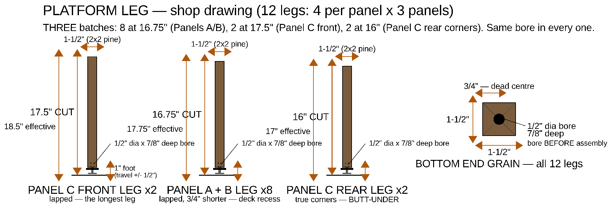
<figcaption>The leg as a part: the <strong>Panel C front leg</strong> (17.5" cut, 18.5" effective), the <strong>Panel A/B leg</strong> (16.75" cut, 17.75" effective), the <strong>Panel C rear corner leg</strong> (16" cut, 17" effective — the one butt-under leg), and the <strong>bottom end grain</strong> with its 1/2" × 1-3/4" insert bore dead centre. This is the sheet to take to the saw. Where the legs then stand in the frame is drawn in Section 8.</figcaption>
</figure>

Twelve legs, 2x2 pine (1.5" × 1.5" actual). Four per panel, one at each corner. Each leg is cut **1" short** of its finished height and gets a screw-in threaded insert in its bottom end grain; a leveling foot threads into that insert and makes up the missing inch, with ±1/2" of adjustment either way.

**How a leg meets its rail — read this before you cut.** Ten of the twelve legs are **lapped**: the leg stands 1.5" inboard of its end rail, against that rail's inner face, and runs up **flush with the rail top**. The two screws then pass through the rail's face into the leg's *side* — long grain, and loaded in shear. A leg lapped this way is 1.5" longer than the void beneath the deck, which is where every one of these cut lengths comes from.

<figure class="floorplan-figure">
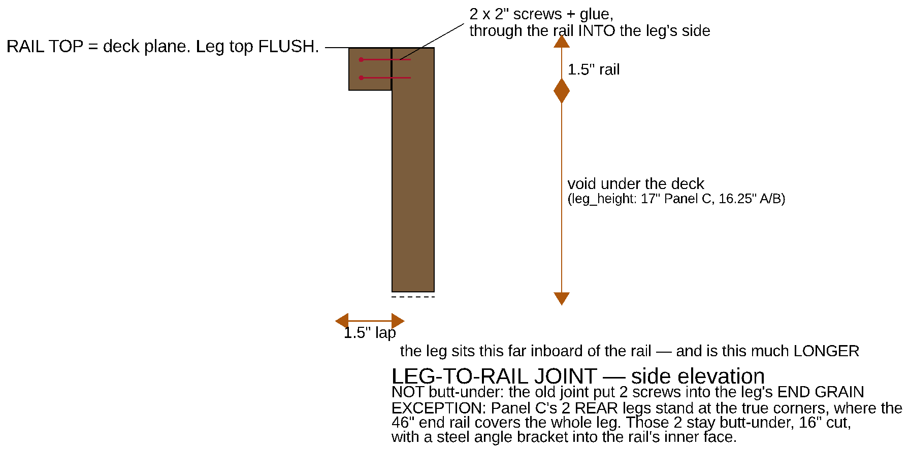
<figcaption>The lap, in side elevation with the end rail seen in section. The leg's top is <strong>flush with the rail top</strong> — the 18.5" deck plane — not stopped at the rail's underside. The 1.5" of leg above the void is what makes an A/B leg 16.75" and not 15.25". <strong>Do not butt the leg under the rail:</strong> that hangs the panel on two screws driven into the leg's end grain, where they have almost no withdrawal strength and glue does nothing.</figcaption>
</figure>

**The two exceptions** are Panel C's rear pair. They stand at the *true corners*, where the 46" end rail passes over the leg's whole 1.5" × 1.5" footprint — there is no rail face left to lap against, and they cannot move inboard because Panel C's width chain has only 1.28" of slack (the appliances have to slide past them). Those two are cut **16"** and butt under the rail, and they are the two legs that get a **steel angle bracket** into the rail's inner face to carry the load the lap carries everywhere else.

Leveling therefore lives **at the floor**, not between the frame and the platform. Every foot is exposed at floor level — tip the corner of the box slightly and spin the knob.

| | Panel A | Panel B | Panel C — front pair | Panel C — rear pair |
|---|---|---|---|---|
| Legs | 4 | 4 | 2 | 2 |
| Joint at the rail | lapped | lapped | lapped | **butt-under** |
| **Saw cut length** | **16.75"** | **16.75"** | **17.5"** | **16"** |
| Foot, nominal exposed | 1" | 1" | 1" | 1" |
| **Effective leg height** | **17.75"** | **17.75"** | **18.5"** | **17"** |
| Void under the deck (rail underside) | 16.25" | 16.25" | 17" | 17" |
| + top rail (2x2) | 1.5" | 1.5" | 1.5" | 1.5" |
| = rail-top height | 17.75" | 17.75" | 18.5" | 18.5" |
| What sits on the rails | 3/4" bed platform | 3/4" bed platform | deck is *recessed*, flush with the rails | (same deck) |
| **Sleeping surface** | **18.5"** | **18.5"** | **18.5"** | **18.5"** |

Two rows are doing the work here. The **void** row is the height under the deck — what the fridge, the drawer and the front wall are all sized against; it is unchanged by any of this. The **effective leg height** row is what you actually stand on the floor, and for a lapped leg it is the void *plus* the rail. Get one leg batch wrong and that panel's share of the mattress sits proud of its neighbour.

## 2. Cut list

| Piece | Qty | Cut length | Stock |
|---|---|---|---|
| Legs — Panel A | 4 | **16.75"** | 2x2 pine |
| Legs — Panel B | 4 | **16.75"** | 2x2 pine |
| Legs — Panel C, FRONT pair | 2 | **17.5"** | 2x2 pine |
| Legs — Panel C, REAR corner pair | 2 | **16"** | 2x2 pine |

**Total: 201" of 2x2.** Cut on their own that is three 8-ft (96") boards, the third barely touched; the full build instead packs the legs alongside the rails so the twelve boards still cover everything — see Appendix H of the full plan.

**Cutting plan, legs alone:**

- **Board 1** — 2 × 17.5" + 2 × 16" + 1 × 16.75" = 83.75", ≈84.4" with kerf. All of Panel C plus one A/B leg, so the odd lengths stay on one board and can't get mixed into the A/B pile.
- **Board 2** — 5 × 16.75" = 83.75", ≈84.4" with kerf.
- **Board 3** — 2 × 16.75" = 33.5". The remaining ~62" is rail stock, not waste.

**Before cutting:**

- Sight down each board and reject anything bowed or crowned — a leg is a short column, and a bowed one puts the load off-axis and racks the frame.
- Cut all four of one length in one setup, off a stop block. Legs that differ by 1/16" are legs the feet have to spend their travel correcting.
- Square ends matter more than exact length here: the bottom end grain takes a bore that must be perpendicular, and the top end has to finish flush with the rail top (or, on Panel C's rear pair, bear flat against the rail's underside).

## 3. Tools and consumables

| For | What |
|---|---|
| Cutting | Mitre saw or circular saw + square; a stop block for repeatable length |
| Boring | 1/2" brad-point bit (a spade bit wanders in end grain) **and** a small pilot bit; drill press or a drill guide/right-angle jig; blue tape for a depth flag |
| Boring, the fast way | **Two drills** — one holding the pilot bit, one holding the 1/2". Twelve legs is 24 bit changes if you run one drill; with two you never swap |
| Driving the insert | **10mm (1 cm) hex wrench** — it fits the insert's own hex drive, and this is what the build actually used. Alternative: a 3/8-16 bolt ~2" long + two 3/8-16 nuts (jam pair) and a wrench |
| Foot stack | 9/16" wrench (3/8-16 jam nut) |
| Frame | Drill/driver, 2" wood screws, wood glue, 12 × 2"–3" steel corner brackets |
| Test piece | A 6" 2x2 offcut — bore it and test-fit an insert before touching a real leg |

## 4. Step 1 — Cut the legs

Cut **8 at 16.75"** (mark them "A/B"), **2 at 17.5"** (mark them "C FRONT") and **2 at 16"** (mark them "C REAR"). Write the length on each leg in pencil on a face that will end up hidden. Keep the three batches physically separated on the bench — 16" and 16.75" are three-quarters of an inch apart and look identical in a pile.

Stack the four legs of one panel and check them end-to-end against each other. Panels A and B should form one flat plane with no daylight. **Panel C will not** — its front pair is deliberately 1.5" longer than its rear pair, and that is the correct result, not a miscut.

All three lengths are dimensioned on the shop drawing in Section 1.

## 5. Step 2 — Bore the insert hole

The same hole goes in every one of the 12 legs, in the **bottom** end grain:

<strong>1/2" diameter × 1-3/4" deep, dead centre of the 1.5" × 1.5" end grain.</strong>

<strong>1-3/4", not 7/8".</strong> The old number was sized for the insert alone — 3/4" of insert plus a little clearance. But the leveling bolt's <strong>stud</strong> passes straight through the insert and keeps going as the foot winds in. Bored only 7/8", the stud bottoms out on solid wood before the foot is anywhere near home, and the leg loses the bottom half of its adjustment. Bore the full <strong>1-3/4"</strong> so the foot can screw all the way in.

Bore it **before the leg goes into the frame** — once the frame is together the hole is nearly impossible to keep square, and squareness here is what keeps the finished foot vertical.

Method:

1. Mark the centre by drawing both diagonals of the end grain.
2. **Pilot first, then the 1/2".** A 1/2" brad point going straight into pine end grain wants to follow the grain; a pilot hole gives it a centre to track.
3. **Run two drills** — pilot bit in one, 1/2" in the other. Twelve legs means twelve pilots and twelve bores, and swapping one chuck 24 times is how the batch loses its afternoon.
4. **Flag the depth with tape on the bit.** Wrap blue tape at 1-3/4" and stop when the tape kisses the end grain. Measure from the bit's **full diameter**, not the brad point's tip — the tip is another ~1/8" ahead of the shoulder that actually cuts the 1/2" hole.
5. Bore on a drill press if you have one; otherwise use a drill guide. Freehand into end grain will wander.
6. Blow the chips out. A packed hole reads as "insert bottomed out" long before it has.

<figure class="photo-figure">
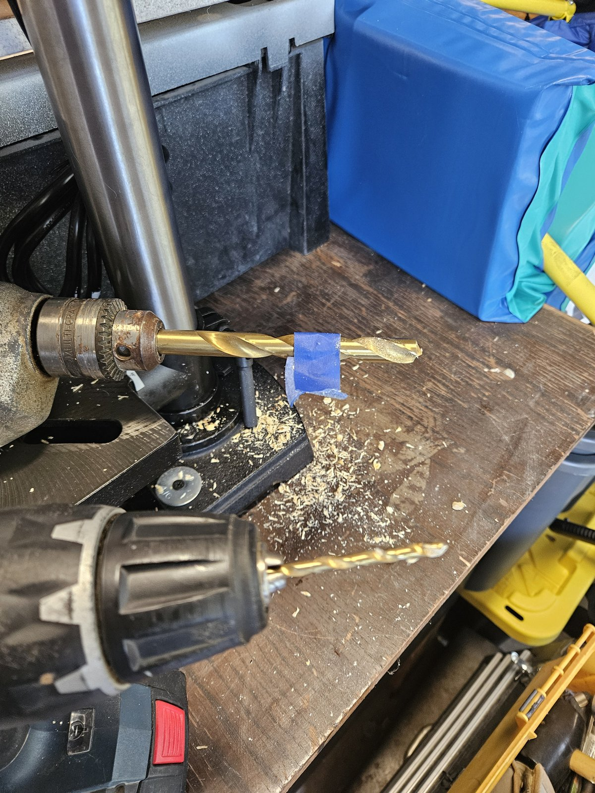
<figcaption>Two drills, so no bit ever gets swapped: the pilot bit on the right, the 1/2" brad point on the left with a <strong>blue-tape depth flag</strong> wrapped at 1-3/4". Bore the pilot, put that drill down, pick the other one up, bore to the tape.</figcaption>
</figure>

The **BOTTOM END GRAIN** view on the Section 1 shop drawing dimensions the hole and its centre; the Panel B sheet below repeats it in the context of the assembled panel.

<figure class="floorplan-figure">
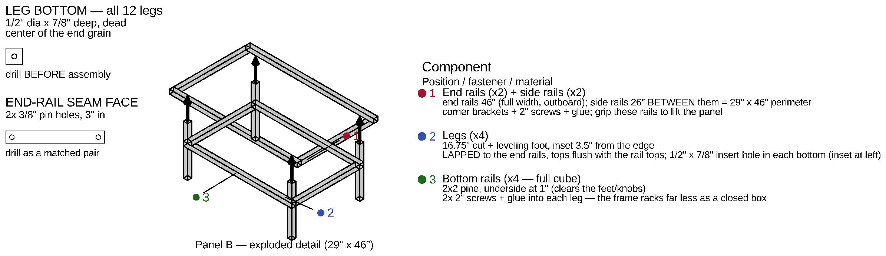
<figcaption>Panel B, exploded — the <strong>LEG BOTTOM</strong> inset at top left is the bore, drawn at 3× and dimensioned. It is the same hole on all 12 legs of all three panels. (The second inset below it is the end-rail alignment-pin hole, which is Component 5's job, not the legs'.)</figcaption>
</figure>

## 6. Step 3 — Drive the threaded insert

The insert is the screw-in type: a **7/16" OD coarse outer wood thread** with a **3/8-16 bore**, and a 5/8" flange that seats on the end grain.

1. **Test-fit in an offcut first.** Bore a scrap 2x2 to the same 1/2" × 1-3/4" and drive an insert into it. End grain in soft pine can split; if it does, the fix is a slightly larger pilot, not more force.
2. **Drive it with a 10mm (1 cm) hex wrench** in the insert's own hex socket. That is the size — not 3/8", not 7/16" — and it is the one tool on this list you are least likely to already have out. A long-arm key gives the leverage to start it into end grain.
3. Keep the wrench square to the end grain as it starts. The first two turns set the angle for all of them, and a crooked insert is a crooked foot you cannot straighten later.
4. Drive it until the flange sits **flush** with the end grain — not proud, or the leg will rock on it, and not sunk, or you lose thread engagement.

<figure class="photo-figure">
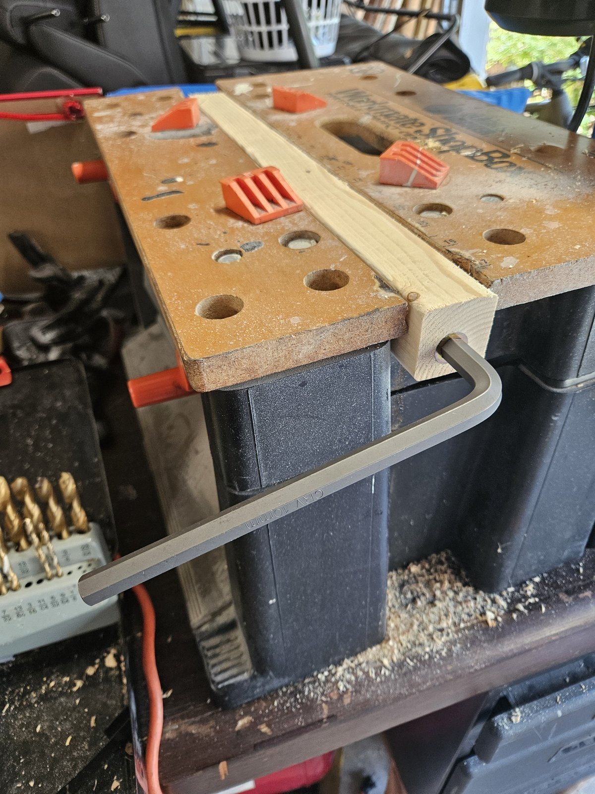
<figcaption>Driving the insert with the <strong>10mm hex wrench</strong> ("CRV 10mm" on the shaft), leg clamped in the bench so both hands are free to keep the key square. The insert's own hex drive is what the wrench engages.</figcaption>
</figure>

**The bolt-and-jam-nut alternative.** If your inserts have a slot rather than a hex, lock two 3/8-16 nuts against each other on a spare bolt, thread the insert onto the bolt up to the jammed nuts, and drive the assembly with a wrench on the bolt head; back the bolt out afterwards by holding the lower nut and turning the upper one loose. It keeps the insert square just as well — it is only slower.

## 7. Step 4 — Assemble the leveling foot

Five parts per foot, twelve feet. The exploded column on the drawing is keyed **A–E** and that is also the assembly order:

<figure class="floorplan-figure">
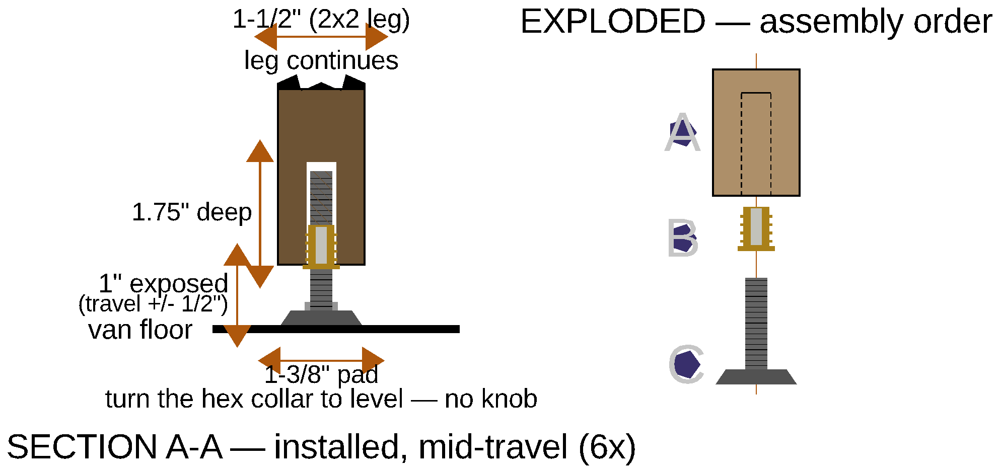
<figcaption>Leg leveling foot — <strong>section A-A</strong> installed at mid-travel (6× actual size), the <strong>exploded</strong> assembly order A–E, and the <strong>knob top view</strong>. Dimensions on the sheet: 1-1/2" leg, 1-3/4" deep bore, 1" exposed foot (travel ±1/2"), 1-3/8" floor pad, 2" knob.</figcaption>
</figure>

| Key | Part | What it is / what to do |
|---|---|---|
| **A** | The leg | Bored 1/2" dia × **1-3/4"** deep, centred, per Step 2 |
| **B** | Screw-in threaded insert | 7/16" OD outer thread, 3/8-16 bore. Driven flush on a spare bolt + jam nut, per Step 3 |
| **C** | 3/8-16 jam nut | Spin it ~1" up the stud. This is what locks the knob |
| **D** | PW6103 star knob (hand wheel) | ~2" dia, 3/8-16 thru-hole. Thread it up to the nut, then wrench the nut **down** onto it to lock the two together |
| **E** | Leveling stud + fixed hex collar + pad | 1-3/8" floor pad. Screw the stud into the insert to **1" exposure** |

<strong>Lock the knob with the JAM NUT, wrenched down on top of it — never by jamming the knob against the stud's fixed hex collar.</strong>
Jammed on the collar, the knob only grips in the tightening direction: the first time you spin it the other way to <em>lower</em> a corner, it unscrews itself off the stud instead of driving it. Knob and jam nut locked to each other grip in <strong>both</strong> directions, so one knob both raises and lowers the leg.
The hex collar's actual job is to be a wrench flat, so you can break a seized foot loose later.

<figure class="photo-figure">
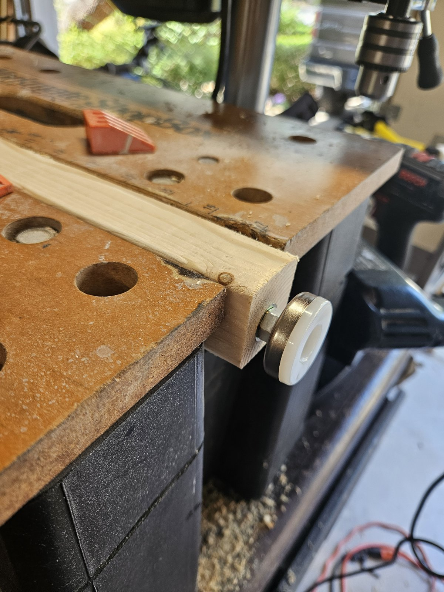
<figcaption>The foot threaded home into the insert — stud, fixed hex collar, and the 1-3/8" pad. Almost none of the stud is showing, which is the whole reason the bore has to be 1-3/4": all of that length is inside the leg.</figcaption>
</figure>

**Skip the kit's stick-on pads.** The bare nylon pad grips the van floor better and doesn't shed — that call was re-confirmed in Sept 2026. The foot in the photo above is how one should leave the bench: nothing stuck to its face.

**The feet, for re-ordering.** The pack's barcode label reads **X002FCXYQT** — "Furniture Leg Leveler", 198 g per pack. That is an Amazon-style seller barcode (the `X00…` prefix), not a manufacturer UPC: it will find the listing again on Amazon, but it will not scan in a store. Photograph the bag before you throw it out.

<figure class="photo-figure">
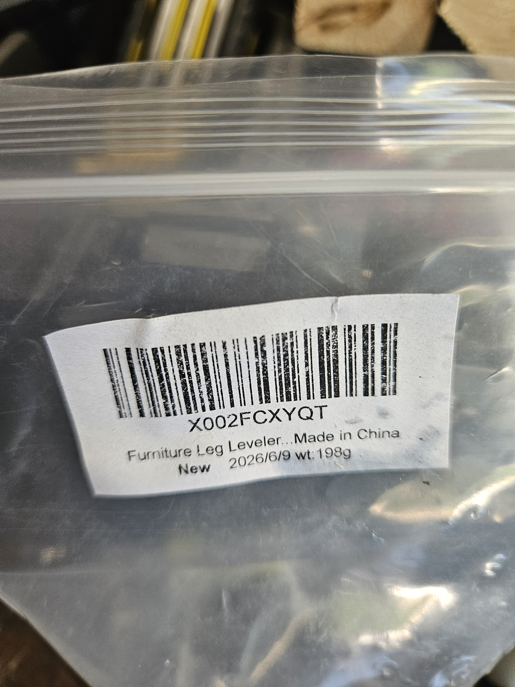
<figcaption>The pack label: <strong>X002FCXYQT</strong>, "Furniture Leg Leveler … Made in China", 198 g. The code to re-order by if a foot goes missing.</figcaption>
</figure>

<figure class="floorplan-figure">
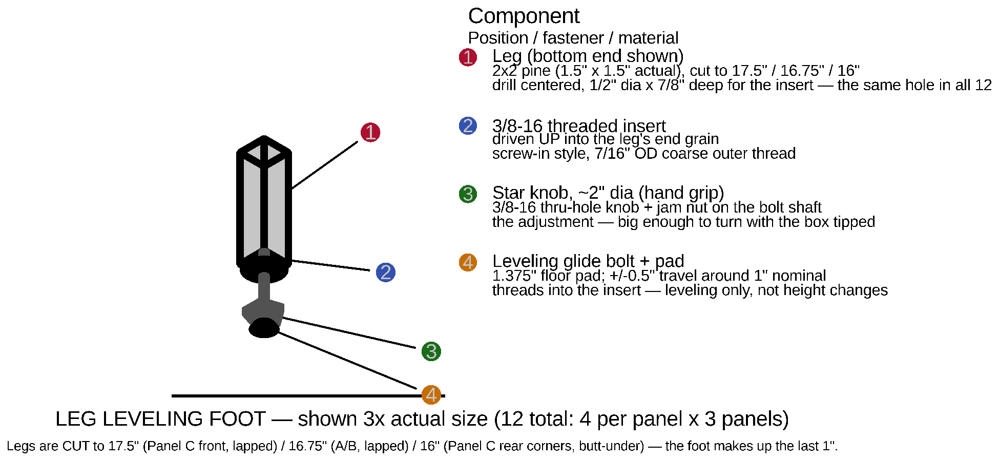
<figcaption>The same foot as a component call-out: <strong>1</strong> the leg, <strong>2</strong> the threaded insert driven up into the end grain, <strong>3</strong> the star knob + jam nut (the adjustment — big enough to turn with the box tipped), <strong>4</strong> the leveling glide bolt and its 1.375" pad, ±0.5" of travel around the 1" nominal. Shown 3× actual size.</figcaption>
</figure>

**Set every foot to 1" exposure before the panels go in the van.** That is mid-travel, and it means the first real leveling pass has adjustment available in both directions. Feet set at the ends of their travel are feet that can only correct one way.

## 8. Step 5 — Set the legs into the frames

Legs go in as part of each panel's frame, before anything else — with the insert already driven (Step 3) and, ideally, the foot already fitted (Step 4).

**Position, all three panels:**

- **Across the width (46"):** legs are inset **3.5"** from each deck side edge, so their outer faces sit 3.5" in and the pair stands 39" apart outside-to-outside. The inset clears the van's floor-level rear heat-vent intrusion, measured at 3.5" per side (V4, Aug 2026 — it was 2.5" in earlier revisions of the plan; use 3.5").
- **Along the length:** a lapped leg sits **1.5" inboard**, its outer face against the **inner** face of its end rail, top flush with the rail top. That is 1.5" further in than the old butt-under position, and the **bottom rails move in with it** — they screw into the legs, so they sit on the same line.
- **Exception 1 — Panel C's REAR pair, position:** those two go at the **true corners**, not inset across the width. The fridge and kitchen slide paths pass exactly where an inset rear leg would stand. The rear-corner floor vents were checked (Aug 2026) and do not reach the leg area, so those legs land on solid floor.
- **Exception 2 — Panel C's REAR pair, joint:** the same two legs are the only ones **butted under** the rail (16" cut, not 17.5"). At a true corner the 46" end rail covers the leg's whole footprint, so there is nothing to lap to. Give each of those two a steel angle bracket into the rail's inner face — that bracket is doing the job the lap does everywhere else, so do not skip it.

<figure class="floorplan-figure">
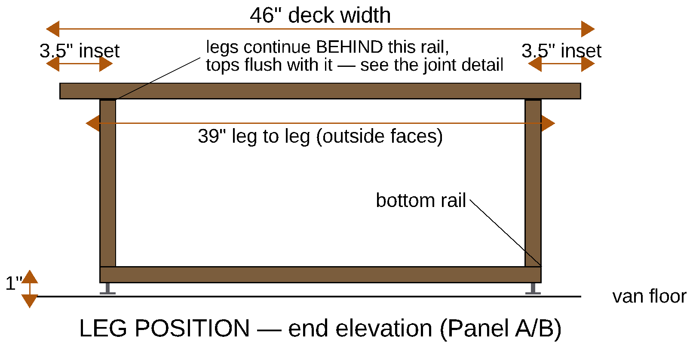
<figcaption>Leg position, end elevation (Panel A/B shown — Panel C is identical except its rear pair). <strong>3.5" inset per side</strong>, <strong>39" leg to leg</strong> across the 46" deck, and the bottom rail's underside level with the leg bottoms, <strong>1"</strong> above the floor. The feet are what stand on the van floor; the leg bottoms never touch it. In this projection the legs are <em>behind</em> the end rail, so they are drawn stopping at its underside — they actually run on up flush with the rail top (Section 1's joint detail).</figcaption>
</figure>

**Joinery — the one place in the build with no biscuits:**

Every 2x2 frame joint — rail-to-rail, rail-to-leg, bottom-rail-to-leg — is <strong>2 × 2" wood screws + glue, plus a steel corner bracket</strong>. A biscuit would blow out 1.5" stock.

Twelve corner brackets total, four per panel, at the rail-to-rail corners. **Panel C's 2 rear corner legs need 2 more brackets on top of that** — they are the butt-under pair, and the bracket is their only withdrawal resistance. Buy 14.

On a lapped leg the two screws go through the **rail's face** into the leg's side, not down through the rail into the leg's end. Clamp the leg to the rail with its top flush before you drill: the top face is the reference surface for the whole deck plane, and 1/16" of leg standing proud of the rail is 1/16" of rock under the mattress.

**Bottom rails.** Each panel gets 2x2 bottom rails with their **underside at 1"** — level with the leg bottoms, i.e. as low as they go without fouling the feet and knobs below. Two 2" screws + glue into each leg. Which faces get one differs by panel, and it is about what has to exit the panel sideways:

| Panel | Bottom rails | Why |
|---|---|---|
| A | 2 × 46" — **END faces only** | The side faces stay open: the DELTA 3 drawer and the WAVE 3 exit there at floor level |
| B | 2 × 46" + 2 × 26" — **all four faces, the full cube** | Nothing exits Panel B sideways, so every face closes. This is the stiffest frame of the three |
| C | 1 × 46" — **FRONT face only** | The tailgate face stays open for the fridge and kitchen unit |

Panels A and B also each get **2 diagonal corner braces** up top, which recover some of the racking rigidity they lost when their own tops were deleted.

### Panel A

<figure class="lego-figure">
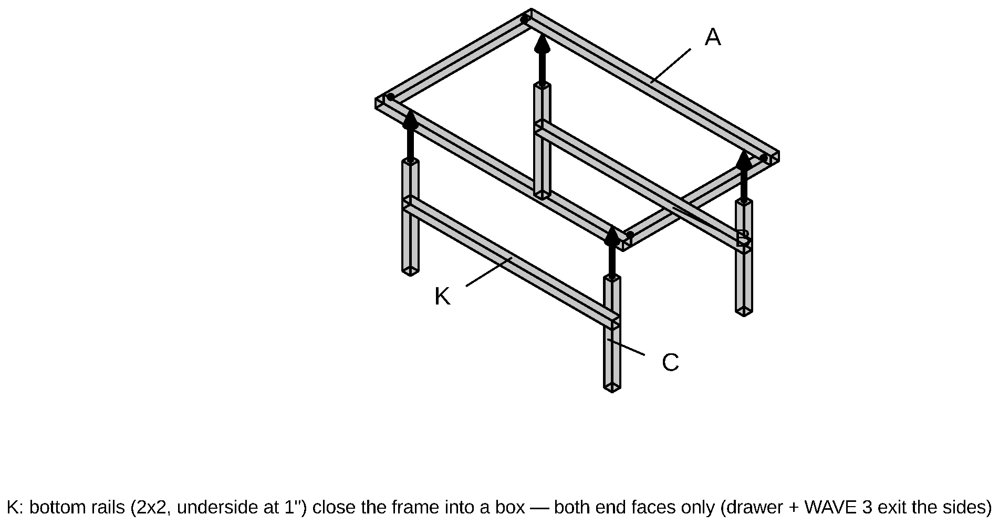
<figcaption>Panel A, frame step: 2 side rails (B, 26") dropped BETWEEN 2 end rails (A, 46" — the outboard pair) with corner brackets and 2" screws, then the 4 legs (C) cut to <strong>16.75"</strong> and bored, lapped to the end rails' inner faces with their tops flush, then the 2 END-face bottom rails (K, 46") and the 2 diagonal corner braces.</figcaption>
</figure>

<figure class="floorplan-figure">
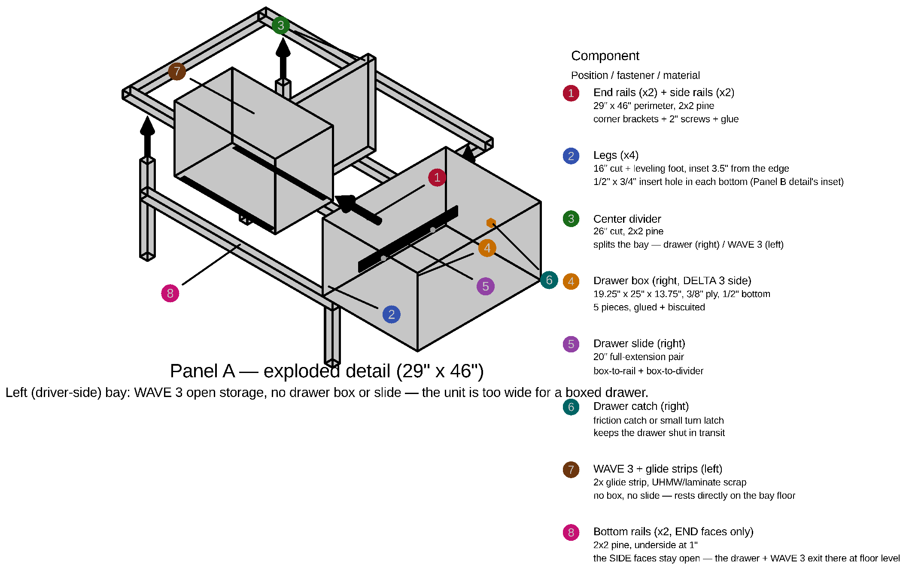
<figcaption>Panel A exploded — item <strong>2</strong> is the legs, item <strong>8</strong> the END-face bottom rails.</figcaption>
</figure>

### Panel B

<figure class="lego-figure">
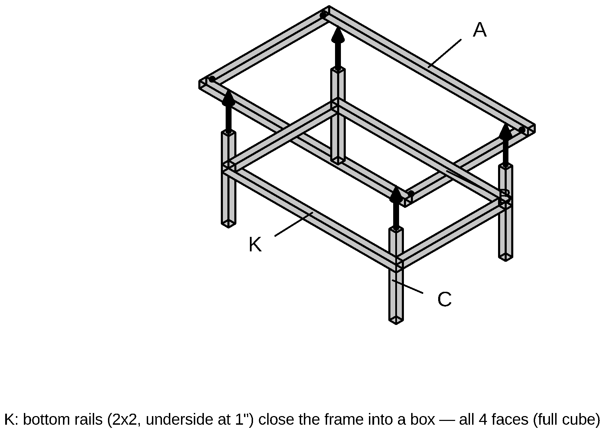
<figcaption>Panel B, frame step — identical to Panel A's except the bottom rails close <strong>all four</strong> faces (2 × 46" + 2 × 26"). Same 16.75" legs, same 3.5" inset — but its 4 side bottom rails are <strong>23"</strong>, not 26", since the lapped legs moved 1.5" inboard at each end. That is the entire panel: no divider, no drawers.</figcaption>
</figure>

### Panel C

<figure class="lego-figure">
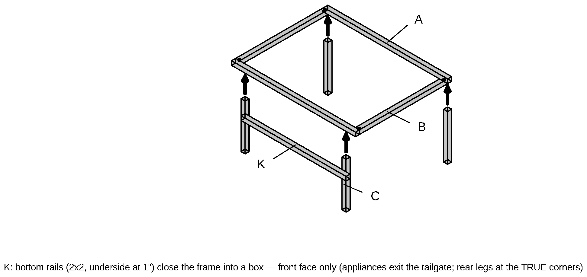
<figcaption>Panel C, frame step: 32.75" side rails (B) between the 46" end rails (A), 4 legs (C) in two lengths — <strong>front pair 17.5" and lapped, inset 3.5"; rear pair 16" and butt-under, at the TRUE corners</strong> — and the FRONT-face bottom rail only (46").</figcaption>
</figure>

<figure class="floorplan-figure">
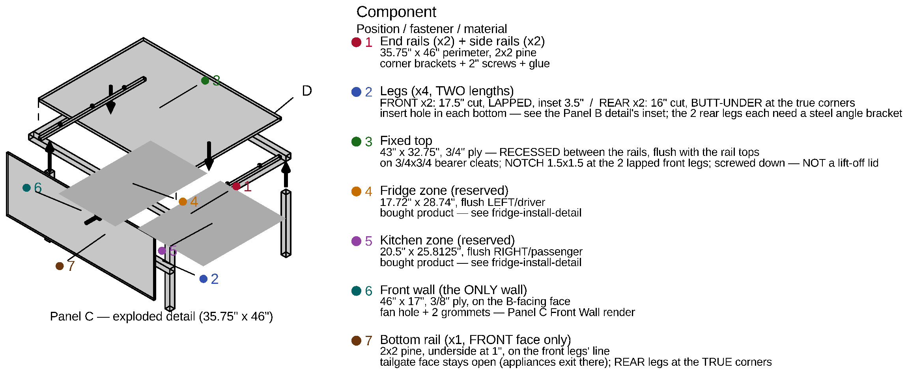
<figcaption>Panel C exploded — item <strong>2</strong> is the legs, item <strong>7</strong> the single front-face bottom rail. Note the rear legs standing at the true corners so the appliance slide paths stay clear.</figcaption>
</figure>

## 9. Leveling the finished boxes

The interior feet are a **one-time set**, not a per-site chore. Per-site leveling happens at the **wheels**, with leveling blocks driven by the Block Calculator (Appendix E of the full plan). The feet exist to take out the van's own floor irregularities, once.

To set them:

1. Put all three panels in the van, in position, with the bed platform resting on Panels A and B.
2. Put a level on the platform. The build's two stick-on bar levels read the same thing permanently: **pitch** on the platform's driver-side rail edge, **roll** on the rear-pantry deck edge.
3. Kneel at the side door, **tip that corner of the box slightly**, and spin that leg's star knob. Every foot is exposed at floor level — nothing boxes it in.
4. Work around the corners until both bubbles centre. Re-check with the van parked on ground you know is level.
5. After that first setup you should not need to touch a knob again.

If you would rather delete the feet entirely, fixed shims set once will do the same job and let the wheel blocks handle all site leveling — it saves ~$72 and loses the fine-trim option.

## 10. Load check

Worst case for the whole build is roughly **700 lb** — two people, mattress, platform, boxes and cargo — spread over 12 feet, so about **58 lb per foot** before dynamic factors.

<strong>Two ratings appear in the full plan, and they are not the same part.</strong>
The BOM line specifies a generic 3/8-16 furniture-leveler kit rated <strong>330 lb per foot</strong>. The parts actually purchased in July 2026 are <strong>Anwenk levelers, rated 1,320 lb per foot</strong>. Both clear the load by a wide margin — 5.7× on the generic kit, 22× on the Anwenk — so this does not change how you build. It is flagged here only so you order the right thing: <strong>check what is actually on the shelf before buying more.</strong>

The feet are not the weak point of this build under any of those numbers. If you want still more margin, 1/2"-13 leveling mounts are a drop-in upgrade — the same install, just a 5/8" insert bore instead of 1/2".

## 11. Shopping list — legs only

| Item | Qty | Note |
|---|---|---|
| 2x2 pine, 8 ft | 2 boards | Of the 12 the full build buys. Aluminum 1"×1" L-channel is the documented alternative |
| Leg leveling feet, 3/8-16, with threaded-insert ("T-nut") kit | 12 | 3 × 4-packs. See the rating note in Section 10 before ordering |
| Star knobs, 3/8-16 thru-hole, ~2" dia | 12 | 3 × 4-packs — Peachtree PW6103 |
| **3/8-16 jam nuts** | **12** | **Bought separately — they are not in either kit.** Everbilt 6-packs, 2 packs |
| Steel corner brackets, 2"–3" | 12 | 4 per panel |
| 2" wood screws | — | 2 per frame joint, 2 per bottom-rail-to-leg joint |
| Wood glue | — | Every frame joint |

The jam nuts are the part this build has repeatedly nearly forgotten — they are not supplied with the levelers or the knobs, and without them the knob cannot lock. Count them before you start.

## 12. Where these numbers come from

Everything here is generated from or checked against the parametric model:

| Value | Source |
|---|---|
| Leg cut 17.5" / 16.75" / 16" | `params.scad` — `leg_cut_length`, `leg_cut_length_ab`, `leg_cut_length_corner` |
| Effective 18.5" / 17.75" / 17" | `params.scad` — `leg_length`, `leg_length_ab`, `leg_length_corner` |
| Void under the deck 17" / 16.25" | `params.scad` — `leg_height`, `leg_height_ab` |
| The 1.5" lap | `params.scad` — `leg_lap` = `frame_rail_sz` |
| Foot 1" nominal, ±1/2" travel | `params.scad` — `leveling_foot_nominal_h`, `leveling_foot_travel` |
| Bore 1/2" dia × 1-3/4" deep | `params.scad` — `leveling_bore_dia`, `leveling_bore_depth` (both drawings read them) |
| 10mm hex to drive the insert | MEASURED in the shop (owner, Sept 3 2026) |
| Feet: pack barcode X002FCXYQT | The bag's own label (owner photo, Sept 3 2026) |
| Pad 1.375" dia | `params.scad` — `leveling_foot_pad_dia` |
| Leg inset 3.5" | `params.scad` — `leg_inset` = `vent_intrusion_width`, MEASURED V4 (Aug 2026) |
| Bottom rail underside 1" | `params.scad` — `bottom_rail_z` |

**The leg lengths changed in Sept 2026 — if you have an older copy, throw it away.** The legs are now **lapped** to the rails rather than butted under them (owner, Sept 2026), which added 1.5" to ten of the twelve legs and moved them 1.5" inboard along each panel's length. Everything that followed from that:

- **Every leg got longer.** A/B 15.25" → **16.75"**; Panel C's front pair 16" → **17.5"**. Panel C's rear corner pair stays at **16"** — it is the one pair that cannot be lapped.
- **The deck plane did not move.** It is still 18.5", and the void under it is still 17" (Panel C) / 16.25" (A/B), so the fridge, the drawer height and Panel C's front wall are all untouched.
- **Panel A's drawer lost 3" of depth** — 25" → **22"** — because the lapped legs at both ends narrowed the bay's fore-aft clear span from 26" to 23". The DELTA 3 stack is 15.7" deep against 20.5" of clear interior, so this spends slack, not margin.
- **Panel B's side bottom rails** are now **23"**, not 26", for the same reason. The 46" end-face bottom rails are unchanged in length; they just sit 1.5" further in.
- **Panel C's front wall** moved 1.5" inboard with the front legs it screws into.
- **2x2 lumber** went from 1,009.5" to 1,018.5" over the same 34 pieces — still twelve boards, but the Appendix H packing table is re-cut.

**Corrections applied Sept 2026 while assembling this subset.** Three leg dimensions were stale in places in the full plan and in the panel-detail drawings, and are corrected in both:

- The **Panel A and Panel B parts lists** called for Panel C's leg length. They have always been their own, shorter length — `leg_cut_length_ab`, now 16.75" after the lap. The panel-detail drawings inherited the same error (they read `leg_cut_length` for all three panels) and have been re-rendered.
- The **insert bore depth** was quoted as 3/4" in the Floor Panel Detail note and on the Panel A/B/C drawings, then 7/8" everywhere. Boring the real thing showed both were short: it is **1-3/4"**, because the depth has to clear the foot's whole stud, not just the insert.
- The **Hardware Sizing** row gave only Panel C's cut; it now gives all three.

**One thing left open, and it is not a leg dimension.** The full plan's frame-lumber table cuts the end-face bottom rails at **46"** — full deck width, matching the end rail above them — while `panel_detail.scad` draws them spanning only leg-to-leg, **39"**. Either length does the bottom rail's job, which is to tie the leg bottoms together with 2 × 2" screws and glue into each leg, and neither changes anything about the legs themselves. Settle it before you cut bottom rails; cutting them at 46" leaves you the option of trimming. The drawing above deliberately carries no length dimension on that rail.
