# Project Smores — Full Build Plan

Two-person setup, 2nd row seats **removed entirely** (3rd row folded flat; seat removal/reinstall procedure incl. the SRS airbag emulators: Section 9). Layout, tailgate to front seats: **Kitchen (Panel C's fridge/kitchen void) → Headboard/pantry (mounted on Panel C's own deck) → Bed (Panel B + Panel A) → front seats.** The headboard/pantry is no longer its own module — it's a double-sided shelving unit, clamped down to Panel C's existing deck with cam levers at the tailgate end and braced by 2 steel L-angle sway braces tied into Panel C's own side rails: 3 fixed tiers plus an adjustable shelf in the tall bottom bay, with an enclosed bed cubby facing the mattress in the middle tier. Panel A and B have no top of their own (capped by the one-piece bed frame), while Panel C keeps its fixed top — all three on uniform legs, forming one continuous deck with 80" of sleeping length for the HEST Dually Long mattress (78" x 50" x 4") (Panel A now sits flush with the front seatbacks, using up the floor space that used to sit empty in front of it). Panel B is a bare-frame deep-storage bay — the side doors don't reach it, so it has no drawers and loads from above by lifting the platform; Panel A holds a right drawer (EcoFlow DELTA 3) plus a left open-storage bay (EcoFlow WAVE 3, no drawer box); Panel C's under-deck void instead houses a real BougeRV compressor fridge and a real JAGAHAHA slide-out camp kitchen, both on heavy-duty slides pulling straight out the open tailgate — bought products, not built from plywood — plus a shallow slide-out **kitchen drawer** hung under the deck in the dead air above the kitchen unit. The fridge and its cooling fans run off the EcoFlow DELTA 3 stack (Panel A) via their own DC line, so they keep running when people are away from the van regardless of ignition state; the DELTA 3 itself gets AC-charged from the front console outlet while driving, alongside the induction cooktop's own cord and Power strip 1's own cord (now a long run too, since the headboard/pantry it's mounted on is at the tailgate end, not the front).

## 0. Measurements to Take

**Start here once you have the van (2nd row out), the fridge, and the kitchen unit in hand.** Every number below either says UNVERIFIED somewhere in this plan (an estimate that drives real cut dimensions) or came from an online listing/photo rather than a hands-on measurement. All of them feed directly into [`params.scad`](params.scad) — update the value there, re-run `./render.sh`, and every diagram, cut list, and BOM total in this plan updates to match. If a measurement comes in smaller than the estimate, the `assert()` guards in `params.scad` will fail loudly (not silently overflow the van) until the design is adjusted.

### The van (once the 2nd row is physically out)

| # | Measure | Goes in `params.scad` as | Current estimate | Your measurement |
|---|---|---|---|---|
| 1 | Interior length, closed hatch to front seatbacks | `van_interior_length` | 96" — UNVERIFIED | |
| 2 | Interior width, between wheel wells | `van_interior_width` | 48.5" — already verified | |
| — | Interior height, floor to headliner | `van_interior_height` | 44" — already verified | |
| 3 | Vent intrusion width, each side (floor level) | `vent_intrusion_width` | 2.5" — already verified | |
| 4 | Hatch curvature clearance | `hatch_curvature_clearance` | 2" — already verified | |
| 5 | Gate opening width — the narrowest point, not the widest | `gate_opening_width` | 48" — UNVERIFIED | |
| — | Interior wall-to-wall width at ~19" AND ~23" above the floor, along the whole 80" sleeping run | gates `bed_frame_width` (52" platform needs >=53" at platform height — the 48.5" figure is the FLOOR pinch between the wheel wells; the walls are wider up here) | — UNVERIFIED, the platform-width gate | |
| 6 | Gate opening height — where the rounded corners start cutting in | `gate_opening_height` | 36" — UNVERIFIED | |
| 7 | Side door opening width (fore-aft span) | `side_door_opening_width` | 40" — UNVERIFIED | |
| 8 | Side door opening height | `side_door_opening_height` | 40" — UNVERIFIED | |
| — | Rear 12V accessory outlet — exact position | (no longer used by this design — the fridge and fan system now run off the DELTA 3 stack instead, Section 1. Informational only, not a blocker.) | — | |
| — | Front console AC outlet — wattage rating | (Section 1/7 — drives the DELTA 3's AC charge rate and the cooktop's power check) | **1500W — VERIFIED** | 1500W |
| — | Front console — how many physical AC outlets (1 or 2)? | (Section 5 — the cooktop, Power strip 1, and the DELTA 3's charging cord are now 3 independent lines wanting console power; if there's only 1 physical outlet, or even with 2, a splitter combines them — no change to the wiring itself, just shared wattage budget, see Section 5's shared-circuit note) | — | |
| — | Folded 3rd-row well depth | (confirms `leg_height` — 17", fridge-driven — actually clears it) | — | |
| — | Factory sunroof present? Opening size if so | (only relevant if you pursue a roof vent later) | — | |
| 9 | Cargo floor level — does it slope front-to-back, or is it flat? | (not currently modeled — every module's 4 legs are the same `leg_height`, which only gives a level deck if the floor itself is level) | assumed flat — UNVERIFIED | |
| — | Side sliding door — usable clear width AND height at the door's actual stopping point, not just the rough opening | `side_door_opening_width` / `side_door_opening_height` | 40" / 40" — UNVERIFIED (see the reachability note in Section 1 — this number decides whether the DELTA 3 stack stays in Panel A or needs to move) | |

### The fridge (BougeRV) and kitchen unit (JAGAHAHA), once purchased

| # | Measure | Goes in `params.scad` as | Listing spec (unverified) | Your measurement |
|---|---|---|---|---|
| 1 | Fridge length as installed (left-right, the 450mm side) | `fridge_ext_length` | 17.72" | |
| 2 | Fridge depth, front to back incl. handles | `fridge_ext_width` | 28.74" (body 28.03") | |
| 3 | Fridge height | `fridge_ext_height` | 15.79" | |
| 4 | Which side is the compressor/vent on? | (confirms the intake/exhaust fan placement in Section 2 still makes sense) | — | |
| 5 | Fridge empty weight | (Section 8 weight table) | 40.6 lb (18.4 kg, manual) | |
| 5b | Floor vents at Panel C's REAR corners | Panel C's rear legs sit at the TRUE corners now | must be vent-free for ~4" | |
| — | Fridge cord length | (confirms it reaches the new DC line's connection point inside Panel C's void — Section 5) | — | |
| — | Fridge slide clearance — how far it must come out before the lid opens fully | `fridge_slide_length` (confirms 24" is enough) | 24" slide | |
| 6 | Kitchen unit width, closed | `kitchen_box_width` | 20" | |
| 7 | Kitchen unit length, closed | `kitchen_box_length` | 26" | |
| 8 | Kitchen unit height, closed | `kitchen_box_height` | 11.8" | |
| 9 | Stove tray length x width x clearance height | (Section 7 — the COOKTRON cooktop's fit depends on this; the current numbers came from listing photos, not a spec sheet) | 23" x 15.7" x 5.7" | |
| 10 | Kitchen unit empty weight | (Section 8 weight table) | ~45 lb | |
| — | Cord pass-through location for the cooktop's power cord | (Section 5/6 cord routing) | — | |
| — | Confirm it still extends to ~70" open | (sanity check — this happens outside the vehicle, doesn't affect interior length) | ~70" | |

---

## Renders

Parametric 3D model: [`platform.scad`](platform.scad) (dimensions in [`params.scad`](params.scad) — edit one file to regenerate every view via `./render.sh`).

| Top-down | Side profile |
|---|---|
| 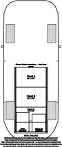 |  |

The interior envelope used for fit checks (Section 1: 96" x 48.5" x 44" — the 96" length is an UNVERIFIED estimate) is a simplified rectangular box — the real hatch curvature, vent shapes, and wall taper aren't modeled beyond the reserves called out in `params.scad`.

Rear view, looking forward from the open tailgate at Panel C with the fridge and kitchen unit both stowed for driving: 

### Fridge Installation Detail

The rear view above is too small-scale to label the fridge's 2 cooling fans and temperature sensor clearly. This top-down detail of Panel C zooms in on just that area, with numbered markers and a coordinate list (see Section 2 for the coordinate system and the full component coordinate table):

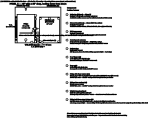

And the electrical side — a schematic (not to physical scale) of how the fridge, both fans, and the NTC sensor are powered and wired:

The fridge's slide mechanism itself, closed vs. fully extended, with the E-track floor anchors it bolts to:

The utility cabinet door that closes off the gap between the kitchen unit and the fridge, exploded so the 2 hinges and magnetic catch each get their own numbered marker (companion to item 8 in the fridge install detail above):

The kitchen drawer — a shallow slide-out drawer hung under Panel C's deck in the dead air above the kitchen unit (11.8" unit, 17" clear void), riding a 24" full-extension slide pair and pulling out the open tailgate; ~3.5" clear inside for utensils, cutting board, flat dry goods, and the cooktop's griddle plate:

### Headboard Storage Detail

The headboard/pantry's shelving, mounted on Panel C's deck at the tailgate end — exploded isometric detail: the shell (just the 2 side panels — no full-height divider, no top) lifted slightly to show the cam-lever clamp-down base cleats, the 2 fixed full-depth shelves plus the pin-mounted adjustable shelf pulled out along their installed axis, and the nook divider hovering over its middle-tier slot (sway braces in the Sway Brace Detail view below):

All 4 sides of the headboard/pantry as flat, dimensioned elevations — mattress-facing (what you see from the bed: the enclosed bed cubby in the middle band, open food tiers above and below), kitchen-facing (the food tiers with their fiddle lips + lash straps, what the rear view above looks at), and both 14"-deep sides — every piece labeled with its material and cut size:

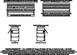

How the tall unit is kept from rocking fore-aft under braking: one steel L-angle brace per side, from ~20" up the side panel down at ~45° to Panel C's OWN side rail. (Re-anchored from Panel B: the flush bed platform now caps Panel B's rails right where the old arms landed — and this way Panel B lifts out without touching the braces at all.)

### Floor Panel Detail

Each floor panel, exploded (Panel A: frame + legs + center divider + one right drawer, left bay is WAVE 3 open storage; Panel B: a bare cube frame — no divider or drawers; Panel C: no divider or drawers — the fridge/kitchen units live in its void, shown here as reserved footprint):

### Bed Platform Detail

Component 2's one-piece slatted bed platform (58" x 52", 8 slats pocket-screwed between two full-length 1x4 side rails — one flush 3/4" plane, cantilevered 3" past the boxes on each side), exploded. Per-site leveling is done at the WHEELS with blocks (Block Calculator, Section 6); the interior leg feet are a one-time set. It rests DIRECTLY on Panel A/B's top rails and ENDS at the B/C seam — Panel C's own fixed deck sits at exactly the same surface height, so the two meet flush and the mattress's last ~20" rides that deck. It lifts straight off; leveling happens at the leg feet, down at the floor, and an RV bar bubble level screwed to the driver-side rail's outer edge reads fore-aft pitch while you turn the knobs (its twin on the headboard nook reads roll):

### Leg Leveling Foot Detail

Leveling lives at the floor: each leg is cut 1" short and gets a 3/8-16 insert in its bottom end grain, taking a leveling glide bolt with a floor pad and a ~2" star-knob hand grip (12 total: 4 per panel x 3). Effective leg height stays 17", but dropping the old between-layers adjusters and platform battens buys 1.25" of extra headroom. To adjust: tip that corner of the box slightly and spin the knob — every leg is exposed at floor level:

**Load**: worst case is ~700 lb total (2 people + mattress + platform + boxes + cargo) spread over 12 feet — ~60 lb per foot against the feet's 330 lb rating each, a 5x margin before dynamic factors. The feet are not the weak point. If you want more margin anyway, 1/2"-13 leveling mounts (1,100 lb each) are a drop-in upgrade — same install, just a 5/8" insert hole instead of 1/2".

**Access**: the practical answer is to stop crawling under the bed at camp entirely — **level the VAN at the wheels** (Andersen/Camco-style curved ramps, standard van-life practice) each site, and set the interior feet ONCE against the van's own floor irregularities. After that first setup you shouldn't need to touch a knob; the two bubble levels tell you at a glance whether the wheels need a ramp.

**Blocks + calculator (the no-feet workflow)**: the two bubble levels read DEGREES (-7 to 7). Degrees plus the wheelbase are all the math needs, so there's a phone calculator for it — **[Sienna Block Calculator](https://claude.ai/code/artifact/149333c6-8f02-47a2-915f-52d26d9059d9)** (also saved in the repo as `leveling_calculator.html`): enter the two readings and which end/side is low, and it returns how many Lynx-style leveling blocks to stack under each tire, the total, and the residual tilt after driving up. One 10-pack of blocks covers ~2.9° of correction at 1.5"/block over the 120.5" wheelbase — beyond ~4 blocks per tire, find a flatter spot. This makes the interior feet a ONE-TIME set (against the van's own floor irregularities), not a per-site chore — and if you'd rather delete the feet entirely, replace them with fixed shims set once and let the blocks do all site leveling (saves ~$72, loses the fine-trim option).

**Installing the calculator on a phone** (two ways):

1. *Online*: open the [calculator link](https://claude.ai/code/artifact/149333c6-8f02-47a2-915f-52d26d9059d9) in Chrome on the phone (it needs the claude.ai login), then Chrome menu → **Add to Home screen** — it gets an icon and opens full-screen. Needs signal at launch.
2. *Offline — the one to rely on at camp*: `leveling_calculator.html` is a single self-contained file with zero network dependencies. Send the copy from this repo (or `~/Downloads/sienna_block_calculator.html`) to the phone by email/Drive/Nearby Share, open it once via **Files → Open with → Chrome**, and bookmark it. It runs with no signal forever and remembers the settings below.

**Using it at a site:**

1. Park in the spot you actually want, engine off, **parking brake on**.
2. Read the two bed-mounted levels: the fore-aft level on the platform's driver-side rail (pitch) and the side-to-side level on the headboard nook (roll). Each reads in degrees; the bubble floats toward the HIGH side, so the opposite end/side is the LOW one.
3. Enter both degree readings and tap which end (nose/tail) and side (driver/passenger) are low. One-time settings under "Van & block settings": wheelbase 120.5", track ~68", and the height each block adds — Lynx-style ≈ 1.5", but **measure your own stack once** and enter that.
4. The van diagram shows blocks per tire. Lay each stack just ahead of its low tire, **drive up slowly**, and chock a wheel.
5. Re-read the levels and refine once if needed — suspension squish and block nesting make a second small pass normal. If any tire calls for more than 4 blocks, the calculator says so: re-park (turning the van around often halves the stack) rather than building a tower.

### DELTA 3 / WAVE 3 Stowage Detail

Stowage for the EcoFlow gear: the DELTA 3 Plus + Smart Extra Battery, stowed unstacked side by side in Panel A's right drawer, and the WAVE 3, stored as open bay storage (no drawer box, no slide) in Panel A's left bay (its hoses/cord stow separately — item 12 in the fridge installation detail above):

### Panel C Front Wall

The one wall any panel gets, as a flat pattern with **every hole dimensioned**: the 120mm intake-fan hole (with its 105mm screw square) centered on the fridge bay, TWO 1" grommets (fridge DC line low, Power strip 1's line above it), and the 8 perimeter mounting screws (2 now landing in the cube-frame bottom rail). Panels A and B have no walls or skirts at all, Panel C's sides stay open, and its tailgate face needs no wall — the fridge, cabinet door, kitchen unit, and kitchen drawer face fill it completely:

---

## 1. Overview

### Vehicle constraints (hard limits — everything below is designed inside them)

The 2nd row seats are being **removed entirely** (not just pushed forward), with the 3rd row folded flat as before. Width, height, vent intrusion, and hatch clearance are unaffected by seat removal and remain the originally verified figures. Interior length is **not yet measured with the seats actually out** — see the UNVERIFIED note below.

| Constraint | Value | Notes |
|---|---|---|
| Max interior length | 96" | **UNVERIFIED ESTIMATE** — closed rear hatch to the front seatbacks, 2nd row removed. See note below. |
| Max floor width | 48.5" | Between the wheel wells — verified |
| Max height | 44" | Load floor to headliner — verified |
| Vent intrusion | 2.5" per side | Rear lower heat vents, at floor level only — legs must stay clear; the raised deck may overhang — verified |
| Hatch curvature reserve | 2" | Nothing is built into the last 2" before the closed hatch — verified |

**Why 96" is a placeholder, not a fact:** the earlier 72" figure was measured with the 2nd row seats still installed, pushed fully forward on their tracks. Removing the seats entirely gains roughly the depth the seats themselves occupied at that forward position — typically 24-26" for a minivan 2nd-row bench/captain's chair plus a bit of track. 96" is that estimate, rounded, and it is **not a measurement**. Treat it exactly like the liftgate opening numbers below: **measure the actual empty interior (closed hatch to the front seatbacks) once the seats are physically out, and correct `van_interior_length` in `params.scad` before cutting anything.** Every downstream number in this plan (panel sizes, cut list, BOM) flows from this one value — re-run `./render.sh` after correcting it and check that all the `assert()` guards still pass.

That leaves a **94" usable length** and a **43.5" floor-level width** (full 48.5" available at deck height). The math: Panel A 29" + Panel B 29" + Panel C 36" = **94" of panels — Panel A sits flush with the front seatbacks (no open floor left over)**, filling usable_length exactly. Unlike the earlier "three panels + a separate rear row" layout, there's no length lost to a dedicated fridge/kitchen zone — the fridge and kitchen unit both live in the void *underneath* Panel C's deck, sharing space with the same legs that hold up the mattress. The headboard/pantry claims the last 14" of Panel C's own 36" (the tailgate-most strip, right next to the fridge/kitchen void), leaving **80" of continuous sleeping run** (Panel A + Panel B + the first 22" of Panel C) for the mattress — the HEST Dually Long (78" long) rides here with ~2" of spare at the head end. If the real measured interior comes in shorter than 96", every panel shrinks proportionally — this is exactly what the `assert()` guards in `params.scad` are there to catch. These limits live at the top of [`params.scad`](params.scad): bump any dimension past the envelope and every render fails loudly instead of silently overflowing the van.

### Rear liftgate opening (UNVERIFIED — confirm by physical measurement)

Every module has to physically pass through the liftgate opening to be lifted in and out — that's the entire point of the modular design, so this matters as much as fitting once installed. Unlike the constraints above, these numbers came from an AI-summarized web search (Reddit/YouTube-sourced), **not a direct measurement** — treat them as a working estimate, not a fact, until you confirm with a tape measure.

| Constraint | Value | Notes |
|---|---|---|
| Gate opening width | 48" | Widest point — UNVERIFIED |
| Gate opening height | 36" | Upper corners are heavily rounded, reducing effective clearance near the edges — UNVERIFIED, treat as optimistic |

**Fit check** (each module carried upright, legs down, the way it sits once installed):

| Module | Passes through as | Width margin | Height margin |
|---|---|---|---|
| Panel A, Panel B, Panel C | 46"W x 19.25"H | **1" per side** | 16.75" to spare |
| Headboard/pantry shelving (separate piece — Component 1) | 46"W x 22"H | **1" per side** | 14" to spare |

The fridge and kitchen unit never need to pass through the gate opening at all — they live inside Panel C's own void as bought products, installed once and left in place, not lifted in and out. The one tight spot that remains: **1" of clearance per side on width** (a rigid 46" wood frame through a 48" opening — real-world weatherstripping intrusion and an imperfect carrying angle could eat that margin). `params.scad` asserts against this the same as every other hard limit — if you measure the real opening and it's smaller, every render will fail until the design is adjusted. **Measure the actual opening (narrowest width, height, corner rounding) before cutting anything.** The headboard/pantry's shelving unit is a separate piece from Panel C specifically so each clears this opening on its own (flip the 8 cam levers — no tools, Component 1) — the combined height (41.25", Panel C plus the shelving) would not need to pass through in one piece.

### Side door openings (UNVERIFIED — confirm by physical measurement)

The side doors only matter for **Panel A**: its right drawer (DELTA 3) pulls out the passenger door and its left bay (WAVE 3) is reached through the driver door — the door openings sit over the old 2nd-row footprint, which is exactly where Panel A lives. **Panel B is beyond the door openings entirely** (owner-confirmed), which is why it has no drawers: nothing pulled sideways from it could clear a door, so its bay is top-loaded deep storage instead. Panel C's void houses the fridge and kitchen unit, both pulling out through the open tailgate. Same status as the liftgate numbers above: a typical estimate, not a measurement — confirm the door openings do overlap Panel A's footprint.

| Constraint | Value | Notes |
|---|---|---|
| Side door opening width (fore-aft) | 40" | UNVERIFIED |
| Side door opening height | 40" | UNVERIFIED |

**Reach caveat:** a ~40"-wide door opening won't expose the full 58" drawer run (Panel A + Panel B) from one position. The drawers nearest the door are an easy reach; the far ones need a lean or a step inside. Once you've measured your door's actual fore-aft position, consider putting your most-used gear in whichever panel's drawers land closest to the opening.

### Layout

- **Headboard/pantry** (14" deep x 46" wide x 22" tall above the deck — as tall as the roof allows, ~2.75" of ceiling clearance to spare against the verified 44" interior height): **no longer its own module** — no frame, no legs, no floor contact of its own. It's a shelving superstructure, **clamped down to Panel C's existing deck** (4x Kipp cam levers into T-nuts under the deck — tool-free, bike-QR style) and braced against driving sway by **2 steel L-angle braces running forward/down to Panel C's OWN side rails** (cam-lever nuts at the rail ends) (~45°, one per side — triangulates the fore-aft rocking that braking/accel would otherwise work into the tall unit; re-anchored from Panel B, whose rails the flush bed platform now caps — Sway Brace Detail render), occupying the last 14" of Panel C's own 36" length (the end flush to the tailgate, right next to the fridge/kitchen void). **3 fixed tiers + an adjustable shelf, no full-height divider, no top**: two FULL-DEPTH (14") shelves — the **bed shelf** at 13" above the deck and an **upper shelf** at 18" — split the 22" height into 3 tiers. The tall 13" bottom bay (deck up to the bed shelf) takes an **adjustable shelf on pins** — run it as one tall bay for bottles/boxes/pots, or split it into two ~6" tiers for cans/plates/packets, per trip — and the top tier (above the upper shelf) is full-depth food storage. Retention is the **marine-galley system**: a 1.5" front **fiddle lip** on every food shelf (the primary stop against the forward slide braking causes) + an elastic **lash strap** across each opening + **bins** for utensils/small items + **non-slip liner** — a bungee net stays only on the one soft-goods tier (bread/chips/produce). The MIDDLE tier, between the two shelves, is split by a 4.25" nook divider into an **enclosed bed cubby** facing the mattress: 2.75" deep, floored by the bed shelf (surface 9" above the mattress top), backed by the divider, and ceilinged by the upper shelf — carrying the half-round edging lip, Power strip 1 (phones/glasses/flashlights/USB), and the roll bubble level. The remaining 10.5" of that middle tier faces the kitchen as food storage. It still comes off Panel C separately — flip the 4 base cam levers and the 4 brace-end cam levers (8 total, no tools) — so its own height clears the liftgate opening on its own. See the Headboard Storage Detail render and Section 6, Component 1.
- **One continuous sleeping deck**, 46" wide x 94" long (Panels A + B + C, on uniform legs, flush with the front seatbacks — no gap), deck surface sitting 19.25" above the van floor (17" legs + 1.5" frame rail + 3/4" ply). `leg_height` is driven by the fridge's 15.79" height (see below), not by the folded 3rd-row well depth — confirm 17" clears your actual well before cutting.
- **Panel A and Panel B share the same frame, and neither has a top of its own.** Panel A has a center divider splitting its bay in two, reached through the side doors: the right (passenger) side is the one real drawer (DELTA 3), the left (driver) side is WAVE 3 open storage (the unit is too wide for a boxed drawer — Section 1). **Panel B has NO drawers and no divider** — the sliding-door openings sit over the old 2nd-row footprint (Panel A), not over Panel B, so nothing pulled sideways from Panel B could clear a door. Its whole bay is deep storage instead: lift the platform + mattress and load it from above (long-term/bulky items you don't touch at camp). The one-piece slatted bed platform (Component 2, 8 slats between 2 full-length side rails, 58" x 52" — cantilevered 3" past the boxes each side, 3/4" thick) spans Panel A + B ONLY and ENDS at the B/C seam: Panel C's own fixed deck is at exactly the same surface height, so the two meet flush and the mattress's last ~20" rides that deck (an 80" platform would have to sit ON that deck — 3/4" too high). It rests DIRECTLY on Panel A/B's top rails as one flush 3/4" plane (slats pocket-screwed between the two side rails). Leveling happens at the leg feet down at the floor — each leg is cut 1" short and carries a hand-adjustable leveling foot. Sourcing: cut eight 45" slats from four 1x4 x 8ft pine boards (two per board) plus two 58" side rails from two more — six boards total (weight swap: was ten slats/seven boards), no bought slat kit to fight with (many queen slat sets ride on metal frames or webbing that don't survive cutting down — Section 4 + Component 2). It lifts off (as a whole) for bay access from above — that's Panel B's ONLY access, and the occasional deep-cleaning route for Panel A.
- **Trade-off: no top means no enclosure — answered with CUBE FRAMES.** Removing the plywood tops loses torsional rigidity and a dust barrier. Two fixes are now specified: diagonal corner braces up top, and **bottom rails closing each frame into a box** (underside 1" up — dropped to the leg bottoms, just clear of the leveling feet, for the tallest box section and the lowest floor-edge curb) on every face that can take one — Panel A's two END faces (its sides must stay open for the drawer/WAVE 3), ALL 4 faces of Panel B (the full cube), and Panel C's FRONT face (its tailgate face stays open for the appliances; its fixed top + new front wall already stiffen it). A closed frame racks far less than rails + brackets alone. The bed frame's slats still have gaps — small items can fall through into the bays below.
- **Panel C has no drawers.** Its under-deck void instead holds two bought products side by side across the 46" width: a **BougeRV Rocky 40 (41-quart, dual-zone)** — 17.72" side left-right, reversible lid (manual §4.4), optional detachable B240 battery at the tailgate-facing end — on a heavy-duty slide, against the driver-side REAR CORNER leg (1.5" in from the edge); and a **JAGAHAHA slide-out camp kitchen** (26"L x 20"W x 11.8"H closed, with its own 2-burner stove space and built-in slide), against the passenger-side rear corner leg — its shelves swing out on that side. (Panel C's rear leg pair sits at the TRUE corners — inset legs would stand exactly in the appliances' slide paths, a collision the Rocky 40's extra width exposed. Verify the floor vents don't reach those corners — Section 0.) **Both pull straight out the open tailgate** (not a side door). Neither is something this plan builds from plywood — both are bought, standalone units. Unlike everything else in this build, both are **bolted through the van's floor pan** via E-track anchors (Section 8) — too heavy to rely on the same "rests unbolted" approach as the sleeping panels. A utility cabinet with a hinged door fills the gap between them: the exhaust fan blows the fridge bay's warm air INTO it, and a low louver in the door lets that warm air escape low toward the tailgate (rather than only bleeding around the door edges); the control panel (switches + surge protector) mounts INSIDE the cabinet, just behind the door on a backer board hung from the deck underside — open the door to reach everything electrical.
- A **HEST Dually Long mattress (78" x 50" x 4", solid foam — no air chambers)** rides on the 52" cantilevered platform: **25" of width per person** (vs 23" at the old 46") and ~2" of spare length parked at the head end under the headboard shelf. The platform overhangs the 46" boxes by 3" per side — the boxes stay at 46" (floor vents + liftgate pass-through), but the mattress lives 19-27" up where the van is wider than its 48.5" floor pinch. **UNVERIFIED: measure wall-to-wall at ~19" and ~23" above the floor along the whole run (need >=53") before cutting the platform** — Section 0. Budget fallback: the DIY 2-layer foam build (Section 4/Component 9), same 50x78 footprint.
- Panel legs sit inset 2.5" from the deck's side edges so they land clear of the floor-level vent intrusion (the deck itself overhangs the vents harmlessly at height).
- **Power:** the fridge is 12V-native, but now runs off the EcoFlow DELTA 3 stack (Panel A) via its own dedicated DC cord rather than the van's rear accessory outlet — see Section 1 for why. **The cooktop, Power strip 1, and the DELTA 3's own AC charging cord each get their own dedicated run to the front console now** (previously the cooktop and Power strip 1 shared one line) — see Section 5 for all three routes.
- **Fire safety + CO safety (owner-placed):** the fire extinguisher and the low-level CO monitor are **deliberately not located in this plan** — both are owner-supplied and will be positioned manually once the build is in the van. Two reminders that survive from the earlier analysis: the design has no propane at all (electric induction cooktop), so the only combustion-gas risk is the Sienna's own engine exhaust while idling parked; and a generic 70ppm home-style CO detector is too slow for that job — use a low-level unit (alarms at 9/25ppm within ~60s).
- **Camp power/cooling (EcoFlow):** an EcoFlow DELTA 3 Plus + Smart Extra Battery (~48 lb combined) stows unstacked, side by side, in Panel A's **right (passenger-side)** drawer — a normal drawer, not E-track anchored, since 48 lb is well within what the drawer slides already handle and this gear is never used while driving. Within the drawer, the **DELTA 3 Plus sits outboard** (nearest the pull wall — it's what the WAVE 3 actually plugs into, used whether or not the extra battery is along) and the **Smart Extra Battery sits inboard** (grabbed less often, for extra runtime only). The **WAVE 3 portable AC/heater stores in Panel A's LEFT (driver-side) bay as open storage, not a drawer** — it's 20.4" wide, too wide for a boxed drawer's 19" clear interior, but the raw bay (20.75", no box walls to eat into it) fits it with ~0.35" to spare. It rests directly on the bay floor on 2 UHMW glide strips, reached by hand through the driver's side door — Panel A ends up with only one actual drawer (right/DELTA 3), since the left side gave up its drawer to make room for the WAVE 3. For camp use, the unit gets carried to wherever it actually runs (Panel C's tailgate deck or the front seat — see the sleeping-configurations note below); it's storage-only in Panel A, not used in place there.
  - **Side-door access isn't confirmed yet.** The side door opening is only an UNVERIFIED ~40" estimate, narrower than Panel A + Panel B's combined 58" drawer run — so only part of that run lands within reach from any one real door position, and whether that favors Panel A or Panel B depends on the door's actual fore-aft position (still unmeasured — see Section 0). This design puts the DELTA 3 stack in **Panel A** since Panel A currently checks out as reachable against the placeholder door estimate, while Panel B comes back **severely limited (only ~3" of overlap)** — functionally blocked by the van's own body structure. **Panel B no longer has its own hinged 2nd access path** (removed along with its top — Section 1/6), so unlike before, there's no fallback if Panel A turns out to be the wrong choice once you measure the real door position: re-check both panels' numbers early, since moving the DELTA 3 stack to Panel B afterward would mean living with that ~3" reach for it, and the WAVE 3's open-storage bay along with it. Both units are charged at camp via shore power or solar — this design does not route van power to either (see Section 5).
  - **Why the fridge (and its fan system) now run off the DELTA 3 stack, not the van's rear outlet.** The earlier design kept the fridge on the Sienna's rear 12V accessory outlet specifically to avoid two costs: a long cord run across all 3 module seams, and competing with the WAVE 3 for the DELTA 3's battery budget. This design accepts both costs deliberately, for a concrete reliability win: **the fridge keeps running when people are away from the vehicle, regardless of the van's ignition state** — the original design's whole fridge-on-the-van's-outlet approach had exactly one open risk (many factory 12V outlets cut off with the key out, which would mean the fridge stops cooling every time the van is parked and locked), and putting the fridge on the DELTA 3 instead makes that risk moot rather than just hoping the outlet turns out to be always-hot. **The real numbers make this hold up:** the DELTA 3 Plus + Smart Extra Battery combined is 2048Wh; the Rocky 40 is rated 60W max / 45W ECO (dual-zone, compressor duty-cycled) — realistically ~450–1050Wh/day depending on mode, partition use, and ambient temp, so a full charge runs the fridge alone for roughly **2 to 4.5 days** unattended, worst case to best case. And recharging is fast: the DELTA 3 Plus's AC input maxes out at 1500W, an almost exact match for the Sienna's front console outlet (**confirmed 1500W**) — a full 0-100% charge takes about 56 minutes, so even a short errand run tops it back off. EcoFlow's DELTA 3 line supports charging and discharging at the same time (running the fridge while AC-charging is normal, it just slows the charge rate somewhat), so there's no need to choose one or the other. **The fan system moves to the DELTA 3 too, not just the fridge** — the fans exist to vent the compressor's heat, so they need to stay available under the exact same conditions the fridge does (parked, people away, ignition off); leaving them on the van's outlet while moving only the fridge would defeat the point. The old rear 12V accessory outlet is simply unused by this design now — free for anything else you'd like to plug in there later. **One real trade-off to plan around:** the front console circuit now has 3 things wanting it (the cooktop, Power strip 1, and the DELTA 3's AC charging, which alone can draw up to the circuit's full 1500W) — see the shared-circuit note in Section 5.
- **Modular lift-out design**: Panel A, Panel B, and Panel C are each built as an independent, self-supporting module — own frame, own 4 legs (the fridge and kitchen unit are bought products with no frame of their own, and aren't lifted out as part of this; the headboard/pantry isn't its own module either — see below). All three now lift straight out and drop straight back in without touching the others (for deep cleaning or reconfiguring — day-to-day storage access is through the drawers/shelves, not by removing a module). With no tops or skirts, each panel is gripped by its exposed 2x2 top rails (no routed hand-holds needed — those were dropped along with the router jig), and anti-rattle bumpers + alignment pins + hand-released seam draw-latches at the A/B and B/C seams keep things fast to install/remove, quiet in transit, and clamped into one rigid beam (Component 5) — see Section 8. The headboard/pantry's shelving superstructure clamps to Panel C with Kipp cam levers — bike-QR-style bolts with a lever at the end: flip 4 base levers + 4 brace levers and it's free, no tools (Component 1) — empty the food side before lifting it. The braces tie into Panel C's own side rails, so Panel B lifts out without touching them.

### WAVE 3 sleeping configurations: tent vs. no tent

The WAVE 3 is **stored** in Panel A's left bay either way (see the DELTA 3/WAVE 3 stowage detail, Renders) — these two configurations are about where it gets carried to and set up for actual camp use, and where its hoses vent. Both use the same unit and DELTA 3 stack.

**With a tent (tailgate open):** carry the WAVE 3 from its Panel A storage bay back toward the tailgate, setting it down on the mattress-covered part of Panel C's deck just forward of the headboard/pantry (the headboard/pantry's own 14" now occupies the tailgate-most strip of Panel C, so the WAVE 3's spot shifted a few inches forward of where it used to sit) — still blowing toward the open tailgate so the shared van+tent air volume gets conditioned together. A cheap non-slip mat under it keeps it from creeping while it runs. Its intake/exhaust hoses route the extra short distance past the headboard/pantry and through the open tailgate gap to true outside air — the open tailgate itself is the path outside, no window seal needed. Power cord runs from the DELTA 3 stack in Panel A's right drawer, the length of Panels A/B/C.

**No tent (sleeping in the Sienna alone, tailgate closed):** with the tailgate shut for security/weather, there's no gap to vent hoses through and nothing to usefully blow into at the tailgate — so the WAVE 3 instead moves to the front of the van:

- Move the WAVE 3 forward to the front passenger seat (seatback reclined or folded flat, whichever the unit sits more level on) — the only open seat/floor space once Panels A/B/C fill the rear cargo area. A non-slip mat or a simple bungee strap around the seat frame keeps it from sliding off during setup; it isn't a permanent mount, just an occasional-use position.
- Vent the hoses out a front window using the **[EcoFlow WAVE Series Car Vent Kit](https://us.ecoflow.com/products/wave-car-vent-kit)** — a real EcoFlow accessory, **$39, officially compatible with both WAVE 2 and WAVE 3**: a 47.2" x 27.6" waterproof, UV-resistant nylon cover that velcros over the window opening (window cracked, not removed) with sealed duct pass-throughs for both hoses. 15-second install, no permanent modification, fully reversible.
- With the front window sealed around the hoses and every other window/door shut, the WAVE 3 conditions the **entire sealed cabin**, not just the back — likely more effective in this configuration than the tent setup, since the whole volume it's blowing into is the one you're sleeping in.
- Power cord routes back to the DELTA 3 stack in Panel A's drawer — roughly the same length run as the induction cooktop's own forward cord (Section 5), just the opposite direction (front seat instead of tailgate). Budget for an extension or a quick-disconnect if the stock WAVE 3 cord doesn't reach.
- **This configuration seals the cabin more tightly than the tent setup, with no open tailgate providing passive fresh-air exchange — the owner-placed low-level CO monitor (see the safety note above; Section 4) matters even more here.** Confirm it's active and audible from the sleeping position before using this configuration, same engine-exhaust-while-idling risk as always, just less passive ventilation to dilute it.

---

## 2. Dimensions & Layout

| Section | Length | Width | Notes |
|---|---|---|---|
| Headboard/pantry (mounted on Panel C, tailgate end) | 14" (of Panel C's own 36") | 46" | **No frame/legs of its own** — clamped to Panel C's deck (4x Kipp cam levers into T-nuts) with 2 steel L-angle sway braces down to Panel C's own side rails, rising 22" above deck level; 3 fixed tiers + an adjustable shelf in the 13" bottom bay, no top (unbolts separately) — full-depth food storage held by fiddle lips + lash straps on every food shelf, an enclosed bed cubby facing the mattress in the middle tier. |
| Panel A | 29" | 46" | **No top of its own** — capped by the one-piece bed frame (Component 2); right (DELTA 3) drawer through the passenger door, left bay is WAVE 3 open storage through the driver door (no drawer box) |
| Panel B | 29" | 46" | **No top of its own** — capped by the same bed frame; **no drawers, no divider, no skirts** (the side doors don't reach it): a bare 2x2 frame whose bay is deep storage, loaded from above by lifting the platform + mattress |
| Panel C | 36" (22" mattress-covered + 14" headboard/pantry) | 46" | **Keeps its fixed top** (screwed down) — the mattress-covered part only reaches ~22" into it (the headboard/pantry claims the last 14", Section 1), and the fridge/kitchen void underneath needs the enclosure regardless; no drawers |
| Fridge (BougeRV Rocky 40, in Panel C's void) | 28.74" deep (incl. handles) | 17.72" wide | 15.79" tall — drives `leg_height` (0.71" spare under the deck); on a 24" heavy-duty slide, against Panel C's driver-side rear corner leg (1.5" in from the edge) |
| Kitchen unit (JAGAHAHA, in Panel C's void) | 26" deep (closed) | 20" wide | 11.8" tall; against Panel C's passenger-side rear corner leg (1.5" in from the edge) — shelves swing out that side; own built-in tailgate slide |

**Drawer dimensions** (Panel A's single right-side DELTA 3 drawer — its left bay is WAVE 3 open storage, and Panel B and Panel C have no drawers):

| Drawer dimension | Value | Notes |
|---|---|---|
| Travel (pull-out direction) | 20" | Matches a standard 20" full-extension slide |
| Depth (fore-aft) | 25" | Fits between the panel's front and back legs |
| Height | 14.5" | Inside the 17" leg-height storage bay, under the removable bed platform (Panel A has no fixed deck of its own) |

`leg_height` (17") is driven by the fridge's 15.79" height plus its 1/2" tray, not by the folded 3rd-row well depth. Measure your actual well and confirm 17" clears it before cutting — if your well is shallower, the fridge (and therefore every leg on the platform) still needs the full 17" of standing height regardless, so the platform would simply sit a bit higher off the true floor than the well alone would require.

### Walls & skirts, by panel

The panels are open 2x2 frames — plywood skins exist only where something needs one:

| Panel | Walls/skirts | Why |
|---|---|---|
| Panel A | **None** | Both bays face the side doors — a skirt would block the only access. Passenger side: DELTA 3 drawer. Driver side: WAVE 3 open bay. |
| Panel B | **None** | Nothing to see or reach — it sits under the platform between A and C. Bare frame, deep storage from above. |
| Panel C — front (B-facing) | **The ONE wall**: 3/8" ply, 46" x 17" | Mounts the 120mm intake fan, holds the low intake louver, and passes both the fridge DC line and Power strip 1's line (two 1" grommets) — every opening dimensioned in the Panel C Front Wall render. |
| Panel C — sides | None | The van wall is ~1" away; the exhaust fan still pulls a net flow across the fridge, so side leakage doesn't matter. |
| Panel C — rear (tailgate) | None needed | Fully occupied already: fridge face + utility-cabinet door + kitchen unit face + kitchen drawer face. |

With no tops and no skirts, every panel's top rails are exposed — **grip those to lift a panel out**. The old routed hand-hold holes (and the router jig for them) are gone from the plan.

### Component coordinates

Two coordinate conventions, each picked to match how you'd actually stand at the access point in question — full reasoning and diagrams in `fridge_install_detail.scad` / `rear_view.scad`:

- **Panel C** (fridge + kitchen system, AND the headboard/pantry — it mounts on Panel C's deck, sharing this same coordinate frame): origin (0,0) at Panel C's **tailgate-facing left corner**, floor level. X increases right (0-46"), Y increases forward toward the Panel B seam (0-36"). Z increases up from the van floor. The headboard/pantry occupies Y 0-14 (the tailgate-most 14", above deck level) — the SAME Y range the fridge/kitchen's own tailgate-facing ends sit in, just at a different Z height (Z 19.25+ for the headboard/pantry vs. Z 0-16ish for the fridge/kitchen below deck).
- **Panel A, Panel B**: origin (0,0) at that panel's **own front-left corner** (front = toward the front seats). X increases right (0-46"), Y increases toward the tailgate (0 = that panel's own length). Z from the van floor.

| Component | Panel | X (in.) | Y (in.) | Z (in.) |
|---|---|---|---|---|
| Kitchen unit (JAGAHAHA) | C | 24.5–44.5 | 0–26 | 0–11.8 |
| Fridge (BougeRV Rocky 40) | C | 2–19.7 | 0–28.74 | 0–16.29 (incl. tray) |
| Intake fan (120mm) | C | 10.86 (on the front wall) | ~35 (Panel C's front wall) | 8.4 |
| Exhaust fan (120mm) | C | 19.7 (fridge's kitchen-facing wall) | ~14.4 | 8.4 |
| NTC temp sensor | C | ~18.2 (just inside the fridge's exhaust wall) | ~12.9 | 8.4 |
| Control panel (switches, surge protector) | C | 21.1–25.1 | ~2 (just behind the cabinet door) | 6.5–12.5 — INSIDE the utility cabinet, on a backer board hung from the deck underside |
| Power strip 2 (cooktop) | C | ~34.5–37.5 | ~26 (kitchen unit's front face) | ~1.5 |
| Right drawer (the only one) | A | 23.75–43.75 | 2–27 | 0–14.5 |
| Center divider | A | 22.25–23.75 | 1.5–27.5 | 0–17 |
| Headboard/pantry side panels (x2) | C | 0–0.75, 45.25–46 | 0–14 | 19.25–41.25 |
| Headboard/pantry full-depth shelves (x2) | C | 0–46 | 0–14 (full depth) | 32.25 (bed shelf), 37.25 (upper) |
| Headboard/pantry base cleats (cam-lever clamp-down, x2) | C | 0–46 | 5.5–8.5 | 19.25 (shelving floor) |
| Headboard/pantry sway braces (x2, to Panel C's own side rails) | within Panel C | 0.75 & 45.25 | headboard side panel → Panel C's side rail at the B/C-seam corner | 39.25 down to ~17.75 (~45° diagonal) |
| Headboard/pantry bed cubby (bed shelf's mattress-facing strip) + nook divider | C | 0–46 | 11.25–14 (cubby 2.75" deep) | cubby surface 33.0 (9" above the mattress top); divider 33.0–37.25 (4.25", enclosed by the upper shelf) |
| Power strip 1 (relocated, phone/light/Claymore fan) | C | ~31 | on the bed cubby shelf, Y~11.25-14 | ~33.8, on the cubby surface |

Coordinates for the fixed/structural items (drawers, panels, fridge, kitchen) come directly from `params.scad`/`platform.scad`'s real geometry. Power strip 1/2 positions are schematic markers in the 2D diagrams (approximate, not separately modeled in the 3D assembly) — confirm exact placement against the real frame once built.

### How under-deck storage is accessed, by panel

- **Panel A**: a **center divider** splits its under-deck void in two. The right (passenger) side is the one real drawer on a 20" full-extension slide (the DELTA 3 stack); the left (driver) side is **WAVE 3 open storage** — no box, no slide, the unit rests on 2 glide strips, reached by hand through the driver's side door. Both van side doors are used, both for Panel A only.
- **Panel B**: **no drawers, no divider** — the side-door openings don't reach it. Its whole bay is deep storage: lift the platform + mattress off and load from above. Use it for the long-term/bulky stuff you don't touch at camp.
- **Panel C**: no drawers at all. Its entire under-deck void is split between the fridge (left/driver side, on its own slide) and the kitchen unit (right/passenger side, on its own slide) — both bought products, both accessed by pulling them out through the **open tailgate**, not a side door. There's no "storage bay" here in the drawer sense; the fridge and kitchen units *are* the storage, permanently installed rather than removable containers. (There's a ~7–10" strip of under-deck space in *front* of the stowed appliances, but it's deliberately **left empty** — it's the intake fan's cool-air plenum, and it's boxed in with poor access, so filling it would choke the fridge cooling. The found-storage additions instead reclaim the dead headroom above the DELTA 3 and WAVE 3, and the utility cabinet's spare volume — see Component 8.)
- None of the 3 panels needs to be lifted out for routine storage access — lifting a panel (gripping its exposed top rails) is only for deep cleaning or reconfiguring, per Section 8. (Panel B's bay is the exception in spirit: loading it means lifting the platform, though never the panel itself.) The headboard/pantry, mounted on Panel C's deck, is the one exception with routine lift-off access: it comes off in a minute (flip the 8 cam levers — no tools) for deep cleaning — day-to-day restocking happens through the open tiers, nothing needs removing.

---

## 3. Full Lumber Sizing & Cut List

The fridge and kitchen unit are bought products (Section 4) — **neither needs any plywood or lumber**, which is why this cut list is smaller than it would be if they were built. `render.sh` still generates a top-down/side/rear-view diagram of everything assembled, but the cutting layouts below are given as plain tables rather than bespoke nested-piece diagrams — simpler to keep correct as dimensions change, and just as usable at the saw.

### Material options & upgrades (owner review, July 2026)

The base build is **Baltic birch plywood + pine framing**, chosen for cost and availability. Two optional upgrades trade a little weight and money for durability — worth it in targeted spots, overkill everywhere:

- **Plywood is already Baltic birch** for every panel that matters (Panel C's deck, the drawer/kitchen boxes, the fridge tray, the whole headboard/pantry). No change needed — birch is the dent- and screw-holding win people usually ask for, and it's already specified.
- **Poplar (or ash/maple) for the top rails.** Pine dents, and the *one* place that matters is the exposed **2×2 top rails you grip to lift each module** — those get handled constantly. Swapping just those rails to poplar (a hardwood) resists denting and holds biscuits/screws noticeably better than pine, which suits the biscuit joinery. Cost: poplar is ~20% denser (a few lb of added lift weight across the rails) and pricier per board — so upgrade the **grip rails only**, and leave the hidden framing and the under-mattress 1×4 slats as pine (weight and cost win there, and they never show or get bumped). Budget ~$25–40 extra.
- **Aluminum angle for the diagonal corner braces.** The Panel A/B corner braces can be aluminum L-angle instead of steel/wood — lighter (these modules are carried) and rust-proof. **Keep steel on the headboard sway braces**, though: those resist *compression/buckling*, where aluminum's lower stiffness (~⅓ of steel's) would need sizing up. Budget ~$10–15 for the aluminum swap.

Neither upgrade changes any dimension in the cut list below — same sizes, different stock. The weight deltas are folded into the note in **Appendix E (Weight Budget)**.

**Weight-reduction swaps (APPLIED, July 2026).** Separately, and pulling the *other* way, the owner asked to lighten the build wherever safe — so the plywood was thinned wherever it isn't carrying real load, and the bed dropped from 10 to 8 slats. This is already reflected in the cut list above and in Appendix E (~21 lb off the structure, build ~449 → ~424 lb):

- **Headboard shelves + side panels → 1/2"** (was 3/4") — the biggest single saving (~12 lb off the heaviest lift-off piece). The fixed shelves keep their front fiddle lip as a stiffening flange; add a shallow rear rail (or one center support if you load it heavy) so the 46" span doesn't sag.
- **Battery-drawer walls, fridge tray, Panel C front wall → 3/8"** (was 1/2") — non-structural; the drawer corners get glued + biscuited, the tray gets a glued edge frame.
- **Kitchen-drawer cheeks → 1/2"** (was 3/4"); **bed platform → 8 slats** (fine under the solid-foam mattress).
- **Kept 3/4":** Panel C's deck and the headboard base cleats — they carry sitting load and the cam-lever clamp pull-out. **Note the tension with the poplar upgrade above:** poplar *adds* ~20% weight, so if you're chasing weight, keep poplar to the grip rails only or skip it.

Honest trade: this reshuffles the plywood so it now needs a 3/8" half-sheet (~+$25) even though it's lighter — a poor cost-per-pound, chosen for easier module lifts, not payload (which already has margin, Appendix E).

### Plywood — 1 sheet 3/4" + 1 sheet 1/2" + a 3/8" half-sheet, Baltic birch (4x8), (or shop-grade)

**Weight-swap note (owner, July 2026):** the plywood was thinned wherever it isn't carrying real load — the biggest weight saving in the build (~21 lb off the structure; see Appendix E). Only the pieces that take load or the cam-lever clamp pull-out stay **3/4"** (Panel C's deck + the headboard base cleats). The headboard carcass (side panels + all shelves), the kitchen boxes, and the battery-drawer bottom drop to **1/2"**. The three purely non-structural pieces — the battery drawer's walls, the fridge tray, and Panel C's front wall — drop to **3/8"**. This adds one 3/8" half-sheet to the buy (~$25) but the 3/4" sheet is now only lightly used (spare stock). **Panel A/B have no tops** (Component 2), the headboard uses Panel C's deck, and **Panel B has no drawers.**

**3/4" sheet** — only the load/clamp pieces: Panel C's deck and the headboard base cleats. This sheet is now largely spare — keep the big offcut for the control-panel backer board (Section 6) and repairs:

| Piece | Qty | Dimensions |
|---|---|---|
| Panel C top (deck) | 1 | 36" x 46" |
| Headboard/pantry base cleats | 2 | 46" x 3" (screwed to the shelving underside; cam levers clamp cleats + deck into T-nuts) |

**1/2" sheet** — the headboard/pantry carcass (2 side panels + 2 fixed shelves + 1 adjustable shelf + nook divider), the kitchen drawer box + its 2 hanging cheeks, and the battery drawer's bottom. ~30 sq ft against ~32 usable — nest carefully:

| Piece | Qty | Dimensions |
|---|---|---|
| Headboard/pantry side panel | 2 | 14" x 22" (1/2" — compression load, no bending) |
| Headboard/pantry FIXED full-depth shelves | 2 | 46" x 14" (1/2" — glued + biscuited to the sides; the front fiddle lip is a stiffening flange, add a shallow rear rail) |
| Headboard/pantry ADJUSTABLE shelf | 1 | 46" x 14" (rests on 4 pins in the 13" bottom bay) |
| Headboard/pantry nook divider | 1 | 46" x 4.25" (middle tier — encloses the cubby) |
| Kitchen drawer box | 5 pieces | bottom 16" x 26"; 2 sides 26" x 4"; front/back 15" x 4" (4.5" exterior height) |
| Kitchen drawer hanging cheeks | 2 | 26" x 6.2" (1/2" — screwed up into Panel C's deck, flanking the drawer) |
| Battery drawer bottom (Panel A right) | 1 | 20" x 25" (1/2" — the base under the 48 lb stack) |

**3/8" half-sheet** (weight swap) — the three non-structural pieces. ~18 sq ft, so a half 4x8 covers it:

| Piece | Qty | Dimensions |
|---|---|---|
| Battery drawer side wall | 2 | 25" x 14.5" (3/8" — glue + biscuit the corners) |
| Battery drawer front/back wall | 2 | 20" x 14.5" (3/8") |
| Fridge tray | 1 | 17.72" x 28.74" (3/8" + a glued 3/4" x 3/4" edge frame for stiffness) |
| Panel C front wall | 1 | 46" x 17" (3/8") — 120mm fan hole + two 1" grommet holes, positions in the Panel C Front Wall render |
| WAVE 3 glide strips (scrap, not from these sheets) | 2 | 20" x 1", UHMW or laminate offcut |

### Frame lumber — 2x2 pine (or 1"x1" aluminum L-channel), sold in 8ft (96") lengths

Panel A, Panel B, and Panel C each get their own independent perimeter frame — 2 long rails + 2 end rails sized to that module's own footprint — plus its own 4 legs. No rail is shared between modules, which is what makes each one lift straight out on its own. **The headboard/pantry needs no frame lumber at all** — it mounts directly onto Panel C's already-built frame. The fridge and kitchen unit need no frame lumber either.

| Piece | Qty | Cut length | Notes |
|---|---|---|---|
| Panel A long rails | 2 | 29" | |
| Panel B long rails | 2 | 29" | |
| Panel C long rails | 2 | 36" | |
| End rails (all 3 modules) | 6 | 46" | 2 per module |
| Center divider | 1 | 26" | Panel A only — splits its bay into drawer (right) + WAVE 3 (left) runs, see Step 2 diagram. Panel B and C have none. |
| Legs (all 3 modules) | 12 | 16" | 4 per module — cut 1" short; the leveling foot makes each leg an effective 17" (Leg Leveling Foot Detail). Panel C's REAR pair sits at the true corners |
| Bottom rails (cube frames) | 5x 46" + 2x 26" | see notes | underside at 1" (dropped to the leg bottoms): Panel A both END faces (2x46), Panel B all 4 faces (2x46 + 2x26), Panel C FRONT face only (1x46) — 2x 2" screws + glue into each leg |

**Total linear footage needed: 964"** (4@29 + 2@36 + 6@46 + 1@26 + 12@16, plus the cube-frame bottom rails: 5@46 + 2@26). Eleven 8ft (96") boards hold 1,056" — a ~9% margin for kerf and layout waste. **Buy 12 boards** to allow for a mis-cut.

### Hardware sizing

| Item | Size needed |
|---|---|
| Drawer slides | 1 pair, 20" full-extension — Panel A's right (DELTA 3) drawer, mounted between the drawer box and the frame's long rail / center divider. Panel B has no drawers (side doors don't reach it) |
| Drawer catches | 1, simple friction catch or small turn latch — Panel A's drawer |
| WAVE 3 glide strips | 2, UHMW or laminate scrap, ~20" x 1", glued/screwed to Panel A's left bay floor — cuts friction sliding the unit in/out by hand (no slide hardware there) |
| Wood screws | 1.25" for plywood-to-frame, 2" for frame-to-frame joints |
| Corner brackets | 2" or 3" steel L-brackets, 12 total (4 per module x 3 modules — the headboard/pantry has no frame of its own, no brackets needed) |
| Cable grommets | 1" diameter, 10 needed (2 cooktop line, 3 Power strip 1's own line, 3 fridge DC line, 2 DELTA 3 AC charging line — see Section 5) |
| Hand-hold holes | **REMOVED** — with no tops or skirts, every panel's 2x2 top rails are exposed; grip those to lift. (The router jig went with them.) |
| Anti-rattle bumper strips | 2 strips (one at each lift-out seam: A/B, B/C — no separate headboard seam anymore, no fridge/kitchen seam since they're not lift-out modules). Adhesive-backed felt or closed-cell foam weatherstrip |
| Alignment dowel pins | 4 pins (2 per seam x 2 seams), 3/8" dowel rod, ~3/4" long, friction-fit into a matching hole on each module face |
| Seam draw-latches | 4 over-center draw latches (2 per seam x 2 seams), stainless/zinc, ~3" body. Mounted LOW on the bottom-rail band (~1.75" up), over the inset leg line, one on each side of each seam. Base plate on one module, hooked bail + lever on its neighbour — flip to clamp the two tight against the bumper, flip to release. Alignment pins LOCATE the modules; these CLAMP them into one rigid beam (with the bed platform tying the A/B tops). Hand-released, so the modular lift-out is preserved — see Component 5 |
| Headboard/pantry clamp-down base | 2 base cleats 46" x 3" (3/4" ply, screwed to the shelving's underside) + 4x Kipp 1/4-20 cam levers w/ fender washers through the cleats and Panel C's deck into T-nuts underneath — solid, rattle-free, and released tool-free by flipping the levers (bike-QR style) |
| Headboard/pantry sway braces | 2x slotted steel angle (L-profile — resists the compression a flat strap would buckle under), 1-1/2" x 1-1/2" x 1/8" x ~30" — one per side, from high on each side panel (~20" up) forward/down at ~45° to Panel C's OWN side rail, just below the deck at the B/C-seam corner. 2x 1/4-20 per end; nyloc nuts at the top (permanent), Kipp CAM-LEVER nuts at the rail end — bike-QR style, flip to release, no tools. This triangulates the tall unit against fore-aft sway under braking/acceleration, and Panel B lifts out without touching it |
| Headboard/pantry retention | 1.5" front fiddle lip on every food shelf (ripped ply/pine) + ~6 elastic lash straps (one per opening) + 2-3 utensil bins + non-slip shelf liner + 1 soft-goods bungee net (one tier). The fiddle lip is the primary stop against the forward slide braking causes |
| Headboard/pantry half-round edging | 1, 3/4" half-round pine trim, 46" long — glued/pinned along the bed cubby shelf's mattress-facing lip |
| Panel A/B diagonal corner braces | 8 total (2 per panel), steel flat-strap or angle bracket — recovers some of the racking rigidity lost by removing each panel's own top |
| Leg leveling feet | 12 total (4 per panel x 3 panels), 3/8-16 T-nut + leveling glide bolt with a 1.5" floor pad and ~2" star-knob hand grip. Legs are CUT to 16" and drilled in the bottom end grain (1/2" dia x 3/4" deep) — the foot brings each back to an effective 17" (Leg Leveling Foot Detail render). Tip a corner slightly and spin the knob to level |
| Bed platform side rails | 2, 58" x 3.5" x 3/4" (1x4 pine), set 52" apart outside-to-outside — the 45" slats pocket-screw between them into one flush 3/4" plane cantilevered 3" past the boxes per side (Bed Platform Detail render); the platform rests directly on Panel A/B's top rails and ends at the B/C seam |
| Ryobi R-series biscuits | R1 (thin stock / 1/2" ply), R2, R3 (3/4" ply) — buy an R1/R2/R3 assortment for the DBJ50. Wood glue (already in the BOM) goes in every biscuit slot + mating face |

### Joinery & Fasteners (Ryobi DBJ50 biscuit guide)

Every wooden joint's method — biscuit vs. screw — with the exact biscuit spacing is on the **Joinery & Fastener Guide** render below. The short version, using the Ryobi DBJ50 detail biscuit joiner (R1/R2/R3 biscuits, 0–9/32" depth, 1-1/2" 6-tooth blade, 90°/45° fence):

- **Biscuits where clean plywood faces meet** (hidden strength + self-alignment, no screw heads on show faces): the headboard carcass (side panels ↔ the 2 fixed shelves — **3× R3 biscuits per shelf end at 2" / 7" / 12" from the front, centered on the ¾"**), the nook divider (**2× R1 per edge**), and every drawer/tray box corner (**2× R1 per corner, centered on the ½"**). **Rule for any biscuited joint: first biscuit 2" from each end, then ~6" on center, always centered on the stock thickness; glue the slot and the mating face, then clamp.**
- **Screws (+ glue) for everything into the 2×2 frame or hardware:** all frame corners get **2× 2" screws + a steel corner bracket** (a biscuit would blow out the 1.5" stock — the one place to skip biscuits); Panel C's fixed top and front wall, the base cleats, and the kitchen-drawer cheeks are screwed to the frame; slides, T-nuts, and cam levers use their own hardware.
- **No fasteners:** the adjustable shelf rests on pins, and the DELTA 3 tray + cabinet bins just drop in.

---

## 4. Bill of Materials (BOM)

| Item | Qty | Est. Unit Cost | Est. Total |
|---|---|---|---|
| 3/4" Baltic birch plywood, 4x8 sheet (Panel C deck + headboard base cleats — now lightly used after the weight swap; the big offcut is spare stock) | 1 | $65 | $65 |
| Headboard/pantry mounting: 4x Kipp cam levers w/ 1/4-20 studs + fender washers + T-nuts (hold-down), 2x 30" slotted steel angle braces, 4x 1/4-20 bolts + nylocs (brace tops), 4x 1/4-20 studs + Kipp cam-lever NUTS (brace rail ends) | 1 set | $85 | $85 |
| 1/2" Baltic birch or shop-grade plywood, 4x8 sheet (headboard carcass — sides + all shelves + nook divider — + kitchen drawer box & cheeks + battery-drawer bottom) | 1 | $50 | $50 |
| 3/8" Baltic birch plywood, half-sheet — weight swap (battery-drawer walls + fridge tray + Panel C front wall) | 1 | $25 | $25 |
| 2x2 pine (8ft lengths) or aluminum L-channel | 12 | $8–15 | $96–180 |
| Panel drawer slides, 20" full-extension (1 pair — Panel A's right/DELTA 3 drawer; Panel B has no drawers, Panel A's left bay has none either) | 1 pair | $16 | $16 |
| Drawer catches (friction catch or small turn latch) | 1 | $3 | $3 |
| WAVE 3 glide strips (Panel A's left bay floor, UHMW or laminate scrap) | 2 | $3 | $6 |
| Corner brackets (frame joints, 4 per module x 3 modules — headboard/pantry has no frame, no brackets needed) | 12 | $1 | $12 |
| Wood screws (1.25" and 2", assorted box) | 2 boxes | $10 | $20 |
| Anti-rattle bumper strip (adhesive felt/foam weatherstrip roll) | 1 | $10 | $10 |
| Alignment dowel pins (3/8" dowel rod, cut to 4 pins) | 1 | $3 | $3 |
| Seam draw-latches (over-center, 4 total — both sides of the A/B and B/C seams) | 4 | $4 | $16 |
| Headboard/pantry retention + adjustable-shelf hardware — 1.5" fiddle-lip stock (ripped ply/pine, ~7 lips), ~6 elastic lash straps, 4x 5mm shelf pins (+ spares), 2-3 utensil bins, a non-slip shelf-liner roll, + 1 soft-goods bungee net (the adjustable shelf itself is 1/2" ply off the spare sheet) | 1 set | $45 | $45 |
| Headboard/pantry half-round edging (3/4" half-round pine trim, 46") | 1 | $7 | $7 |
| Wood glue | 1 | $8 | $8 |
| Ryobi R-series biscuit assortment (R1/R2/R3) for the DBJ50 — carcass, shelf, drawer & box joints (see the Joinery & Fastener Guide) | 1 | $12 | $12 |
| Panel A/B diagonal corner braces (x8, recovers racking rigidity lost with the tops) | 8 | $3 | $24 |
| Leg leveling feet — [Heavy Duty 3/8-16 furniture levelers w/ T-nut kit, 4-pack](https://www.amazon.com/Furniture-Levelers-Adjustable-Leveling-Cabinets-Sofa/dp/B081ZT4Q4G) (330 lb per foot; buy 3 packs = 12) | 3 packs | $12 | $36 |
| Foot hand-grip knobs — [Peachtree 3/8-16 thru-hole star knobs, ~2" dia, 4-pack](https://www.amazon.com/Star-Thru-Hole-Knob-Woodworking/dp/B000UH7Y84) (1 per foot, jam-locked on the bolt; buy 3 packs = 12) + 12x 3/8-16 jam nuts | 3 packs | $12 | $36 |
| Bed platform lumber — 1x4 x 8ft pine boards (two 58" side rails + eight 45" slats, two per board) | 6 | $5 | $30 |
| Kitchen drawer slide pair — 24" full-extension side-mount, 100lb class | 1 | $16 | $16 |
| Kitchen drawer magnetic catch (box + cheeks come from the plywood sheets' spare area) | 1 | $3 | $3 |
| RV bar bubble levels — RV Designer E409 screw-on 2-pack (PITCH on the platform's driver-side rail edge, ROLL on the headboard nook) | 1 | $9 | $9 |
| RV leveling blocks, Lynx-style 10-pack + 1 wheel chock (per-site leveling at the WHEELS — see the Block Calculator note, Section 6) | 1 | $40 | $40 |
| **HEST Dually Long mattress** ([hest.com/products/dually](https://hest.com/products/dually) — 78" x 50" x 4" solid foam, memory-foam top, washable waterproof cover INCLUDED; no air chambers) | 1 | $530–590 | $530–590 |
| — Budget fallback: DIY 2-layer foam (queen 4" HD base + 1.5" memory topper, both cut to 50" x 78" with a serrated/electric knife + spray adhesive + a separate waterproof cover) — swaps in for the HEST at ~$185–255 total | (alt) | ($185–255) | ($0 in total below) |
| Cable grommets (2 cooktop line, 3 Power strip 1's own line — deck + front wall + console end, 3 fridge DC line, 2 DELTA 3 AC charging line) | 10 | $6 | $60 |
| 16 AWG extension cord (household AC-rated — cooktop to console outlet run, ~8ft) | 1 | $15 | $15 |
| 16 AWG extension cord (household AC-rated — Power strip 1's own dedicated run, headboard/pantry at the tailgate end straight to the console, ~8ft — now one of the longest lines) | 1 | $15 | $15 |
| 16 AWG DC cord (automotive/solar SAE-rated — fridge line, DELTA 3 in Panel A back to the fridge in Panel C, ~8ft) | 1 | $15 | $15 |
| 16 AWG cord (household AC-rated — DELTA 3 AC charging line, front console to Panel A, ~3-4ft) | 1 | $8 | $8 |
| Per-module surface wire raceway — a CordMate II kit for the 3 AC lines (~$28) + a 123" open-slot raceway kit for the DC line (~$18, screws included), AC and DC in separate channels + screw-mount cord clips | 1 set | $46 | $46 |
| Inline male/female extension-cord connector pairs (2 for the cooktop line's 2 seams, 2 for Power strip 1's line's 2 seams — AC-rated, only the DELTA 3 charging line crosses no seams, see Section 5) | 4 | $8 | $32 |
| SAE quick-disconnect connectors (2 for the fridge DC line's 2 seams — DC-rated, matches the fridge's actual 12V circuit) | 2 | $8 | $16 |
| 3-way AC outlet splitter (front console — the cooktop, Power strip 1, and the DELTA 3's charging cord are now 3 lines wanting console power, whether there are 1 or 2 physical outlets — see Section 5's shared-circuit note) | 1 | $10 | $10 |
| **BougeRV Rocky 40 (CR04001), 41QT dual-zone** ([bougerv.com Rocky V3.0](https://www.bougerv.com/products/rocky-12v-camp-fridge) — specs verified against the saved user manual: 28.74" x 17.72" x 15.79", 40.6 lb (18.4 kg), 60W max / 45W ECO, reversible lid, optional B240 battery) | 1 | $400–500 (UNVERIFIED — check the live listing) | $400–500 |
| Heavy-duty 24" full-extension drawer slide pair, 200lb-rated (fridge tray — loaded fridge can realistically hit 60–90lb) | 1 pair | $25–40 | $25–40 |
| **[JAGAHAHA wooden slide-out camp kitchen](https://www.amazon.com/dp/B0FLDCNYZX)**, left side, built for a 2-burner stove (confirmed product link — **no listed price found in research; treat as an UNVERIFIED estimate** until you check the live listing) | 1 | $300–350 | $300–350 |
| [COOKTRON Portable Induction Cooktop 2 Burner w/ Removable Iron Cast Griddle Pan](https://www.amazon.com/dp/B09MCR1SDT) — confirmed exact product, 18.1"x9.1"x4.3" (fits the JAGAHAHA's 23"x15.7"x5.7" stove tray with margin on every axis); see Section 7 for why the Duxtop 9620LS was dropped | 1 | $189.99 | $189.99 |
| 120mm 12V fan + PWM temperature controller w/ NTC probe (W1209-style, fridge-bay cooling) | 1 | $15–20 | $15–20 |
| Snap-in louvered RV vents — 1 low intake (front wall, cool-air scoop) + 1 low exhaust (cabinet door) | 2 | $6 | $12 |
| 12V fused distribution block (control panel) — **PURCHASED July 2026: Nilight 6-way blade fuse block w/ negative bus, waterproof cover, label stickers, fuse assortment included** (no separate ATO fuse pack needed) | 1 | $17.98 | $17.98 |
| Illuminated toggle switches (fridge, cooktop, fan — 3) | 3 | $5 | $15 |
| Small electrical project enclosure (control panel housing) | 1 | $10–15 | $10–15 |
| **Claymore V600+ tripod fan** (personal comfort, Power Strip 1) | 1 | $46 | $46 |
| Snap-Loc E-Track anchors, 1000lb WLL / 3000lb break strength each, bolt-on (4 for the fridge slide + 4 for the kitchen unit — see "Securing heavy components," Section 8; the Sienna's factory cargo hooks are rated for cargo nets only, not this) | 8 | $6.99 | $56 |
| 5/16" stainless carriage bolts + nuts + fender washers (2 per E-track anchor, through the floor pan) | 16 | — | $12 |
| Erickson ratchet straps, 500lb WLL, 1" x 10' (kitchen unit, criss-crossed over the top to the E-track anchors) | 1 pack of 4 | $32 | $32 |
| Tension rod + blackout curtain fabric | 1 | $40 | $40 |
| Wood sealant/varnish | 1 | $20 | $20 |
| Sandpaper, misc finishing supplies | — | $15 | $15 |
| 6-outlet power strip, individual switches (Power strip 1 + Power strip 2) | 2 | $18 | $36 |
| [Cook N Home 10-Piece Stainless Steel Cookware Set](https://www.amazon.com/Cook-Home-10-Piece-Stainless-Cookware/dp/B00VEAJKT2) — 1qt + 2qt saucepans w/ lids, 3qt casserole w/ lid, 5qt stockpot w/ lid, 10" fry pan w/ lid; 18/10 stainless with an aluminum-encapsulated base (real stainless, not a nonstick coating that scratches/dents), confirmed induction-compatible, dishwasher-safe — swapped in for a cheaper, tougher pick than the marine-grade Magma nesting set (if needed) | 1 set | $65–90 | $65–90 |
| [PeaceOut Toyota Sienna Sliding Doors Bug Nets](https://peaceout.ca/en/products/toyota-sienna-front-sliding-doors-bug-nets) — Sienna-specific, sold as a pair (driver + passenger sliding doors), no-see-um mesh, magnetic + hook-and-loop attachment (temporary, no screws), carry bag included — lets both side doors stay open for ventilation while sleeping without bugs getting in. Real listed price is in CAD; $ figure here is an approximate USD conversion — confirm current exchange rate before ordering. | 1 pair | ~$197 (CAD $269.99) | ~$197 |
| DELTA 3 drawer hardware: 1x1 pine locating cleats, 2 screw-eye D-rings + cam strap, 1" cable grommet (Panel A right drawer — see Renders) | 1 set | $15 | $15 |
| WAVE 3 hose/cord storage hook, inside the utility cabinet (kitchen-side wall — see Renders) | 1 | $4 | $4 |
| Non-slip mat, WAVE 3's point-of-use surface (Panel C's deck or the front seat — not the Panel A storage bay, see Renders) | 1 | $12 | $12 |
| FOUND STORAGE — DELTA 3 drawer top tray (reclaims ~3.3" of dead headroom above the DELTA 3 stack: cables, the DELTA 3's own cords, dongles) — shallow lift-out bin | 1 | $8 | $8 |
| FOUND STORAGE — WAVE 3 bay overhead shelf (reclaims ~2.9" above the WAVE 3: hoses, remote, flat soft goods; the unit still slides out beneath it) — 1/2" ply on 1x1 cleats, from offcut/scrap | 1 | $5 | $5 |
| FOUND STORAGE — utility-cabinet bins (the cabinet's spare volume beside the control panel: dish soap, sponges, utility odds) | 2 | $4 | $8 |
| [EcoFlow WAVE Series Car Vent Kit](https://us.ecoflow.com/products/wave-car-vent-kit) — official accessory, WAVE 2/3 compatible, velcro window seal + duct pass-throughs, no permanent modification (no-tent sleeping configuration, Section 1) | 1 | $39 | $39 |
| Ling Labs SRS seat emulators, Sienna 2nd row (0651 Round + 6134 Rectangle) — click into the van-side yellow floor plugs when the seats are out so the airbag system reads normally (removal/reinstall procedure: Section 9). **Price is an UNVERIFIED estimate — check the live listing** | 1 set | ~$50–100 | ~$50–100 |

**EcoFlow DELTA 3 Plus + Smart Extra Battery and WAVE 3 (already owned, not priced here)** — see the DELTA 3/WAVE 3 stowage detail in Renders and Section 1.

### Recommended purchase links — slides + electrical (checked July 2026)

- **Cam levers (the bike-QR-style bolt-with-a-lever)**: [Kipp 1/4-20 external-thread cam lever, 30mm stud](https://www.amazon.com/Kipp-04232-1011A2X30-Levers-External-Surface/dp/B013I9ZY1E) (headboard hold-down, 4x) and [Kipp 1/4-20 internal-thread cam lever](https://www.amazon.com/Kipp-04232-1011A2-Levers-Internal-Surface/dp/B013I9Z5NG) (brace-end nuts, 4x) — flip to clamp, flip to release, no tools.
- **Leveling blocks**: [Lynx Levelers 10-pack](https://www.amazon.com/Lynx-Levelers-00015-Leveling-Blocks/dp/B000BUV1RK) — the "legos"; pair with the [Sienna Block Calculator](https://claude.ai/code/artifact/149333c6-8f02-47a2-915f-52d26d9059d9).
- **Bubble levels**: [RV Designer E409 screw-on bubble level, 2-pack, screws included](https://www.amazon.com/RV-Designer-E409-Screw-Bubble/dp/B004MDYRZU) — the 3/4" body height matches the platform rail's exposed edge exactly. Alternate if you'd rather have 2-axis pucks: [4-pack 2" bullseye levels with mounting holes](https://www.amazon.com/Accuracy-Bullseye-Bubble-Spirit-Mounting/dp/B00XNEU654) (these need a horizontal surface — deck corner, not the rail edge).

Specific products verified against this plan's specs, full URLs shown for copy-paste. Quantities refer to what THIS build needs; several listings are multi-packs. The AITRIP W1209 3-pack originally recommended went **Currently unavailable** — the HiLetgo 2-pack below is the same W1209 board with case, in stock. The low-level CO monitor is owner-supplied (battery-powered, see the BOM note above) and deliberately absent here.

<table class="buy-links">
<tr><th>Item (plan spec)</th><th>Product</th><th>Link</th></tr>
<tr><td>Panel drawer slides — only 1 pair needed now (Panel A's right/DELTA 3 drawer; Panel B has no drawers — the side doors don't reach it — and Panel A's left bay is WAVE 3 open storage, Section 1), 20" full-extension, 100 lb class — <strong>PURCHASED</strong> (July 2026)</td><td>GlideRite 20" 100 lb ball-bearing slides, 5-pair pack ($46.99; 4 spares now — one could serve as the kitchen drawer's pair if you go 20" instead of 24" there)</td><td><a href="https://www.amazon.com/20-inch-Extension-Ball-Bearing-Drawer-Over-Travel/dp/B07KFLS2C9">https://www.amazon.com/20-inch-Extension-Ball-Bearing-Drawer-Over-Travel/dp/B07KFLS2C9</a></td></tr>
<tr><td>Fridge slide — 1 pair, 24" — <strong>PURCHASED</strong> (July 2026)</td><td>VADANIA #D76 (VD2576) 24" industrial heavy-duty WITH LOCK — 379 lb, 3" (76mm) rail, 3-fold full extension, locks both closed (transit) and extended (loading), 1 pair ($79.20). The lock is an upgrade over the original non-locking 200 lb spec. INSTALL NOTE: the 76mm rail wants ~3" of flat vertical face — add a 1x3 (or plywood strip) apron along each side of the fridge tray for the inner rail to screw into; the outer rail still bolts to the E-track anchors per the fridge slide detail.</td><td><a href="https://www.amazon.com/VADANIA-Industrial-Extension-Bearing-Widening/dp/B08C56Z6GF">https://www.amazon.com/VADANIA-Industrial-Extension-Bearing-Widening/dp/B08C56Z6GF</a></td></tr>
<tr><td>Fridge slide, premium alternate</td><td>Hettich 24" full-extension, 500 lb (~$70+)</td><td><a href="https://www.amazon.com/Drawer-Slide-Extension-Capacity-Hettich/dp/B0016LEBBG">https://www.amazon.com/Drawer-Slide-Extension-Capacity-Hettich/dp/B0016LEBBG</a></td></tr>
<tr><td>120mm 12V fans — need 2 (intake + exhaust)</td><td>GDSTIME 120mm x 25mm 12V dual-ball-bearing fan, ~$9 — sold singly, ORDER QTY 2. (The UMLIFE 2-pack link originally here started redirecting to a 60mm 5V USB variant — verify 12V / 120x120x25mm on the spec table before buying any fan listing.)</td><td><a href="https://www.amazon.com/GDSTIME-Bearings-Brushless-Cooling-Exhaust/dp/B00N1Y4BMA">https://www.amazon.com/GDSTIME-Bearings-Brushless-Cooling-Exhaust/dp/B00N1Y4BMA</a></td></tr>
<tr><td>W1209 temp controller + NTC probe (need 1; 2nd is a spare)</td><td>HiLetgo 2pcs W1209 12V with case + waterproof probe (~$10)</td><td><a href="https://www.amazon.com/HiLetgo-Temperature-Controller-Thermostat-One-Channel/dp/B07VDWRZKB">https://www.amazon.com/HiLetgo-Temperature-Controller-Thermostat-One-Channel/dp/B07VDWRZKB</a></td></tr>
<tr><td>Fused 12V distribution block — <strong>PURCHASED</strong> (July 2026)</td><td>Nilight 6-way blade fuse block w/ negative bus, waterproof cover, label stickers + fuse assortment included ($17.98 — replaces the Blue Sea 5025 pick and the separate ATO fuse pack)</td><td><a href="https://www.amazon.com/Nilight-Negative-Standard-Waterproof-Automotive/dp/B09NPQBXCG">https://www.amazon.com/Nilight-Negative-Standard-Waterproof-Automotive/dp/B09NPQBXCG</a></td></tr>
<tr><td>Illuminated toggle switches — need 3 — <strong>PURCHASED</strong> (July 2026)</td><td>Ampper 12V 20A illuminated round rockers, 10-pack ($8.99)</td><td><a href="https://www.amazon.com/Illuminated-Rocker-Switches-Ampper-Terminals/dp/B0BZPY5D9L">https://www.amazon.com/Illuminated-Rocker-Switches-Ampper-Terminals/dp/B0BZPY5D9L</a></td></tr>
<tr><td>Control panel enclosure</td><td>LMioEtool IP65 hinged ABS junction box, 5.9" x 3.9" x 2.8" (~$12)</td><td><a href="https://www.amazon.com/LMioEtool-Waterproof-Dustproof-Universal-Electrical/dp/B0CJJCKXK3">https://www.amazon.com/LMioEtool-Waterproof-Dustproof-Universal-Electrical/dp/B0CJJCKXK3</a></td></tr>
<tr><td>16 AWG cord run + 2 seam disconnects (cooktop line — corrected: this is a 120V AC household circuit, not 12V DC, so it needs AC-rated cord, not an automotive/solar SAE connector)</td><td>DEWENWILS 3ft 16AWG SJTW indoor/outdoor extension cord, ETL listed, 2-pack (~$13) — buy 2 packs (4 cords) and chain 3 of them in series from the kitchen unit to the console; each male/female plug joint between segments IS the disconnect at that seam, no splicing needed</td><td><a href="https://www.amazon.com/DEWENWILS-Extension-Weatherproof-Outdoor-Grounded/dp/B0891VDLV5">https://www.amazon.com/DEWENWILS-Extension-Weatherproof-Outdoor-Grounded/dp/B0891VDLV5</a></td></tr>
<tr><td>16 AWG DC cord run + 2 seam disconnects (fridge line — this one really is 12V DC, DELTA 3 to fridge, so the SAE connector IS the right part here)</td><td>OYMSAE 12 ft 16AWG SAE-to-SAE quick-disconnect cables, 2-pack — the SAE plugs ARE the seam disconnects (~$14)</td><td><a href="https://www.amazon.com/OYMSAE-Extension-Disconnect-Connector-Automotive/dp/B0B2JLGJCR">https://www.amazon.com/OYMSAE-Extension-Disconnect-Connector-Automotive/dp/B0B2JLGJCR</a></td></tr>
<tr><td>16 AWG cord, ~3-4ft (DELTA 3 AC charging line, front console to Panel A — household AC-rated, no seam crossing)</td><td>DEWENWILS 3ft 16AWG SJTW indoor/outdoor extension cord, ETL listed, 2-pack (~$13) — same product as the cooktop line above, 1 pack covers this with a spare</td><td><a href="https://www.amazon.com/DEWENWILS-Extension-Weatherproof-Outdoor-Grounded/dp/B0891VDLV5">https://www.amazon.com/DEWENWILS-Extension-Weatherproof-Outdoor-Grounded/dp/B0891VDLV5</a></td></tr>
<tr><td>3-way AC outlet splitter (front console — cooktop, Power strip 1, and the DELTA 3's charging cord all want console power now)</td><td>GE 3-Outlet Extender Wall Tap, 52203, UL listed, 125VAC (~$6-13)</td><td><a href="https://www.amazon.com/GE-Adapter-Grounded-Outlets-52203/dp/B00006IBFC">https://www.amazon.com/GE-Adapter-Grounded-Outlets-52203/dp/B00006IBFC</a></td></tr>
<tr><td>Leg leveling feet — 12 needed (buy 3 four-packs); 3/8-16 leveling feet WITH T-nut kit, 330 lb per foot</td><td>Heavy Duty Furniture Levelers w/ T-Nut Kit, 4-pack (~$12/pack)</td><td><a href="https://www.amazon.com/Furniture-Levelers-Adjustable-Leveling-Cabinets-Sofa/dp/B081ZT4Q4G">https://www.amazon.com/Furniture-Levelers-Adjustable-Leveling-Cabinets-Sofa/dp/B081ZT4Q4G</a></td></tr>
<tr><td>Foot hand-grip knobs — 12 needed (buy 3 four-packs), jam-nutted onto each foot bolt as the easy hand grip</td><td>Peachtree PW6103 Star Thru-Hole Knob 3/8-16, 4-pack (~$12/pack) + 8x 3/8-16 jam nuts</td><td><a href="https://www.amazon.com/Star-Thru-Hole-Knob-Woodworking/dp/B000UH7Y84">https://www.amazon.com/Star-Thru-Hole-Knob-Woodworking/dp/B000UH7Y84</a></td></tr>
<tr><td>1" cable grommets — need 10 (the 20-pack covers all pass-throughs) — <strong>PURCHASED</strong> (July 2026)</td><td>EASYEAH 1" rubber grommets, 20-pack ($9.99)</td><td><a href="https://www.amazon.com/Diameter-Hole%EF%BC%8CRubber-Synthetic-Protection-Double-Sided/dp/B085S6S6KH">https://www.amazon.com/Diameter-Hole%EF%BC%8CRubber-Synthetic-Protection-Double-Sided/dp/B085S6S6KH</a></td></tr>
<tr><td>6-outlet power strips, individual switches — need 2</td><td>CRST 6-outlet metal strip, individual switches, 1200J (~$25 each)</td><td><a href="https://www.amazon.com/CRST-Individual-Protectors-ECO-Friendly-Protector/dp/B097JH3W3W">https://www.amazon.com/CRST-Individual-Protectors-ECO-Friendly-Protector/dp/B097JH3W3W</a></td></tr>
<tr><td>Cord clips — ~10-12 along the cooktop cord run</td><td>VIPMOON 100x 1/4" R-type nylon screw-mount clamps w/ screws (~$9) — screw-mount, NOT adhesive: stick-on clips let go under vehicle vibration and temperature swings. Size up to 3/8" if the SAE cable measures over ~0.28"</td><td><a href="https://www.amazon.com/VIPMOON-Mounting-Fastener-Electrical-Management/dp/B07HGZ83JB">https://www.amazon.com/VIPMOON-Mounting-Fastener-Electrical-Management/dp/B07HGZ83JB</a></td></tr>
</table>

Slides + electrical together run **~$290-305**. These links satisfy the corresponding BOM rows above — don't double-count.

**Estimated total (summing the BOM table above): ~$3,065–3,460 with the fridge + kitchen included, or ~$2,365–2,610 if you already own equivalents** — the owner-supplied CO monitor and fire extinguisher aren't priced here. The itemized BOM table is the authoritative figure; the breakdown below traces where the money goes and how the design's cost evolved. It includes ~$111 for the bed platform and its leveling — six 1x4 boards (~$30, weight swap dropped it from seven), 12 leg leveling feet w/ T-nuts (3 four-packs, ~$36), 12 star-knob grips + jam nuts (~$36), and the RV Designer E409 bubble-level 2-pack (~$9: pitch on the rail edge, roll on the headboard nook); ~$19 for the kitchen drawer hung above the kitchen unit (slide pair + catch — its box and cheeks come out of the plywood sheets' spare area); ~$24 for Panel A/B's diagonal corner braces, added to recover some of the racking rigidity lost when their tops came off, ~$50–100 UNVERIFIED for the Ling Labs SRS seat emulators (Section 9), ~$43 for Power strip 1's own dedicated cord run (now one of the longest lines, crossing 2 seams — its own ~8ft cord, 2 grommets, and 2 inline connector pairs), and ~$52 for the headboard/pantry's retention system (fiddle lips, ~6 lash straps, bins, non-slip liner, shelf pins, a soft-goods net) + the adjustable bottom-bay shelf (1/2" ply off the spare sheet) + half-round shelf edging). The July-18 round adds ~$191: a Lynx-style leveling-block 10-pack + chock (+$40 — per-site leveling moves to the wheels, driven by the Block Calculator), Kipp cam levers replacing the headboard's hex bolts and wing nuts (+$60 — tool-free, bike-QR style), three extra 2x2 boards for the cube-frame bottom rails (+$24 mid-range), a 10th cable grommet (+$6), two passive louvered cooling vents — a low cool-air intake scoop in the front wall and a low exhaust louver in the cabinet door (+$12), a pantry upgrade — an adjustable bottom-bay shelf plus the fiddle-lip/lash-strap/bins/liner retention system replacing the old nets-everywhere approach (a single soft-goods net stays) (+$33 net over the old $12 net), and 4 over-center seam draw-latches that clamp the three modules into one rigid beam (+$16); Panel B losing its drawers entirely (owner-confirmed: the side doors don't reach it — its bay is top-loaded deep storage now) saves ~$86: two slide pairs, two catches, and a whole 1/2" plywood sheet, less ~$8 for Panel C's new front wall hardware coming out of that freed sheet. Panel A's left bay going to WAVE 3 open storage instead of a 4th drawer nets out close to a wash: -$19 (one less drawer slide pair, one less catch, no more plywood tray) offset by the glide strips and a non-slip mat. Moving the fridge and fan system onto the DELTA 3 stack (instead of the van's rear outlet) adds ~$79: a 2nd cord (fridge DC line, Panel A to Panel C) and its own charging cord (front console to Panel A), the grommets and disconnects both need, and a 3-way splitter now that 3 lines want the console's power instead of 2. Relocating the headboard/pantry onto Panel C's deck instead of its own module saves ~$20-34: one fewer module's worth of frame lumber (2 fewer 2x2 boards) and corner brackets, since it no longer needs a frame of its own. This is above the old built-from-plywood design's ~$1,245–1,452 mainly because of three swaps that trade DIY labor (or an inadequate factory feature) for bought reliability: a real BougeRV Rocky 40 + JAGAHAHA kitchen (~$700–850 combined, Rocky price UNVERIFIED) instead of building fridge/kitchen boxes from the same plywood as the panels, the fridge cooling/control electronics (2 fans, controller, sensor, surge protector — new this redesign, ~$85–120 combined), and real E-track floor anchors + rated straps (~$100) replacing the factory cargo hooks once those turned out to be rated for cargo nets only, not securing a 45-90lb item. The mattress is now a bought HEST Dually Long (~$530–590, cover included) — the DIY 2-layer fallback (~$185–255) stays in the BOM as the budget swap. The plywood was ~$115 across 2 sheets (one 3/4", one 1/2") after Panel A/B lost their tops, Panel B its drawers, and the headboard moved onto Panel C's deck — down from 4 sheets earlier. The July-2026 **weight swap** then thinned the non-critical panels to 1/2"/3/8" (~21 lb off the structure, Appendix E) and the bed to 8 slats: it shaves ~$5 on the 1x4s but adds a 3/8" half-sheet (~$25), so plywood is now ~$140 across a 3/4" sheet (lightly used), a 1/2" sheet (full), and a 3/8" half-sheet — a poor cost-per-pound, but the owner prioritized easier module lifts. A later review round also adds the per-module surface wire raceway — a CordMate II kit for the AC lines + an open-slot kit for the DC line, AC/DC separated (~$46, Section 5) — replacing the loose cord clips for cleaner, serviceable runs. Two optional material upgrades are documented but NOT in the total above — poplar top-rails (~$25–40) and aluminum corner braces (~$10–15), see Section 3's "Material options & upgrades."

---

## 5. Power Cord Routing

Every purchased electrical component at its real position — icon-based top-down layout, the control-cluster mounting elevation, and the fan installation detail (screw pattern + airflow direction):

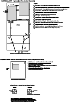

**The fridge (and its fan system) now runs off the DELTA 3 stack, not the van's rear outlet** — see the "Why the fridge and fan system now run off the DELTA 3 stack" note in Section 1 for the full reasoning (reliability while people are away from the vehicle, backed by real runtime/recharge numbers). This does mean the fridge needs a cord after all, unlike the previous design's direct-plug simplification — a DC line from the DELTA 3 (Panel A's right drawer) forward to the fridge (Panel C), crossing the same 2 module seams the cooktop's cord does. The Sienna's rear 12V accessory outlet is simply unused now — nothing in this design plugs into it, so it's free for anything else later.

**Cord management — run each module's cords in a surface raceway, not loose clips (owner, July 2026).** Instead of loose zip-tied/clip-covered runs, route the cords through a **segmented plastic surface raceway (wire duct / Wiremold-style)** — a short length screwed to the inside of each module's frame, one channel per panel, meeting at the existing seam disconnects. Two rules keep it correct: (1) the raceway must stay **segmented per module** (a separate length in A, B, and C) — NOT one continuous conduit spanning the seams, or a panel can't be lifted out; the inline AC connectors / SAE DC disconnects still live at each seam. (2) Keep the **120V AC and 12V DC lines in separate channels** (a divided duct, or two small ducts side by side) — don't bundle them together. This protects the cords from abrasion, makes every run traceable, and lets you pull or add a wire later without fishing it through the frame — a real serviceability win over clipped cords for a small added cost (see the raceway line in Section 4's BOM). Where a run has to cross into a module's interior bay, a snap-cover raceway lifts open without unscrewing.

**Four cords need routing in total, each on its own independent line — none of them share a run:**

### Cooktop line (Power strip 2 → front console)

From the kitchen unit forward to the front console AC outlet — this is a full 120V AC household circuit (the induction cooktop draws real wattage, not a low-voltage DC load), so it uses a proper household-rated extension cord, not an automotive/solar DC connector. Because Panel A, Panel B, and Panel C are still independent lift-out modules, the cord crosses a seam at each of the two remaining module boundaries (Panel C → Panel B, Panel B → Panel A) on its way forward. Each crossing gets an inline male/female extension-cord connector pair (the AC-rated equivalent of a quick-disconnect) so any single panel lifts out without cutting or re-threading the cord. See the [Step 8 diagram](renders/steps/step-08-power-channel.svg).

**Power strip 2 rides the slide-out kitchen unit** so it travels to wherever you're actually cooking — the JAGAHAHA extends to ~70" out the tailgate in use. Mount the strip on the unit itself, and leave a **slack loop** of cord (a coil or a short cord reel near the kitchen's stowed position) that pays out as the unit slides — size it to the unit's full extension so the cooktop keeps power at the cook position without straining the connector at the first seam.

1. Drill a 1" grommet hole in the frame rail at the kitchen unit's corner post nearest the cord's exit path.
2. Route a channel: either dado a 3/4"-wide, 1/2"-deep groove along the inside face of one long side rail, or simply zip-tie the cord along the rail's inner face under a cord-clip cover strip — no routing tools needed if you skip the dado.
3. At each of the 2 remaining seams the cord crosses (Panel C → Panel B, Panel B → Panel A), splice in an inline male/female extension-cord connector pair so the cord separates cleanly when that panel is lifted out.
4. Run the cord from the kitchen unit, along the channel, forward to a grommet hole near Panel A's front edge (flush with the front seatbacks, closest to the front seats — no open floor gap to cross anymore, Section 1).
5. From there, route the cord along the van floor track (under the edge of the deck, not through it) forward to the front console AC outlet.
6. Leave 12-18" of slack coiled near the kitchen unit so it can be pulled slightly forward on its own slide for use without disconnecting.

### Power strip 1 line (Headboard/pantry → front console) — the long way now

The first leg is drawn in crimson on the Headboard Elevations (right-side view): from the strip on the bed cubby shelf, the cord is cable-clipped down the passenger side panel's inner face, exits through a 1" grommet in Panel C's deck at the headboard's back corner, crosses under the deck, and leaves Panel C through the front wall's UPPER grommet (3" in from the driver edge, 5.5" up — the fridge DC line uses the lower one). From there it runs the floor channel forward.

Power strip 1 (phone/device charging, reading light, the Claymore fan) mounts in the **headboard/pantry's bed cubby** (Component 1) — the enclosed middle-band nook, which sits at the **tailgate end of Panel C**, not the front. This flips Power strip 1's cord from the simplest line in the design to one of the longest: it now runs the full length of the platform, crossing the same 2 seams (Panel C → Panel B, Panel B → Panel A) the cooktop and fridge DC lines do. Like the cooktop line, this is a 120V AC cord — household-rated extension cord, not a DC connector.

1. Drill a 1" grommet hole in Panel C's frame rail near the headboard/pantry's mattress-facing edge, where the cord exits toward the mattress-covered part of the deck.
2. Route the cord forward along the same rail-channel approach as the cooktop and fridge DC lines (its own dedicated run, not sharing their channel) — a dado groove or a zip-tied cord under a clip-cover strip.
3. At each of the 2 seams the cord crosses (Panel C → Panel B, Panel B → Panel A), splice in an inline male/female extension-cord connector pair, same as the cooktop line.
4. Continue forward to a grommet hole near the front of the platform, then along the van floor track to the front console AC outlet.
5. Leave about a foot of slack coiled where the cord exits the shelving superstructure — that's the only place this cord needs any give, so unbolting the shelving from Panel C (Component 1) never requires unplugging anything.
6. Terminate at the front console's 2nd AC outlet if one exists (see below); if there's only one physical outlet, this cord, the cooktop's, and the DELTA 3's charging cord all land on it through a splitter at the plug end (see the shared-circuit note below) — the lines stay electrically independent all the way back to that point, so this doesn't reintroduce the old shared-line limitation, it just means the console's total wattage budget is now the shared constraint instead of an in-line splice.

### Fridge DC line (DELTA 3 → Panel C fridge bay)

The fridge's DC line runs from the DELTA 3 Plus's DC output (Panel A's right drawer) back toward the tailgate, through Panel B, into Panel C's fridge bay. Unlike the cooktop and Power strip 1's lines, this one really is 12V DC, so an automotive/solar SAE quick-disconnect is the right connector type here. Like the cooktop's line, it crosses the same 2 remaining module seams (Panel A → Panel B, Panel B → Panel C), so it needs its own quick-disconnects too. This is the trade-off Section 1 already flagged: reintroducing a long cord run in exchange for the fridge no longer depending on the van's ignition state.

1. Drill a 1" grommet hole in Panel A's frame rail near the DELTA 3 drawer, and one more at each of the 2 seams it crosses (Panel A → B, Panel B → C) — 3 total, reusing the same rail-channel approach as the cooktop line (a dado groove or a zip-tied cord under a clip-cover strip both work).
2. Install a quick-disconnect connector at each of the 2 seams so Panel A and Panel B still lift out independently.
3. Terminate the cord at the fridge's DC input inside Panel C's void, near the control enclosure (Component 7).
4. Leave a few inches of slack at the DELTA 3 end so opening/closing that drawer doesn't strain the connection.

The fan system's own wiring (fuse/switch/PWM controller/fans, Section 1) taps off this same DELTA 3 source rather than a separate line — see the fridge wiring schematic in Renders.

### DELTA 3 AC charging line (front console → Panel A drawer)

A second, independent cord charges the DELTA 3 stack itself from the front console's AC outlet while driving — this is what makes the fridge's long runtime (Section 1) actually sustainable trip after trip, instead of draining down with no way to recharge until you're back home. Like the cooktop and Power strip 1's lines, this is a 120V AC household cord (charging the DELTA 3's AC input), not a DC connector. Panel A is now the module closest to the front seats (the headboard/pantry moved to the opposite end, onto Panel C — Section 1), so this cord **crosses zero panel seams**, just a short run through the open floor gap in front of Panel A.

1. Drill a 1" grommet hole in Panel A's front end rail, near the DELTA 3 drawer.
2. Run the cord forward, through the open floor gap (nothing built there — Section 1), to a grommet hole near the front of the platform.
3. Continue along the van floor track to the front console AC outlet — same routing as the other two forward-running lines.
4. Leave enough slack at the Panel A end that pulling the DELTA 3 drawer open doesn't strain the connection.

**Front console outlet count is UNVERIFIED.** An owner-supplied reference floor plan shows 2 separate 110V AC outlets at the center console (plus a 3rd near the rear cargo area, which this design doesn't use). Confirm the actual count and position against the real van (Section 0) before cutting the grommet holes for any of the 3 AC lines that terminate there.

**Note on power source:** confirm your Sienna trim actually has a household 120V AC outlet in the front console (common on Hybrid/XLE trims) before planning either route — if yours doesn't, the cooktop needs a portable power station instead (Section 7).

**Shared-circuit wattage: 3 AC lines now want the console's power, and the DELTA 3 alone can ask for all of it.** The console outlet is confirmed at 1500W — a duplex outlet's 2 sockets are typically the same underlying circuit, not independent budgets, so whichever socket the DELTA 3 charges from, its AC input (up to 1500W at full X-Stream speed) can consume the circuit's entire rated capacity by itself. Running the induction cooktop at the same time you're fast-charging the DELTA 3 could oversubscribe the circuit. In practice this rarely collides — cooktop use happens at camp with the engine off, DELTA 3 charging is most useful while driving — but if you ever want both at once (e.g., cooking during a highway rest stop with the engine idling), cap the DELTA 3's AC charge rate in its app (EcoFlow lets you limit input wattage) to leave headroom for the cooktop, rather than relying on not noticing a tripped breaker.

**The WAVE 3 is the one thing still fully self-contained.** It draws from the DELTA 3 Plus (in Panel A's drawer) via its own charge cable, and isn't wired to any van circuit at all.

---

## 6. Illustrated Build Manual — By Component

Everything from Sections 3-4 reorganized around **10 self-contained components**, in the order you'd actually build them. Each component lists its parts, then walks through numbered steps in instruction-manual format: **the new parts for that step on the left, an exploded assembly view showing how they go in on the right** — drawn as woodworking-plan line art (white parts, black edges, letter labels keyed to the parts list, arrows showing insertion direction). Every piece dimension traces back to the cut list (Section 3) and every hardware item to the BOM (Section 4). Panels A and B share identical frame/divider/drawer construction, so those steps intentionally reuse the same diagrams in both components.

Cut every piece for every component up front, per Section 3's cut list, before starting Component 1 — sand all edges once cut.

### Component 1: Headboard/Pantry

**No longer its own module** — no frame, no legs, no top of its own. This is a shelving superstructure, **clamped down to Panel C's already-built deck** with cam levers (Component 4) and braced against driving sway by 2 steel L-angle braces tied into Panel C's own side rails, occupying the last 14" of Panel C's own 36" length, at the tailgate end right next to the fridge/kitchen void. **3 fixed tiers + an adjustable shelf, no full-height divider, no top**: two full-depth (14") shelves — the bed shelf at 13" above the deck and the upper shelf at 18" — split the 22" height into 3 tiers. The tall bottom tier and the top tier are full-depth food storage, held by the fiddle-lip + lash-strap retention system (below). The middle tier, between the two shelves, is split by a 4.25" nook divider into an enclosed 2.75"-deep bed cubby facing the mattress (floored by the bed shelf at 9" above the mattress top, ceilinged by the upper shelf, with the half-round edging lip, Power strip 1, and the roll bubble level in it) and a 10.5"-deep food tier facing the kitchen. The 13" bottom bay carries an **adjustable shelf on pins** (one tall bay or two ~6" tiers), and every food shelf gets the **fiddle-lip + lash-strap + bins + liner** retention system. It comes off Panel C by flipping 4 base cam levers and the 4 sway-brace cam levers at the rail ends (8 total) — under a minute, no tools — so its own 22" height clears the liftgate opening on its own. Build Panel C (Component 4) first — this component's context is Panel C's own finished frame and top. See the Headboard Storage Detail render for the full dimensioned elevations.

**Parts needed:**

- Headboard/pantry side panels — 2, 14" x 22", 1/2" ply (weight swap: was 3/4" — compression load, no bending)
- Headboard/pantry full-depth shelves — 2, 46" x 14", 1/2" ply (weight swap: was 3/4" — the carcass webs; keep the front fiddle lip as a stiffening flange, add a shallow rear rail. No full-height divider, no top)
- Headboard/pantry base cleats — 2, 46" x 3", 3/4" ply (plain rip, screwed to the shelving underside)
- Clamp-down hardware — 4x Kipp cam levers (1/4-20 x 30mm stud) + fender washers + T-nuts (through the base cleats + Panel C's deck — flip to release, no tools)
- Sway braces — 2x slotted steel angle (L-profile), 1-1/2" x 1-1/2" x 1/8" x ~30", bolted at every end: 2x 1/4-20 + nylocs per top end, 2x 1/4-20 studs + Kipp cam-lever nuts per rail end — Sway Brace Detail render
- Headboard/pantry nook divider — 1, 46" x 4.25", 1/2" ply (middle tier — spans bed shelf to upper shelf, enclosing the cubby)
- Headboard/pantry ADJUSTABLE shelf — 1, 46" x 14", 1/2" ply (bottom bay, on pins) + 4x 5mm shelf pins (+ spares)
- Fiddle lips — ~7, 1.5" x 44.5", ripped ply/pine (one per food-shelf front edge, both faces)
- Retention — ~6 elastic lash straps (one across each tier opening) + 2-3 utensil bins + a non-slip shelf-liner roll + 1 soft-goods bungee net (one tier)
- RV bar bubble level — 1 (the ROLL half of the E409 2-pack; the PITCH one goes on the bed platform, Component 2)
- Half-round edging — 1, 3/4" half-round pine trim, 46"
- Power strip 1 + its own dedicated cord run (Component 6)
- Wood screws (1.25" ply-to-ply), wood glue, and Ryobi R-series biscuits (R3 for the shelf-to-side joints, R1 for the nook divider) — see the Joinery & Fastener Guide

1

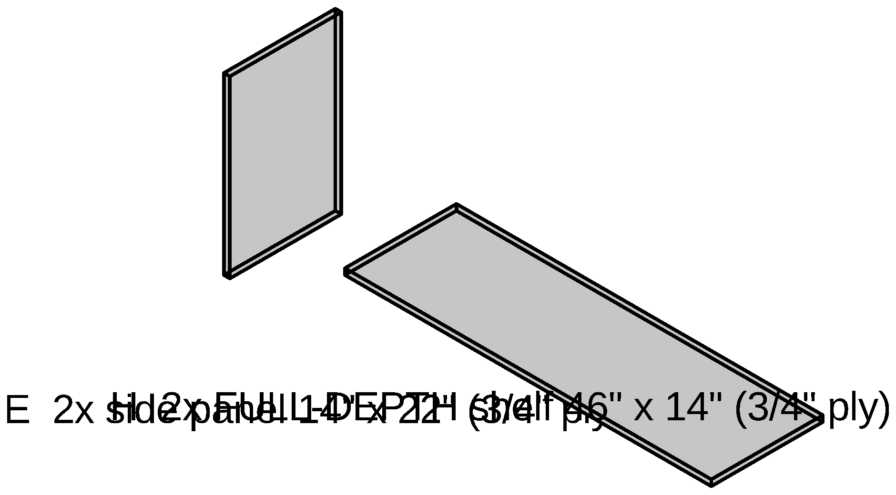

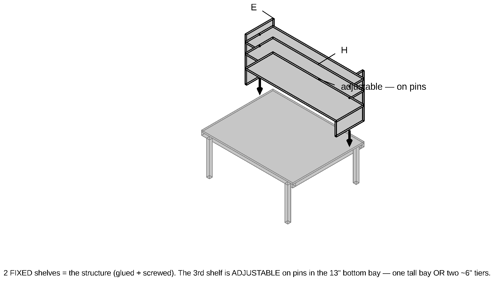

Build the shelving carcass as its own separate assembly, positioned over the tailgate end of Panel C's deck (shown here in context, but not yet fastened to it): 2 side panels (E) + the 2 FIXED full-depth shelves (H) glued and BISCUITED in at 13" (the bed shelf) and 18" (the upper shelf) — 3x R3 biscuits per shelf end at 2"/7"/12" from the front (Joinery & Fastener Guide), glue + clamp, no screw heads on the visible side panels. Before assembly, drill a 5mm shelf-pin column up each side panel through the bottom bay (3"-11" on center) and cut the 3rd, ADJUSTABLE shelf — it drops onto 4 pins so the 13" bottom bay runs as one tall bay or two ~6" tiers. The two fixed shelves ARE the structure — no full-height divider, no top, both faces open.

2

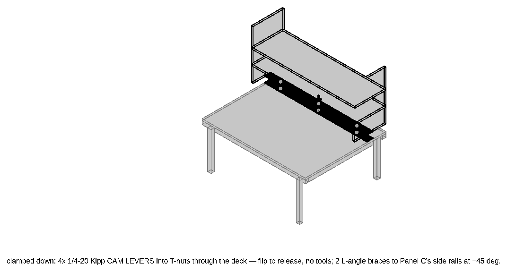

Screw the 2 base cleats (G) flat to the shelving shell's underside, set the shell in place at the deck's tailgate end, and clamp down through the cleats and Panel C's 3/4" deck: 4x Kipp cam levers (1/4-20 studs) with fender washers into T-nuts hammered in from below — flip the levers to lock, flip to release, no tools (the bike-QR-style hardware). Then run the 2 L-angle sway braces from high on each side panel (~20" up) forward and down at ~45° to Panel C's OWN side rails, just below the deck at the B/C-seam corner — every connection BOLTED: 2x 1/4-20 + nyloc nuts at each top end (permanent), 2x 1/4-20 studs + Kipp cam-lever nuts at each rail end (Sway Brace Detail render). The bolts carry the vertical load; the braces triangulate the tall unit against fore-aft rocking under braking, and because both ends land on Panel C, Panel B lifts out without touching them. Empty the food side before ever unbolting it.

3

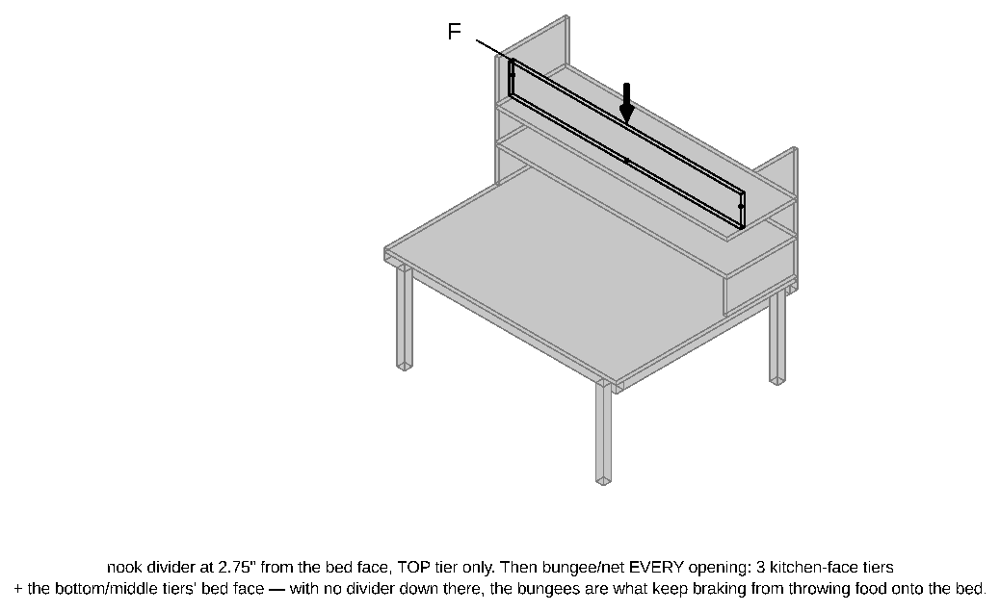

Drop the 4.25" nook divider (F) into the middle tier, 2.75" from the mattress face — it spans from the bed shelf up to the upper shelf — 2x R1 biscuits + glue into each shelf edge, screwed into both side panels (Joinery & Fastener Guide) — enclosing the bed cubby. Then fit the RETENTION: glue/pin a 1.5" fiddle lip (K) along every food shelf's front edge (both faces — that lip is what stops the forward slide braking causes), run an elastic lash strap (L) across each tier opening for the taller items, lay non-slip liner under everything, and stand utensils/small items in bins so they can't slip out. Keep a bungee net on just one tier for soft goods (bread/chips/produce).

4

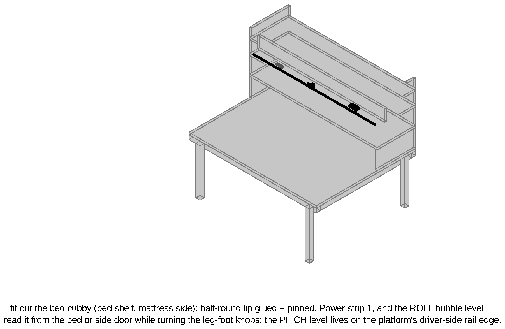

Fit out the bed cubby — the bed shelf's mattress-facing 2.75", its surface 9" above the mattress top, a comfortable reach while lying down. Glue/pin half-round edging along the shelf's front lip, mount Power strip 1 in the cubby (Component 6 for its dedicated cord run), and screw the ROLL bubble level beside it — read it from the bed or side door while turning the leg-foot knobs.

### Component 2: Panel A & Bed Platform

Panel A and Panel B share the same frame construction — neither has a top of its own anymore; the one-piece slatted bed frame caps both at once (see Steps 6-7 below, and the Bed Frame Detail render). They diverge at the drawers: **Panel A's left (driver-side) bay is WAVE 3 open storage, not a drawer** — the WAVE 3 (20.4" wide) is too wide for a boxed drawer's 19" clear interior, so it rests directly on the bay floor instead, reached by hand through the driver's side door. Panel A ends up with only ONE actual drawer (right side, DELTA 3).

**Parts needed:**

- Long rails — 2, 29" cut, 2x2 pine
- End rails — 2, 46" cut, 2x2 pine
- Legs — 4, cut to 16", 2x2 pine (1.5" x 1.5" actual — plenty for this load); the leveling foot brings each back to an effective 17"
- Leg leveling feet — 4 (3/8-16 T-nut in the leg's bottom end grain + glide bolt + 2" star knob jam-locked on the shaft), one per leg (Leg Leveling Foot Detail render)
- Bottom rails — 2, 46" cut, 2x2 pine (END faces only — the side faces stay open for the drawer/WAVE 3)
- Center divider — 1, 26" cut, 2x2 pine
- Corner brackets — 4
- Diagonal corner braces — 2 (recovers racking rigidity lost without a top)
- Drawer box — 1 (right/DELTA 3 side only), 5 pieces: bottom 20"x25" (1/2" ply), 2 side walls 25"x14.5" + 2 front/back walls 20"x14.5" (3/8" ply) — weight swap: walls 1/2"→3/8", glue + biscuit the corners since it carries the 48 lb DELTA stack
- Drawer slide — 1 pair, 20" full-extension
- Drawer catch — 1, friction catch or small turn latch
- DELTA 3 drawer hardware (right drawer) — 1x1 pine locating cleats, 2 screw-eye D-rings + cam strap, 1" cable grommet
- WAVE 3 glide strips (left bay floor) — 2, UHMW or laminate scrap, cuts friction sliding the unit in/out by hand
- Bed platform lumber — six 1x4 x 8ft pine boards: two 58" side rails + eight 45" slats, two per board (Bed Platform Detail render)
- RV bar bubble levels — 1x 2-pack (RV Designer E409, screws included): PITCH one mounts here, ROLL one goes to the headboard nook (Component 1)

1

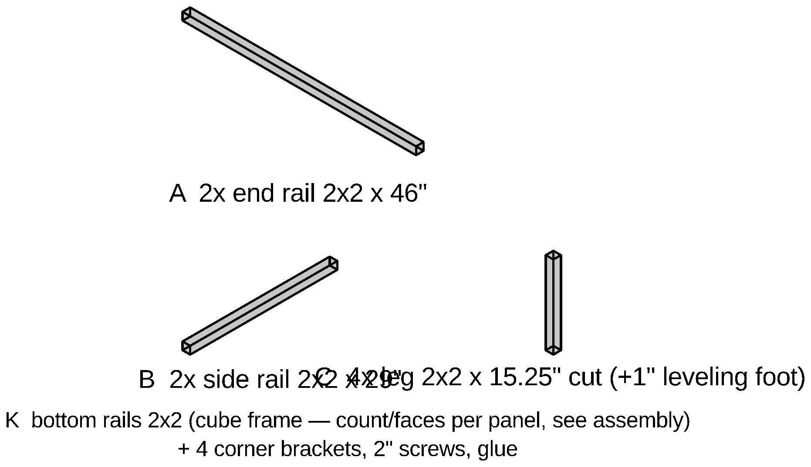

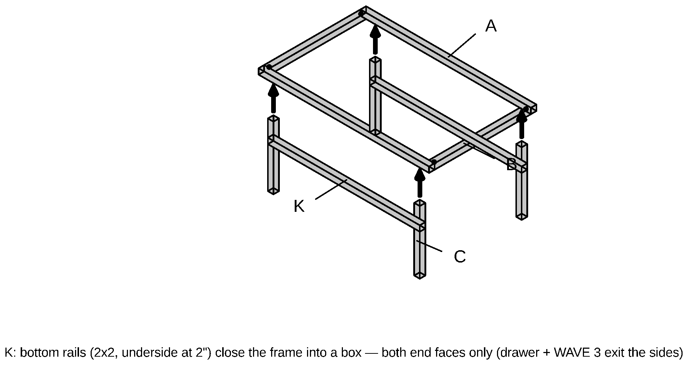

Build the frame: 2 side rails (B) + 2 end rails (A) joined with corner brackets and 2" screws, then the 4 legs (C) — CUT to 16", drilled in the bottom end grain (1/2" dia x 3/4" deep, centered) for a 3/8-16 threaded insert, so the leveling foot brings each leg back to an effective 17" (Leg Leveling Foot Detail render). Much easier to drill before assembly. Legs inset 2.5" from the deck's side edges to clear the floor-level vent intrusion. Then close the bottom: 2 END-face bottom rails (K, 46", underside 1" up at the leg bottoms — Panel A's SIDE faces stay open so the drawer and WAVE 3 can exit) plus 2 diagonal corner braces up top — the part-cube racks far less than rails + brackets alone. (Panel B's frame differs only at the bottom rails: it closes all 4 faces.)

2

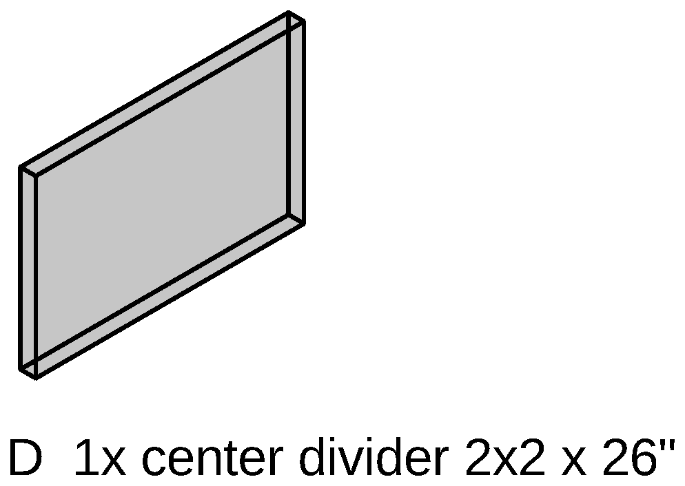

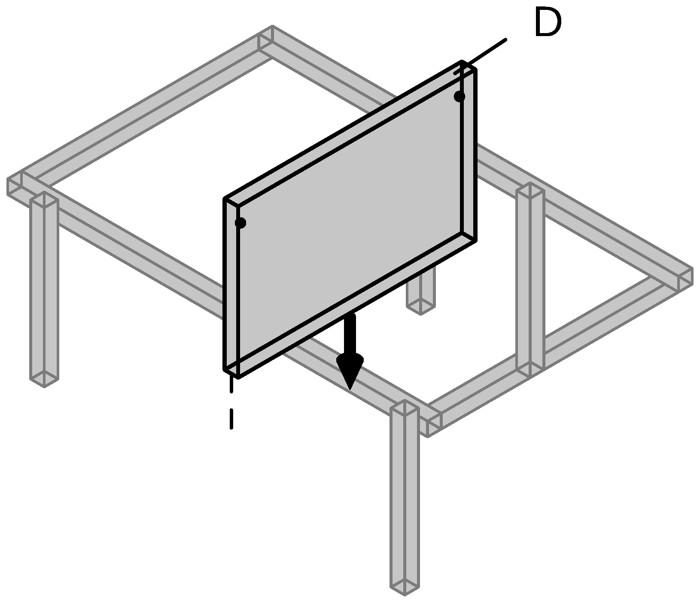

Drop the center divider (D) into the bay, centered on the panel's width — it splits the void into a left and right bay and carries one side of the right bay's drawer slide.

3

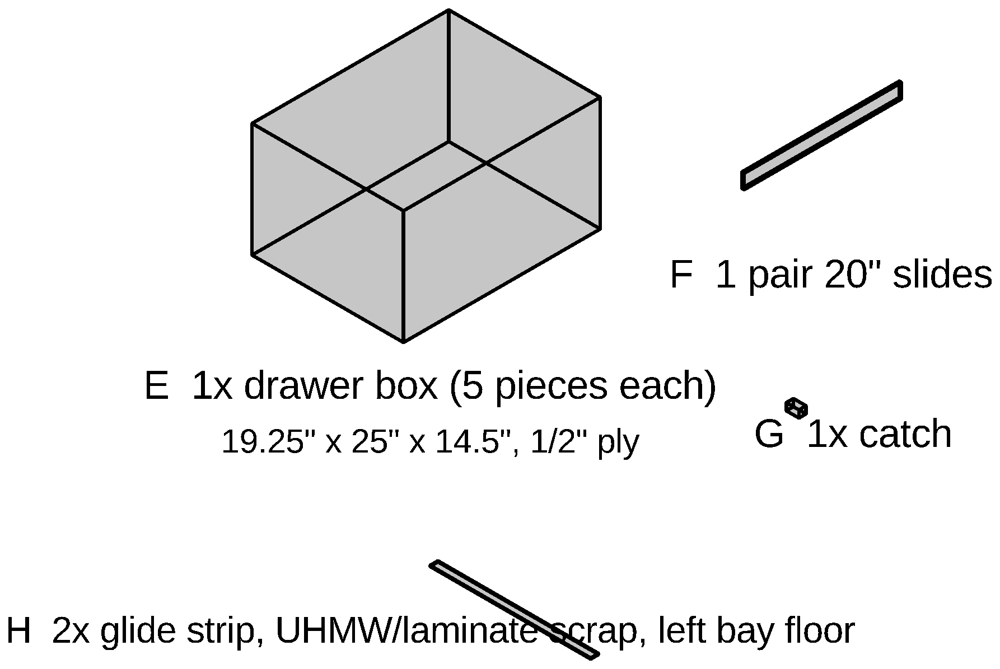

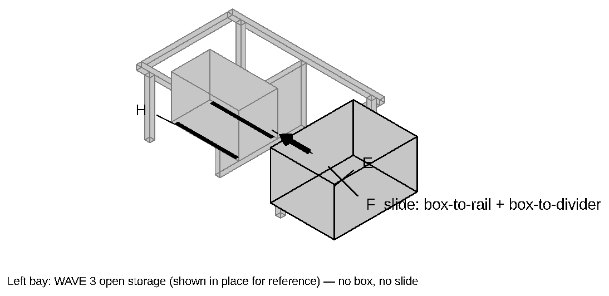

Build the right (DELTA 3) drawer box (E, 5 pieces, open top) — biscuit the corners with 2x R1 biscuits each + glue, bottom in a glued rabbet (Joinery & Fastener Guide) — and slide it onto its pair of 20" full-extension slides (F) — one slide side on the frame's outer rail, the other on the center divider. Add a catch (G) so it doesn't slide open in transit. On the LEFT bay, skip the drawer entirely: glue/screw down the 2 glide strips (H) along the floor instead — that's the WAVE 3's storage spot (Component 8).

4

DELTA 3 drawer hardware (parts list above): pine cleats, 2 D-rings + cam strap, 1" grommet

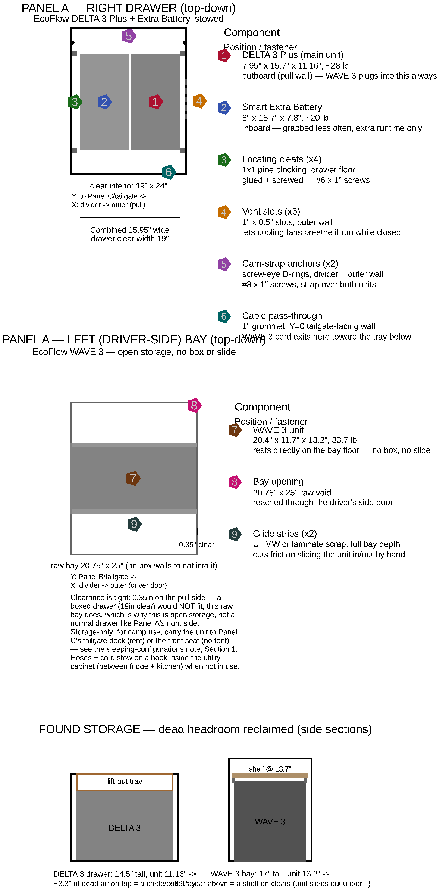

In the right drawer, add the DELTA 3 fixtures: locating cleats glued/screwed to the drawer floor, D-rings + cam strap to hold the stack down in transit, and a cable grommet for the WAVE 3's charge cable. DELTA 3 Plus outboard (pull wall), Smart Extra Battery inboard — see Component 8.

5

six 1x4 boards: 2 rails + 8 slats + pocket screws (parts list above)

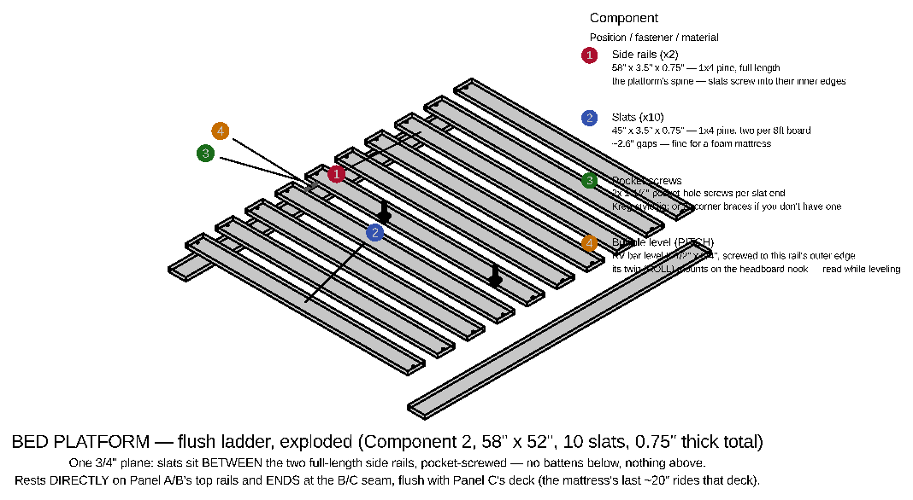

Cut two 58" side rails and eight 45" slats from six 1x4 x 8ft pine boards (slats two per board; rails one per board). Lay the rails on edge-guides 52" apart outside-to-outside, space the slats evenly between them (~4.3" gaps — fine under the solid-foam HEST mattress), and pocket-screw each slat end into the rails' inner edges (2x 1-1/4" pocket screws per end; 2" corner braces work if you don't have a pocket-hole jig). Everything sits in one flush 3/4" plane that ENDS at the B/C seam — Panel C's own deck is at the same height, so the sleeping surface stays flush and the mattress's last ~20" rides that deck. The platform adds only 3/4" to the stack. Last, screw one RV bar bubble level to the driver-side rail's outer edge at mid-span (the 3/4" face fits it exactly) — it reads fore-aft PITCH from the slider door while you turn the leg-foot knobs; its twin reads ROLL from the headboard nook (Component 1).

6

no new parts — the assembled platform from Step 5 (leveling feet already on the legs, Step 1)

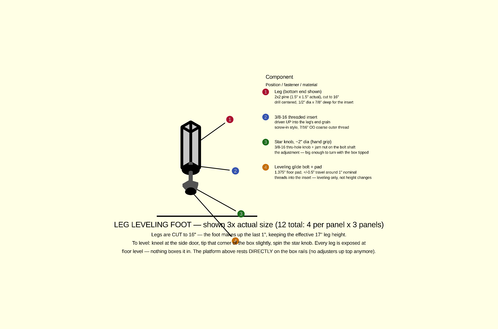

Set the finished platform down directly on Panel A + B's top rails and Panel C's mattress zone, centered so it overhangs the boxes 3" per side — nothing fastens it, it rests there and lifts straight off for drawer-bay access (it enters/exits the van tilted diagonally through the liftgate). Then LEVEL the boxes at the floor: with a level on the platform, tip each box corner slightly and spin that leg's star-knob foot until the bubble centers along both axes. Re-check after the van is parked on level ground.

### Component 3: Panel B

Same frame construction as Panel A — and that's the whole build. **Panel B has no drawers, no divider, and no skirts**: the sliding-door openings sit over Panel A's footprint, not Panel B's (owner-confirmed), so nothing pulled sideways from this panel could ever clear a door. Its bay is deep storage instead — lift the platform + mattress and load it from above with the long-term/bulky things you don't touch at camp. The Panel B detail render dimensions **every hole in the panel**: the 4 leg-bottom leveling-insert holes (1/2" dia x 3/4" deep, dead center of each leg's end grain) and the alignment-pin holes on both seam faces (2x 3/8" dia x 3/8" deep, 3" in from each side edge).

**Parts needed:**

- Long rails — 2, 29" cut, 2x2 pine
- End rails — 2, 46" cut, 2x2 pine
- Legs — 4, 16" cut, 2x2 pine (leveling feet make up the inch)
- Bottom rails — 4: 2x 46" + 2x 26" (all four faces — the full cube)
- Corner brackets — 4
- Diagonal corner braces — 2

1

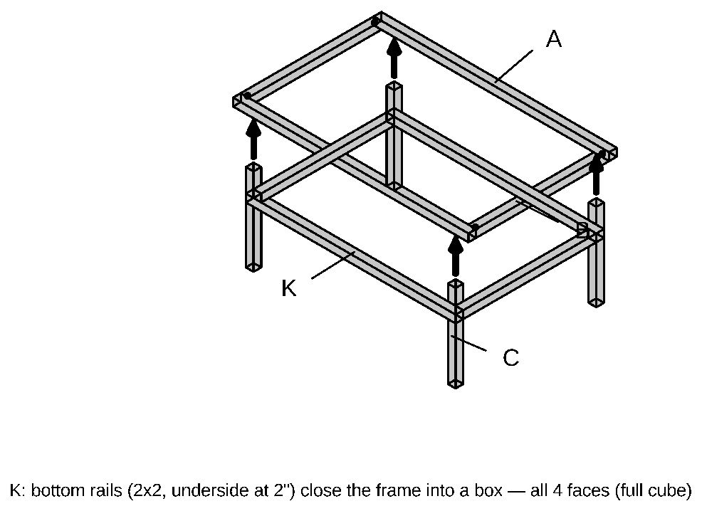

Build the frame — like Panel A's step 1: side rails (B), end rails (A), corner brackets, 4 legs (C) inset 2.5" from the deck edges (drilled for their leveling inserts BEFORE assembly), the 2 diagonal corner braces, and bottom rails on ALL FOUR faces (2x 46" + 2x 26", underside 1" up at the leg bottoms) — **the full cube**: nothing exits Panel B sideways, so every face can close, and this is the stiffest frame of the three. That's the entire panel — no divider, no drawers, nothing else. Drill the alignment-pin holes when mating it to its neighbors (Component 5).

### Component 4: Panel C

Build this one before Component 1 (Headboard/Pantry) — its shelving superstructure bolts down to this panel's finished deck at the tailgate end (T-nuts under the deck), with no frame or top of its own.

**Parts needed:**

- Panel C top — 1, 36" x 46", 3/4" ply
- Long rails — 2, 36" cut, 2x2 pine
- End rails — 2, 46" cut, 2x2 pine
- Legs — 4, 16" cut, 2x2 pine (leveling feet make up the inch; REAR pair at the true corners)
- Bottom rail — 1, 46" cut, 2x2 pine (FRONT face only)
- Corner brackets — 4
- Front wall — 1, 46" x 17", 3/8" ply, with the 120mm fan hole + two 1" grommet holes + the 7" x 2.5" low intake louver pre-cut (Panel C Front Wall render — every opening dimensioned)
- Louvered RV vents — 2 snap-in (1 low intake in the front wall, 1 low exhaust in the cabinet door)
- No divider, no drawers — the void stays fully open for Component 7 (Fridge & Kitchen Install)

1

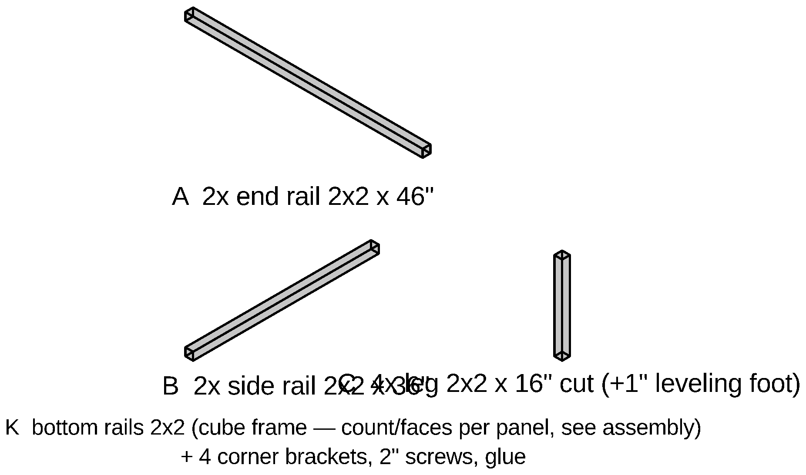

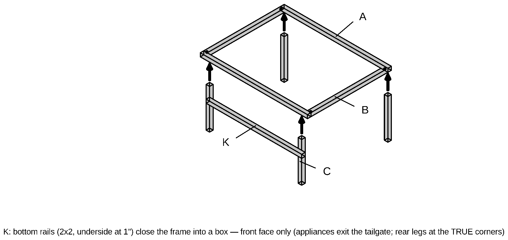

Build the frame — same construction as Panels A/B, with 36" side rails (B): end rails (A), corner brackets, 4 legs (C) — FRONT pair inset 2.5", REAR pair at the TRUE corners (the fridge/kitchen slide paths pass exactly where inset rear legs would stand; verify the vents don't reach those corners, Section 0). Add the FRONT-face bottom rail (46", underside 1" up at the leg bottoms) — the tailgate face stays open for the appliances.

2

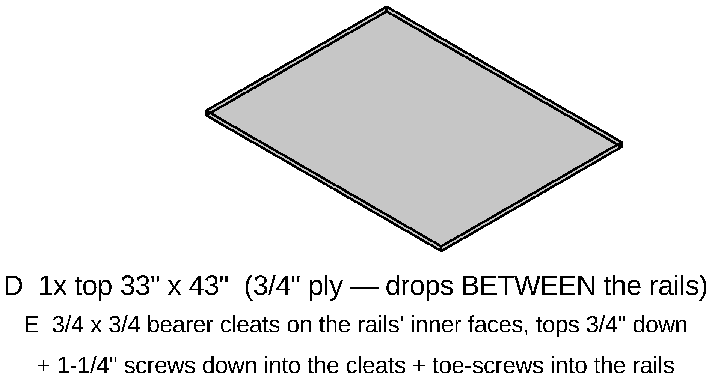

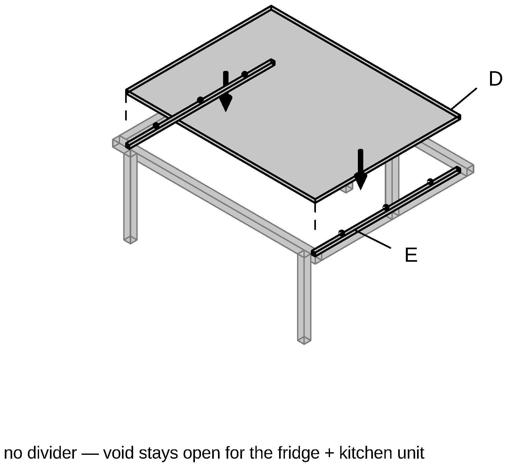

Screw the top (D) down fixed directly to the frame rails — NO divider, since the fridge and kitchen unit need the full width of the void underneath.

3

front wall: 46" x 17" 3/8" ply, holes pre-cut per the Panel C Front Wall render

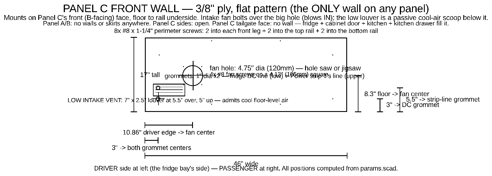

Cut the front wall and its openings to the render's dimensions — the 4.75" (120mm) fan hole centered on the fridge bay (10.86" from the driver edge, 8.4" up), two 1" grommet holes at 3" in (fridge DC line at 3" up, Power strip 1's line at 5.5" up), and the 7" x 2.5" LOW INTAKE LOUVER in the driver-side corner (5.5" over, 5" up) — a passive cool-air scoop that feeds the fridge the coolest floor-level cabin air, screened with a snap-in RV louver vent — then screw it to the front (B-facing) face: 2x #8 x 1-1/4" into each front leg + 2 into the top rail + 2 into the bottom rail (8 total). This is the ONLY wall on any panel; the intake fan bolts over the fan hole in Component 7. Panel C's sides stay open and its tailgate face is fully occupied by the fridge, cabinet door, kitchen unit, and kitchen drawer.

### Component 5: Anti-Rattle Bumpers, Alignment Pins & Seam Draw-Latches

**Parts needed:**

- Anti-rattle bumper strips — 2 (adhesive-backed felt or closed-cell foam weatherstrip), one per seam
- Alignment dowel pins — 4 (2 per seam), 3/8" dowel rod, ~3/4" long
- Over-center draw latches — 4 (2 per seam × 2 seams), stainless/zinc, with their keepers and mounting screws

1

1 bumper strip + 2 dowel pins per seam (A/B seam and B/C seam)

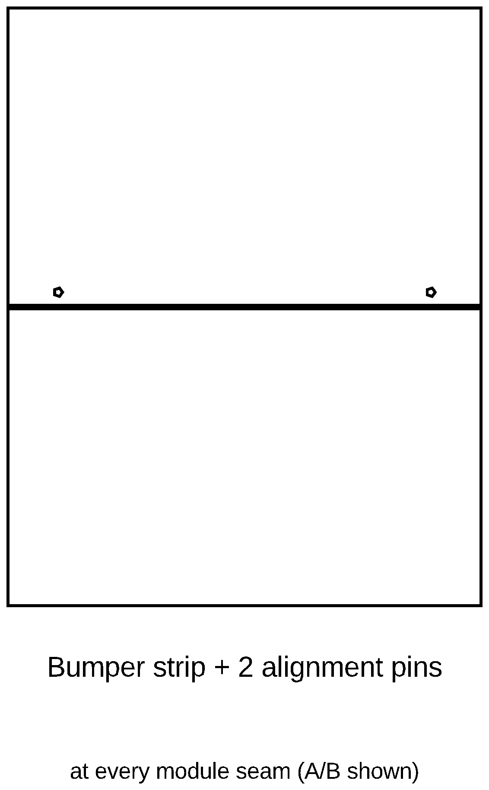

At each seam, apply an adhesive bumper strip across the full seam face on one side of the joint, then drill matching 3/8" holes and friction-fit 2 alignment dowel pins — the panels register in the same spot every time they're lifted out and reinstalled, and don't rub or squeak in transit.

2

2 over-center draw latches per seam (one each side), mounted low on the bottom-rail band

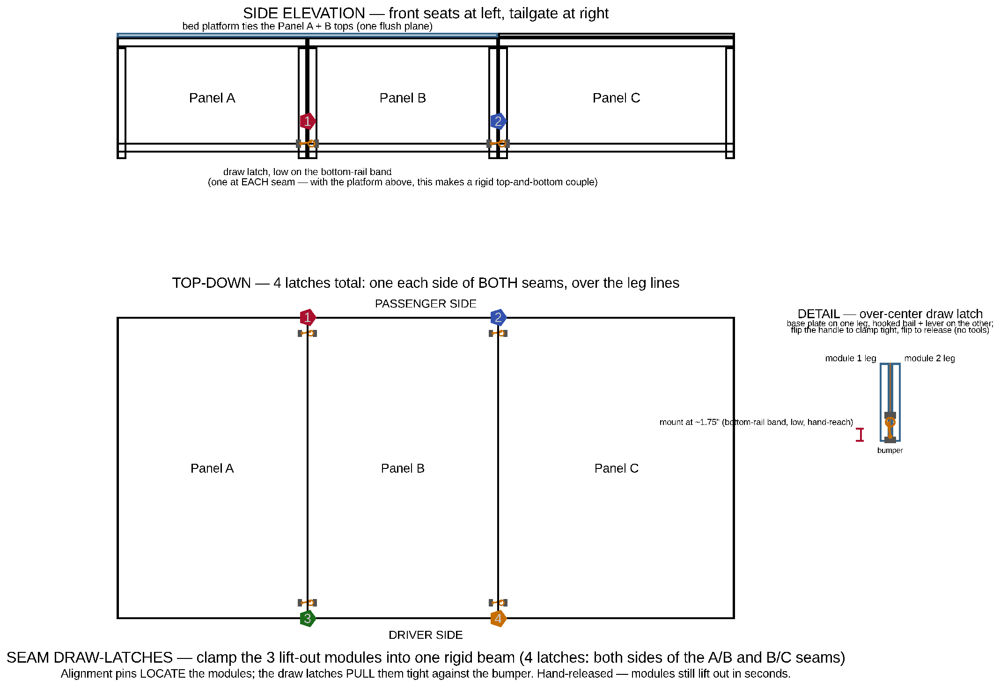

The alignment pins only <em>locate</em> the modules; the draw latches <em>clamp</em> them together. Mount one over-center draw latch on each SIDE of each seam (4 total: both sides of A/B and B/C), <strong>low on the bottom-rail band (~1.75" up), over the inset leg line</strong> — hand-reachable from the side door / tailgate. The base plate screws to one module's leg/rail, the hooked bail + lever to its neighbour's; flip the handle to pull the two modules tight against the bumper strip, flip to release. This ties the three boxes into one rigid beam: the bed platform already couples the Panel A + B <em>tops</em>, and a low latch completes a top-and-bottom couple that kills sway and rattle. It stays fully modular — the latches are hand-released, so any panel still lifts out in seconds. <strong>Honest scope:</strong> this buys rigidity and quiet, not a higher weight rating — the cube-framed boxes are already strong (5× margin at the feet). Don't rely on the latches to carry more load; their job is to stop relative motion between modules.

### Component 6: Cord Runs — Cooktop, Power Strip 1, Fridge DC & DELTA 3 Charging

**Parts needed:**

- 16 AWG extension cord (household AC-rated), ~8ft (cooktop line)
- 16 AWG extension cord (household AC-rated), ~8ft (Power strip 1's own dedicated line — now one of the LONGEST lines, since the headboard/pantry it mounts on sits at the tailgate end, not the front)
- 16 AWG DC cord (automotive/solar SAE-rated), ~8ft (fridge line — DELTA 3 in Panel A back to the fridge in Panel C)
- 16 AWG cord (household AC-rated), ~3-4ft (DELTA 3 AC charging line — front console to Panel A)
- Cable grommets — 10, 1" diameter (2 cooktop line, 3 Power strip 1 line, 3 fridge DC line, 2 DELTA 3 charging line)
- Inline male/female extension-cord connector pairs — 4 (AC-rated, 2 for the cooktop line's 2 seams, 2 for Power strip 1's line's 2 seams)
- SAE quick-disconnect connectors — 2 (DC-rated, for the fridge DC line's 2 seams — only the DELTA 3 charging line crosses no seams)
- Per-module surface wire raceway (AC + DC separated) + screw-mount cord clips — 1 set
- 3-way AC outlet splitter — 1 (front console, now shared by 3 lines — see Section 5)

1

cooktop cord + 2 grommets + 2 inline connector pairs + clips (parts list above)

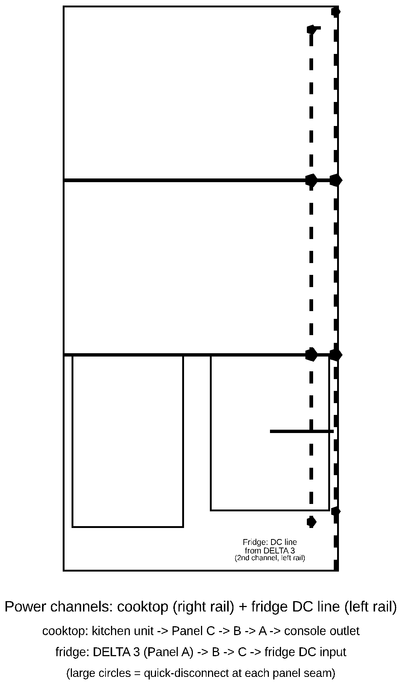

Before final assembly, drill the grommet pass-throughs and route the cooktop's cord forward through Panel C → B → A while the frames are still accessible. Splice in an inline male/female extension-cord connector pair at each of the 2 seams the cord crosses so any panel still lifts out independently, then secure the run with clips — front console AC outlet at the Panel A end, the kitchen unit's cooktop space at the Panel C end.

2

Power strip 1's own cord + 3 grommets + 2 inline connector pairs (parts list above)

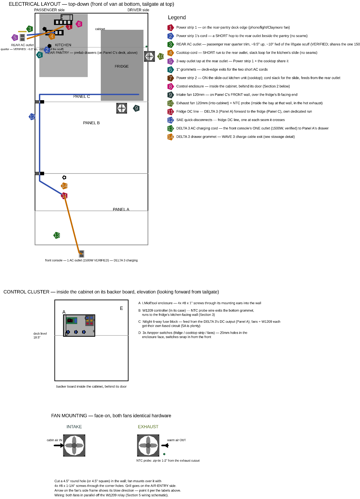

Power strip 1 now mounts in the headboard/pantry's bed cubby (Component 1), at the tailgate end of Panel C — the opposite end from the console. Drill a grommet where the cord exits the shelving near the mattress-facing edge, route it forward on its own dedicated rail through Panel C → B → A (electrical layout diagram above), and splice in an inline male/female connector pair at each of the 2 seams it crosses, same as the cooktop line. Drill the 2nd grommet near Panel A's front edge and terminate at the console via the 3-way splitter.

3

fridge DC cord + 3 grommets + 2 SAE disconnects (parts list above)

The fridge now runs off the DELTA 3, not the van's rear outlet (Section 1) — route its DC line from the DELTA 3's output (Panel A's right drawer) back through Panel B into Panel C, with an SAE quick-disconnect at each of the 2 seams it crosses, terminating at the fridge's DC input near the control enclosure (Component 7).

4

DELTA 3 charging cord + 2 grommets (no disconnect needed)

Run the DELTA 3's own AC charging cord from Panel A's drawer forward, through the open floor gap, to the front console — zero seams, since Panel A is now the frontmost sleeping panel. Terminate all 3 forward-running AC lines (cooktop, Power strip 1, DELTA 3 charging) at the console via the 3-way splitter.

### Component 7: Fridge & Kitchen Install

**Parts needed:**

- BougeRV Rocky 40 (41QT dual-zone) + fridge tray (3/8" ply + glued 3/4" edge frame, 17.72" x 28.74")
- Heavy-duty 24" full-extension drawer slide pair, 200lb-rated
- JAGAHAHA slide-out camp kitchen + COOKTRON induction cooktop
- 120mm 12V fan + PWM temperature controller w/ NTC probe
- 12V surge protector/fused distribution block, 3 illuminated toggle switches, small electrical enclosure
- 8 Snap-Loc E-Track anchors, 16 5/16" carriage bolts/nuts/fender washers
- 4 Erickson 500lb ratchet straps
- Utility cabinet door hardware — 2 small hinges + 1 magnetic catch + 1 low louvered vent (3" x 4")
- Kitchen drawer — box (1/2" ply, 16" x 26" x 4.5") + 2 hanging cheeks (1/2" ply, 26" x 6.2" — weight swap: was 3/4") + 24" full-extension slide pair (100lb) + magnetic catch

1

no parts — inspection only

<strong>Before drilling anything</strong>, get under the van and confirm the anchor locations are clear of the fuel tank/lines, brake lines, and wiring harnesses.

2

8 E-Track anchors + 16 carriage bolts/nuts/fender washers + sealant

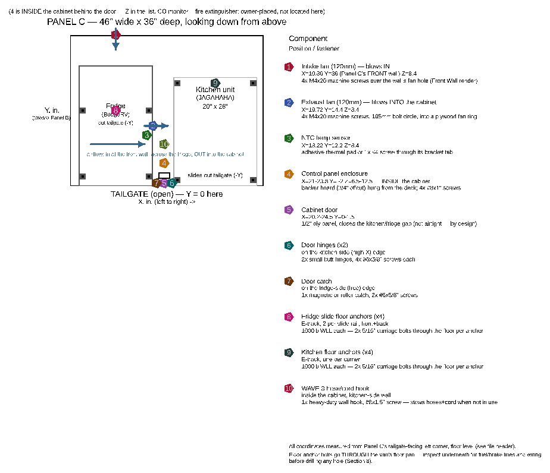

Mark and drill 8 holes (2 per anchor: 4 under the fridge's slide zone, 4 under the kitchen unit's footprint), bolt the anchors through the floor pan — washers on the underside — and seal each hole with butyl or silicone before and after bolting.

3

fridge + 3/8" ply tray (edge frame) + 24" 200lb slide pair

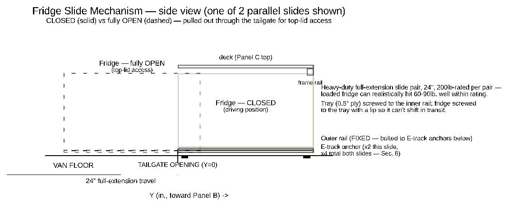

Mount the Rocky 40 on its plywood tray on the heavy-duty slide pair; bolt the slide's outer rail to its 4 E-track anchors, against Panel C's driver-side rear corner leg (1.5" in from the edge), pulling straight out the open tailgate between the corner legs. Face the compressor/battery end toward the tailgate (B240 swaps without a full slide-out), re-hinge the reversible lid to open toward the van wall, and let the unit stand 12 hours before first power-up (manual). Connect its DC input to the fridge line routed in from the DELTA 3 (Component 6, step 3) — leave enough slack for the slide's full travel.

4

2 fans + controller/NTC probe + control enclosure

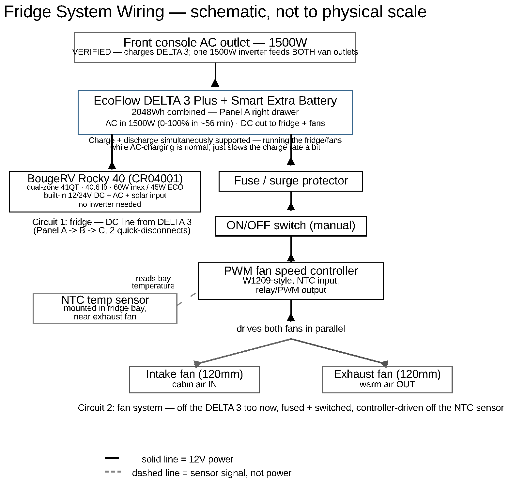

Bolt the intake fan over the front wall's fan hole (Component 4 step 3 — blowing IN) and snap the passive low intake louver into the wall's vent opening beside it (cool floor-level air in), install the exhaust fan + NTC probe (NTC just INSIDE the bay at the fridge's kitchen-facing wall, in the hot exhaust airflow, feeding the controller — it blows the warm air INTO the utility cabinet), and the control panel enclosure (switches + surge protector) INSIDE the cabinet — just behind the door, screwed to a backer board (the 3/4" sheet's offcut) hung from the deck underside, so opening the door reaches every switch. Wire everything per the schematic. The CO monitor and fire extinguisher are owner-placed — position them yourself once the build is in the van (the CO monitor stays battery-powered and unwired either way).

5

cabinet door + 2 hinges + magnetic catch

Build and hang the utility cabinet door over the gap between the kitchen unit and the fridge — 2 small hinges on the kitchen-side edge, magnetic catch on the fridge-side edge, and a 3" x 4" LOW LOUVER (5" up, centered) so the exhaust fan's warm air exits low toward the tailgate instead of only bleeding around the door edges.

6

kitchen unit + 4 ratchet straps

Slide the JAGAHAHA kitchen unit into place against Panel C's passenger-side rear corner leg (1.5" in from the edge) — its shelves swing out on that side — and strap it down: 4 Erickson 500lb ratchet straps, criss-crossed over the top, hooked to its 4 E-track anchors.

7

COOKTRON cooktop

Set the cooktop into the JAGAHAHA's built-in 2-burner stove space and connect its cord into Component 6's power channel.

8

kitchen drawer box + 2 hanging cheeks + 24" slide pair + magnetic catch

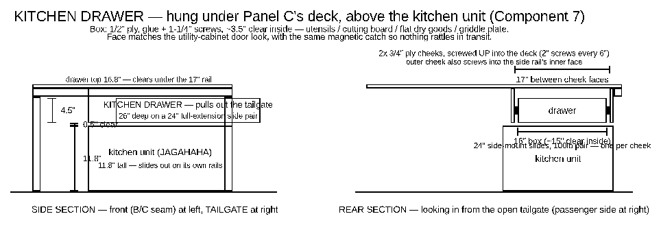

Hang the kitchen drawer in the dead air above the kitchen unit (Kitchen Drawer Detail render): screw the two 1/2" ply cheeks UP into Panel C's deck — 2" screws every 6", the outer cheek also screwed into the side rail's inner face — biscuit the box corners (2x R1 each + glue, Joinery & Fastener Guide), mount the 24" slides inside the cheeks, and hang the 16" x 26" x 4.5" box (~3.5" clear inside). It clears the kitchen's lid by 1/2", passes under the tailgate-face rail, and pulls out the open tailgate like everything else in Panel C. Give its face the same look and magnetic catch as the utility-cabinet door so nothing rattles in transit. Utensils, cutting board, flat dry goods, the cooktop's griddle plate.

### Component 8: EcoFlow Stowage (DELTA 3 + WAVE 3)

**Parts needed:**

- EcoFlow DELTA 3 Plus + Smart Extra Battery, EcoFlow WAVE 3 (already owned, not priced)
- WAVE 3 hose/cord storage hook
- Non-slip mat (camp-use point of use — Panel C's deck or the front seat, not the storage bay)
- EcoFlow WAVE Series Car Vent Kit (no-tent sleeping configuration only)
- FOUND STORAGE: DELTA 3 drawer top tray (shallow lift-out bin) + WAVE 3 overhead shelf (1/2" ply + 1x1 cleats, from offcut) + 2 utility-cabinet bins

**Battery placement — low and counterbalanced (owner review, July 2026).** Heavy batteries want to sit **low and centered**, and this design already gets both most of the way there: the DELTA 3 stack (~48 lb) rides in Panel A's floor-level under-deck drawer — about as **low** as it can go. On the **lateral** axis it looks off to one side (passenger), but the ~34 lb WAVE 3 sits in the **opposite** (driver) bay of the same Panel A, so the two heaviest movable items counterbalance each other — the whole build's lateral center of mass ends up only **~1.8" off centerline** (Appendix E), which is trivial on a ~4,500 lb van. So the "get it centered" concern is effectively already answered. A longer drawer sliding the DELTA to the true centerline was considered and **not adopted**: a 48 lb load cantilevered at the end of a long slide is tippy when open and hard on the hardware, it fouls the bed-platform cantilever near Panel B, and it wouldn't free clean storage (the drawer sweeps its own travel path). If you still want to nudge it inboard for free, shift Panel A's center divider a couple inches toward the driver side to re-center the DELTA bay. See **Appendix E** for the full weight-distribution analysis.

1

uses Panel A's right-drawer fixtures (Component 2, step 4)

Stow the DELTA 3 Plus outboard (pull wall — it's what the WAVE 3 plugs into) and the Smart Extra Battery inboard, side by side over the locating cleats, cam strap over both. Connect the fridge DC line and the AC charging cord (both routed in Component 6) to the DELTA 3 Plus's DC output and AC input ports — it now powers the fridge/fans continuously and gets charged from the front console while driving (Section 1).

2

uses Panel A's left-bay glide strips (Component 2, step 3) + storage hook

Slide the WAVE 3 into Panel A's left bay, resting on the 2 glide strips — no box, no slide hardware, just reach in through the driver's side door. Mount the hose/cord hook inside the utility cabinet (kitchen-side wall) for when the unit is carried off to run at camp. <strong>Found storage</strong> (DELTA 3/WAVE 3 detail render, side sections): the DELTA 3 stack is only 11.16" tall in a 14.5" drawer, so drop a shallow lift-out tray in the ~3.3" of dead air on top for cables/cords; and the WAVE 3 is 13.2" in the 17" bay, so screw a thin shelf onto 1x1 cleats at ~13.7" — flat soft goods and the WAVE 3's own hoses ride up there while the unit still slides out beneath it. Neither touches the frame or the units' function.

3

tent config: non-slip mat only · no-tent config: non-slip mat + WAVE Car Vent Kit

<strong>Tent</strong> (tailgate open): carry the WAVE 3 from Panel A's bay to Panel C's deck, just forward of the headboard/pantry (which now occupies the tailgate-most 14"), on the non-slip mat, and route its hoses past the headboard/pantry and through the open tailgate gap — no window seal needed. <strong>No tent</strong> (tailgate closed): carry it instead to the front passenger seat, on the same mat, and install the Car Vent Kit over a cracked front window for the hoses.

### Component 9: Mattress

**Primary path — BUY, no build:** the HEST Dually Long (78" x 50" x 4") drops onto the platform as-is: solid foam, no inflation, washable waterproof cover included. Heads go at the headboard end. Done.

**Budget fallback — DIY 2-layer build** (the steps below): same 50" x 78" footprint, ~$185–255 all-in, 5.5" thick (costs ~1.5" of the headroom the HEST keeps).

**Fallback parts needed:**

- Queen 4" firm high-density foam base + queen 1"-2" memory foam topper
- Spray adhesive (or large fabric strips)
- Waterproof mattress cover

1

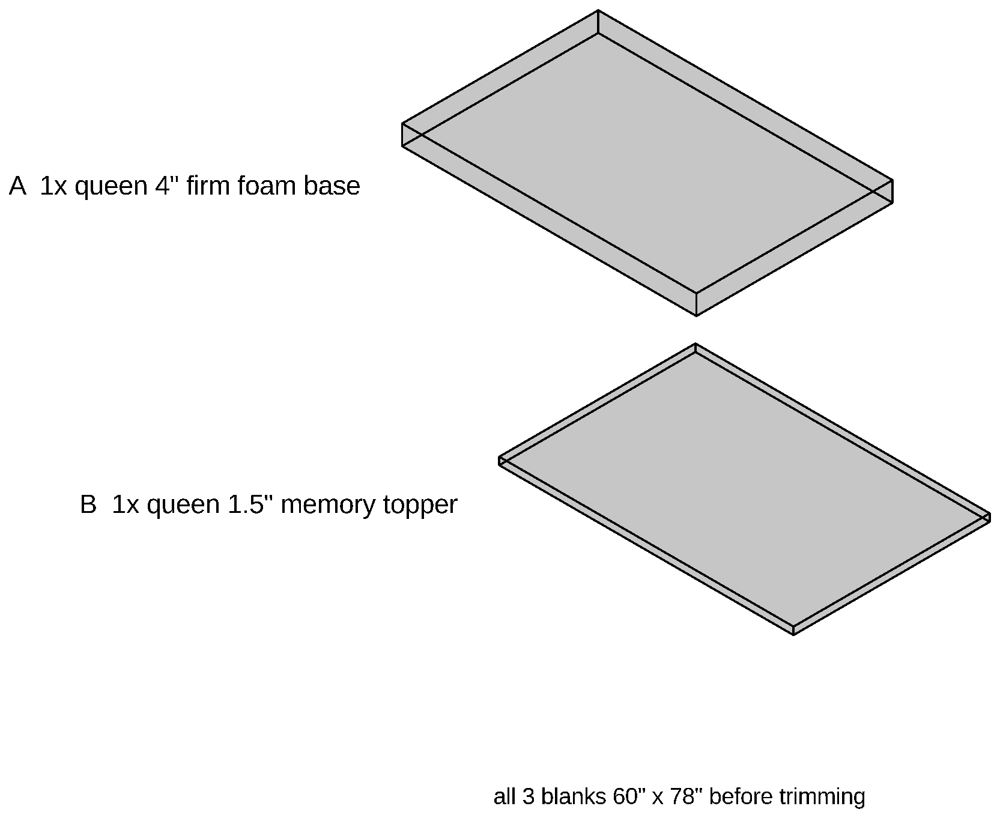

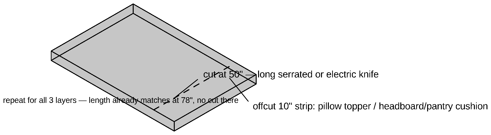

FALLBACK ONLY (skip if you bought the HEST). Buy both foam layers at queen size (60" x 80") and trim to 50" wide x 78" long with a long serrated or electric knife; the offcut strips work as a pillow topper or headboard/pantry cushion.

2

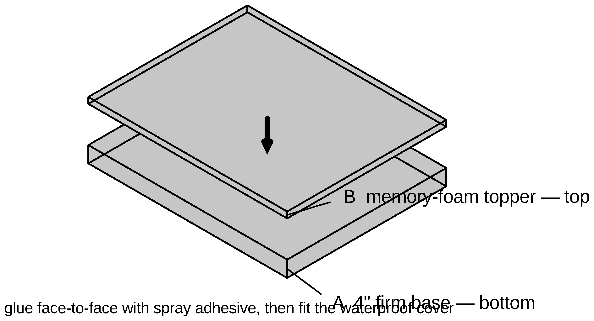

FALLBACK ONLY. Stack the firm base (A) with the memory-foam topper (B) on top; bond face-to-face with spray adhesive, fit the waterproof cover, and lay it on the platform.

### Component 10: Final Assembly, Curtain & Test Fit

**Parts needed:**

- Tension rod + blackout curtain fabric
- Wood sealant/varnish, sandpaper/misc finishing supplies

**Steps:**

1. Sand and apply 2 coats of wood sealant/varnish to all plywood surfaces (especially edges) to prevent moisture damage.
2. Install the curtain rod (tension rod + blackout fabric) between the front seats and the platform area for privacy.
3. Test fit everything: confirm the cooktop's cord and the DELTA 3's charging cord both reach the console outlet(s), confirm the fridge's DC line reaches the DELTA 3 in Panel A with its disconnects seated at both seams, and confirm the tailgate closes with everything loaded.
4. Do a full lift-out/reinstall dry run on Panel A, Panel B, and Panel C — gripping each by its exposed top rails, each should come free and drop back in without binding, rubbing, or forcing a bumper/pin out of place. For **Panel A and Panel B specifically**, also test lifting the one-piece bed platform off the box rails first (they no longer have a top or lid of their own — the platform is the only thing capping them), then confirm each panel's drawers pull smoothly once it's clear. For **the headboard/pantry specifically**, empty the food tiers, flip the 8 cam levers (4 base + 4 brace-end — no tools), and confirm the whole shelving unit comes off Panel C cleanly — it's not one of the three lift-out panels, but it should still detach in minutes. The braces tie into Panel C's own side rails — Panel B lifts out without touching them.

*No diagram — finishing and test steps, not new construction.*

---

## 7. Induction Cooktop & Power Strip Design

### Recommended cooktop: [COOKTRON Portable Induction Cooktop 2 Burner w/ Removable Iron Cast Griddle Pan](https://www.amazon.com/dp/B09MCR1SDT)

- **Real measurements confirmed from the JAGAHAHA's own listing photos**: the stove tray is **23"L x 15.7"W, with 5.7" of clearance** when pulled out.
- The **JAGAHAHA kitchen unit is built for a 2-burner stove** (per its own listing) — a single-burner cooktop would leave half its designed stove space unused.
- An earlier draft of this plan recommended the **Duxtop 9620LS dual burner** — its manufacturer manual gives its actual footprint as **23.9"L x 14.2"W x 2.4"H**, which is **0.9" too long for the 23" tray**. Dropped in favor of the option below.
- **Confirmed exact product** (real listing photos with dimension callouts): **18.1"L x 9.1"W x 4.3"H** (briefcase-style unit with a fold-down handle) — fits the tray with real margin: ~4.9" of length, ~6.6" of width, ~1.4" of height to spare. Two 6.3"-diameter induction zones, 1800W total, plus an included removable non-stick cast-iron griddle pan that lays across both zones — a direct match for "two burner or griddle" in one unit.
- **Price: $189.99** (confirmed current listing price).
- Requires magnetic (induction-compatible) cookware — test with a magnet before buying pots/pans if you don't already own compatible ones (the included griddle pan is already induction-ready). See the cookware recommendation below.

**Power check — confirmed:** the front console AC outlet is rated at **1500W (verified against the real van, Section 0)**. That's good news relative to the old "many factory outlets are limited to a few hundred watts" risk, but it's still **less than the cooktop's own 1800W total** (both induction zones at full power). In practice this means: don't run both burners at max heat simultaneously if anything else is drawing off the same console circuit (Power strip 1 included) — step one zone down, or stagger which burner is running hot, rather than assuming the full 1800W is actually available.

### Cookware: Cook N Home 10-Piece Stainless Steel Set

A cheaper, tougher swap for an earlier draft's marine-grade Magma nesting set (~$185–240) — this doesn't need to be pretty, just durable and induction-compatible, and real stainless steel beats a nonstick coating for camping abuse. 1qt + 2qt saucepans, 3qt casserole, 5qt stockpot, and a 10" fry pan (matching the cooktop's two 6.3"-diameter zones), each with its own tempered-glass lid, all in 18/10 stainless with an aluminum-encapsulated base — confirmed induction-compatible, oven-safe to 400°F, dishwasher-safe. ~$65–90, comfortably under budget. It doesn't nest as compactly as the Magma set did, so confirm it fits the kitchen unit's storage space once both are in hand.

### Kitchen unit: bought product, no slide-out tray to build

Unlike the earlier design (a plywood box with a built-in drawer slide for the cooktop), the JAGAHAHA kitchen unit is a standalone product with its **own** slide-out mechanism and stove space already built in — there's no cooktop tray to build. Set the COOKTRON cooktop into that built-in space and run its cord through a grommet at the back of the unit, into the same frame-rail channel used to reach the front console outlet (Section 5). No plumbing, no water lines, no sink.

### Multiport AC power strips (2 total)

| Location | Purpose |
|---|---|
| Power strip 1 — mounted in the headboard/pantry's bed cubby (relocated from Panel A — Component 1/6) | Phone/device charging, reading light, and the **Claymore V600+ tripod fan** — easy reach from the sleeping area, right by where your head/torso would be |
| Power strip 2 — mounted ON the slide-out kitchen unit (travels to the cook position; cord has a slack loop for the slide) | Powers the induction cooktop and any other small kitchen appliance (kettle, blender) |

**Each strip now runs on its own dedicated cord back to the front console (Section 5)** — Power strip 1 no longer taps onto the cooktop's line. They're still not unlimited: each strip is still capped by whatever its own console outlet can actually supply, so a 6-8 outlet power strip is for convenient access to that one circuit, not for adding capacity beyond it — don't run the induction cooktop and multiple other high-draw devices on Power strip 2 at the same time. The console circuit now has a 3rd tenant too — the DELTA 3's own AC charging cord (Section 1/5), which alone can draw up to the circuit's full rated 1500W — so all 3 lines (Power strip 1, Power strip 2/cooktop, DELTA 3 charging) land on the console's outlet(s) through a 3-way splitter, sharing one wattage budget rather than each having its own. (The fridge is on its own separate DC line off the DELTA 3, not either console strip, see Section 5.)

**Recommended power strip:** a compact 6-outlet strip with individual switches (e.g., a basic surge-protected strip, ~$15-20 each) — the individual switches let you kill power to specific outlets without unplugging everything, useful for lights left on overnight.

All cooktop and power strip hardware costs are already folded into the master BOM in Section 4.

## 8. Modular Lift-Out Design & Weight

Panel A, Panel B, and Panel C each rest unbolted on the van floor — nothing is fastened down, and no module shares a frame rail with its neighbor. Pull the bumper strips free, lift any of the three out by their exposed 2x2 top rails (no tops or skirts in the way — the old routed hand-holds are gone), and the sleeping deck is gone for normal minivan use; drop them back in and the alignment pins register everything in the same spot every time. The headboard/pantry is not one of these three lift-out modules — it has no frame or floor contact of its own; it detaches separately from Panel C's deck (flip 4 base cam levers + 4 brace cam levers = 8, no tools, Component 1) — empty the food tiers before lifting it. **The fridge and kitchen unit are the one deliberate exception to "nothing is fastened down"** — see below.

### Securing heavy components (fridge + kitchen unit)

**The "rests unbolted, lifts out" design that works fine for the lightweight sleeping panels is not safe for the fridge (up to ~90lb loaded) or the kitchen unit (45lb).** In a hard stop or collision, an unsecured item that heavy becomes a projectile — this is the one place in the whole build where "modular and non-invasive" has to give way to "actually bolted to the vehicle."

**The Sienna's factory cargo hooks are not adequate for this.** Toyota's own documentation is explicit that they're for hanging a cargo net, not for restraining loose cargo — confirmed by checking the owner's manual guidance, not an assumption. Do not use them to anchor the fridge or kitchen unit.

**What this plan uses instead**: [Snap-Loc E-Track anchors](https://www.etrailer.com/E-Track/Toyota/Sienna/Snap-Loc/SLSS.html) — bolt-on, stainless steel, 1000lb safe working load / 3000lb break strength each, $6.99 apiece. Eight of them, through-bolted into the van's actual floor pan (not just resting on the folded 3rd row):

- **4 anchors under the fridge's slide zone** (2 per slide rail) — the slide's outer rail bolts directly to these, independent of Panel C's own lift-out frame. Panel C's frame/legs never touch the fridge or its slide, so this doesn't compromise Panel C's own lift-out design at all — it was never structurally connected to the fridge in the first place.
- **4 anchors under the kitchen unit**, one per corner, with 4 [Erickson 500lb-rated ratchet straps](https://www.etrailer.com/Cargo-Tie-Downs/toyota/sienna/Erickson/EM31352.html) criss-crossed over the top.

**Why this margin is enough**: DOT commercial cargo securement rules (49 CFR 393, Subpart I) require tie-downs rated for 0.435g forward / 0.5g rearward / 0.25g lateral deceleration, with combined working load at least 50% of the cargo's weight. A single 1000lb-WLL E-track anchor is roughly 11x the fridge's loaded weight (90lb) and 22x the kitchen unit's (45lb) — this plan uses 4 anchors per item, not 1, for a wide margin over that commercial-vehicle baseline, even though a DIY conversion isn't held to DOT's certification process.

**Before you drill anything**: the E-track bolts go all the way through the van's floor pan. Get underneath the van and physically confirm each of the 8 locations (see the fridge install detail diagram, Section 2, for exact X/Y) is clear of the fuel tank, fuel lines, brake lines, and wiring harnesses before drilling — reposition an anchor if it isn't. Seal each hole with butyl or silicone sealant on both sides of the bolt to prevent water intrusion and rust.

**Approximate weight per module** (plywood + frame + legs only, rough estimates — excludes mattress and small hardware):

| Module | Est. weight |
|---|---|
| Headboard/pantry shelving superstructure (side panels + 2 fixed shelves + adjustable shelf + nook divider + fiddle lips + base cleats, mounted on Panel C's deck) | ~46 lb |
| Panel A (incl. divider + 1 drawer box/slide + corner braces + 2 bottom rails + glide strips + WAVE 3 overhead shelf, no top) | ~43 lb |
| Panel B (bare cube frame — bottom rails on all 4 faces + corner braces; no top, no divider, no drawers) | ~33 lb |
| Panel C (frame + front bottom rail + deck + front wall + fridge tray + kitchen drawer & cheeks + control enclosure — fridge/kitchen unit tracked separately below) | ~49 lb |
| BougeRV Rocky 40 fridge (empty weight, manual spec) | 40.6 lb / 18.4 kg (realistically 60-90 lb loaded — why it's on a 200lb-rated slide, not a lift-out module) |
| JAGAHAHA kitchen unit (real product weight) | 45 lb |
| EcoFlow DELTA 3 Plus + Smart Extra Battery (Panel A right drawer, included in that drawer's own weight above) | ~48 lb |
| EcoFlow WAVE 3 (Panel A left bay, stored in place — unlike the old tailgate tray, it doesn't need removing for driving) | 33.7 lb |

**All three panels are comfortable one-person lifts now.** Losing the tops — and, for Panel B, all its drawers and divider — dropped every module well under the ~50 lb rule of thumb for a solo carry (weights in the table above): **Panel B is a bare cube frame at ~33 lb**, **Panel A is ~43 lb** (one right-side drawer + the WAVE 3 open bay + the overhead shelf), and **Panel C is ~49 lb** (frame, deck, front wall, fridge tray, kitchen drawer, and the small control enclosure). The heaviest single lift is Panel C at ~49 lb, still a solo carry. The headboard/pantry's own **~46 lb** shelving rides on top of Panel C when installed but detaches separately (flip its cam levers); it's a one-person lift too — but empty its food tiers first, since cans and boxes add real weight on top of that.

**Fit and quiet-in-transit checklist:**

- Each panel is lifted by gripping its exposed 2x2 top rails (no tops or skirts in the way) — the old routed hand-holds were removed; a two-hand, centered grip keeps the lift balanced.
- Bumper strips + alignment pins + seam draw-latches (hardware in Section 3, installed in Section 6, Component 5) go at the Panel A/B and Panel B/C seams. The bumpers stop the panels rubbing/rattling, the pins register them in the same spot each time, and the 4 over-center draw latches (both sides of each seam, low on the bottom-rail band) clamp the three modules into one rigid beam so they can't creep or rock relative to each other — with the bed platform tying the A/B tops, the low latches complete a top-and-bottom couple. All hand-released, so any panel still lifts out in seconds.
- Do the full lift-out/reinstall dry run in Section 6, Component 10 before you consider the build done — that's the real test of whether the modular fit is tight enough to stay quiet but loose enough to lift easily (with a second person, given the weight note above).

Test the well depth, fridge dimensions, and drawer weight against your actual van and materials before cutting — the numbers above are solid starting estimates but real-world results vary by trim year and exactly what plywood you source.

---

## 9. Seat Removal & Reinstall (Camper ↔ Passenger Mode)

The 2nd-row seats come out entirely for camper mode (Section 1) and go back in for passenger use. The Sienna's 2nd-row seats carry SRS (airbag/occupancy) wiring, so pulling them without the right procedure leaves airbag warning lights on the dash — this build uses **Ling Labs SRS emulators (0651 Round + 6134 Rectangle)** plugged into the vacated van-side floor connectors so the airbag system reads normally with the seats out.

**The 30-minute battery wait is a safety step, not a convenience step** — the airbag computer holds backup electrical power in capacitors that must fully drain before any SRS connector is touched. Do not skip or shorten it in either direction of the transition.

### Transitioning to Camper Mode (Removing Seats)

1. **Turn off the vehicle** completely and open the rear trunk hatch.
2. Locate the 12V battery in the right rear trunk wall panel and **disconnect the negative terminal**.
3. **Wait exactly 30 minutes.** Do not skip this; the airbag computer holds backup electrical power in capacitors that must drain completely.
4. Unbolt the seats and **unplug the floor harnesses**.
5. Firmly click the **Ling Labs 0651 Round** and **6134 Rectangle** emulators into the van-side yellow floor plugs. Give them a light tug to verify they are locked.
6. Reconnect the negative 12V battery terminal and tighten it. Start the van; the dashboard lights will clear normally.

### Transitioning to Passenger Mode (Reinstalling Seats)

1. Turn off the vehicle and **disconnect the negative 12V battery terminal** again.
2. **Wait 30 minutes** to de-energize the SRS system.
3. Unplug the Ling Labs dongles and store them safely in your glovebox or center console for the next trip.
4. Bolt the captain's chairs back down securely and **plug the factory seat harnesses back into the floor**.
5. Reconnect the negative 12V battery terminal.

### Storage Tip

When in camper mode, the vehicle-side plugs sit flat on the floor. Use a small piece of plastic wrap or a ziplock bag secured with a rubber band around the emulators to prevent dirt, dust, or spilled camping liquids from getting into the electrical contact points.

---

## Appendices — Working Sheets

These references consolidate the plan into sheets you actually work from. Four are **also a live web page** (interactive check-off boxes, or a calculator; all printable); the weight budget is also a spreadsheet file:

- **Shopping List** — https://claude.ai/code/artifact/24d09bf4-2f51-42d5-879d-003ab1c65326
- **Cut List** — https://claude.ai/code/artifact/fc8fa178-40f9-40dc-9ecf-f8dc181ad479
- **Build Sequence** — https://claude.ai/code/artifact/eff00cab-1e69-4a54-8eec-2d9346072e92
- **Leveling Block Calculator** — https://claude.ai/code/artifact/149333c6-8f02-47a2-915f-52d26d9059d9
- **Weight Budget** — spreadsheet in the repo as `weight_budget.csv`

Appendices B and C consolidate Sections 4 and 3; Appendix A (build order), Appendix D (leveling calculator), and Appendix E (weight budget) are new here.

### Appendix A — Build Sequence & Assembly Order

The order to build in — **dependency-first, not the Component numbering.** Work top to bottom; the "needs" is what must be finished before each phase.

**Phase 0 — MEASURE & PREP, before any cutting** (Section 0, 9) — *critical*
1. Measure the real van and update `params.scad`: interior length (96" est.), liftgate (48×36"), both side-door openings, floor-to-wall width at ~19" and ~23" up (need ≥53" for the 52" platform). *UNVERIFIED — a bad number breaks an assert.*
2. Confirm the rear-corner floor vents don't reach the last ~4" (Panel C's rear legs sit there). *UNVERIFIED.*
3. Remove the 2nd-row seats; install the Ling Labs SRS emulators (Section 9).
4. Buy & verify materials (Appendix B); confirm the Rocky 40 + JAGAHAHA live-listing dimensions/prices.

**Phase 1 — Cut all plywood & lumber** (Section 3 / Appendix C)
1. Cut both sheets + all boards. The ½" sheet nests to ~95% — lay it out before cutting.
2. Drill the leg leveling-insert holes and the headboard shelf-pin columns now (far easier before assembly).
3. Pre-cut the Panel C front-wall openings (fan hole, 2 grommets, louver — Front Wall render).

**Phase 2 — Build the three frames** (Components 2/3/4, step 1)
1. Panel A frame: rails + 4 legs + divider + 2 END-face bottom rails (underside 1") + 2 diagonal braces. Corners: 2× 2" screws + bracket + glue.
2. Panel B frame — the full cube: bottom rails on ALL 4 faces, no divider/drawers.
3. Panel C frame: front pair inset 2.5", REAR pair at the true corners; FRONT-face bottom rail only.
4. Install the 12 leveling feet + star knobs.

**Phase 3 — Panel C build-out (fridge / kitchen / cooling)** (Components 4 + 7)
1. Screw down the fixed top + front wall (mount the low intake louver).
2. Drill & bolt the 8 E-track floor anchors — **inspect underneath for fuel/brake lines first**, seal each hole. *Verify.*
3. Fridge on its tray + locking slide (driver corner); kitchen unit strapped down (passenger corner). Let the fridge stand 12h before first power-up.
4. Hang the kitchen drawer + cabinet door (with its low exhaust louver).
5. Cooling + control cluster: intake fan (blows IN), exhaust fan + NTC on the fridge's kitchen-facing wall, W1209 + fuse block + switches on the backer board inside the cabinet.

**Phase 4 — Headboard / pantry** (Component 1 — *needs Panel C's finished deck*)
1. Build the carcass with biscuits: shelves 3× R3/end at 2/7/12"; nook divider 2× R1/edge; glue + clamp.
2. Base cleats + cam-lever T-nuts; 2 L-angle sway braces.
3. Adjustable shelf on pins; fiddle lips + lash straps + bins + liner (one soft-goods net).
4. Clamp onto Panel C (8 cam levers); mount Power strip 1 + ROLL bubble level in the bed cubby; route its cord.

**Phase 5 — Panel A build-out (EcoFlow bays)** (Components 2 + 8)
1. Right bay: R1-biscuited drawer box on a 20" slide + catch; DELTA 3 cleats + D-rings + a cable tray.
2. Left bay: 2 glide strips + an overhead shelf on 1×1 cleats at ~13.7" (WAVE 3 slides out beneath it).

**Phase 6 — Bed platform** (Component 2 — *needs Panel A & B built*)
1. Assemble 2× 58" rails + 10× 45" slats (pocket screws or R2 biscuits), ends flush at the B/C seam.
2. Screw the PITCH bubble level to the driver-side rail edge.

**Phase 7 — Seam hardware** (Component 5): bumper strips + 2 alignment pins at the A/B and B/C seams.

**Phase 8 — Cord runs** (Component 6): the four lines to the console — cooktop (AC), Power strip 1 (AC), fridge DC, DELTA 3 charging — grommets + inline/SAE disconnects at each seam + a 3-way console splitter.

**Phase 9 — Install in the van** (Components 10 + 8)
1. Set Panel A → B → C; register the alignment pins.
2. Connect power + stow the DELTA 3 stack and WAVE 3.
3. Lay the platform → HEST mattress → tension-rod curtain.

**Phase 10 — Commission & test** (Component 10) — *critical*
1. Lift-out / reinstall dry run (each panel by its top rails; headboard by its 8 cam levers).
2. Level the van at the WHEELS (Appendix D) + set the interior feet once.
3. Power-up + cooling test (fridge stood 12h; fans ramp off the NTC); pull every drawer/slide.
4. Owner-place the low-level CO monitor + fire extinguisher.

### Appendix B — Materials Shopping List

Consolidates Section 4's BOM into a shopping order with links. Prices are estimates; items marked **UNVERIFIED** need a live-listing check. **Purchased** = already bought (July 2026); **owned** = existing gear, not priced.

**Lumber & Plywood** — 3/4" Baltic birch sheet ($65), 1/2" Baltic birch sheet ($50), 3/8" Baltic birch half-sheet ($25, weight swap), 12× 2×2 pine 8ft ($96–180), 6× 1×4 pine 8ft ($30), 3/4" half-round pine trim 46" ($7).

**Frame / fasteners** — headboard mounting set: Kipp cam levers + L-angle braces + T-nuts ($85); corner brackets ×12 ($12); diagonal corner braces ×8 ($24); wood screws ($20); wood glue ($8); [Ryobi R-series biscuit assortment](https://www.amazon.com/) ($12); alignment dowel pins ($3); anti-rattle bumper strip ($10).

**Drawers & slides** — Panel A drawer slides (GlideRite 20" 100lb 5-pack, *purchased*, $47); drawer catch ($3); kitchen-drawer slide 24" ($16) + catch ($3); fridge slide 24" heavy-duty locking (VADANIA, *purchased*, $79).

**Leveling** — leg leveling feet (3 four-packs, $36); star-knob grips (3 four-packs, $36); RV bubble levels E409 2-pack ($9); [Lynx leveling blocks 10-pack](https://www.amazon.com/Lynx-Levelers-00015-Leveling-Blocks/dp/B000BUV1RK) + chock ($40).

**Fridge & kitchen** — [BougeRV Rocky 40](https://www.bougerv.com/products/rocky-12v-camp-fridge) ($400–500, **UNVERIFIED**); [JAGAHAHA slide-out kitchen](https://www.amazon.com/dp/B0FLDCNYZX) ($300–350, **UNVERIFIED**); [COOKTRON induction cooktop](https://www.amazon.com/dp/B09MCR1SDT) ($190); [Cook N Home cookware set](https://www.amazon.com/Cook-Home-10-Piece-Stainless-Cookware/dp/B00VEAJKT2) ($65–90).

**Electrical & cooling** — 120mm 12V fans ×2 ($18–20); W1209 controller + probe ($10); Nilight fuse block (*purchased*, $18); Ampper switches 10-pack (*purchased*, $9); enclosure ($12–15); snap-in louver vents ×2 ($12); grommets (EASYEAH 20-pack, *purchased*, $10); power strips ×2 ($50); AC cords ($26); fridge DC/SAE cord ($14); 3-way splitter ($6–13); cord clips ($9).

**Anchoring** — E-track anchors ×8 ($56); 5/16" carriage bolts ×16 ($12); ratchet straps 4-pack ($32).

**Comfort & interior** — [HEST Dually Long mattress](https://hest.com/products/dually) ($530–590); Claymore V600+ fan ($46); tension rod + blackout curtain ($40); [PeaceOut Sienna bug nets](https://peaceout.ca/en/products/toyota-sienna-front-sliding-doors-bug-nets) (~$197); [EcoFlow WAVE vent kit](https://us.ecoflow.com/products/wave-car-vent-kit) ($39); non-slip mat ($12); WAVE 3 hose hook ($4); WAVE 3 glide strips ($6); DELTA 3 drawer hardware ($15).

**Found storage** — DELTA 3 drawer tray ($8); WAVE 3 overhead shelf, from offcut ($5); utility-cabinet bins ×2 ($8).

**Finishing / vehicle** — pantry retention set (fiddle lips, straps, bins, liner, pins, net, $45); half-round edging ($7); wood sealant ($20); sandpaper/misc ($15); Ling Labs SRS emulators (~$50–100, **UNVERIFIED**).

**Already owned (not priced):** EcoFlow DELTA 3 Plus + Smart Extra Battery, EcoFlow WAVE 3.

**Total: ~$3,065–3,460 with the fridge + kitchen, or ~$2,365–2,610 if you already own equivalents** (see Section 4 for the full itemized BOM and every purchase link).

### Appendix C — Cut List (consolidated)

Finished sizes; add saw kerf. Full context in Section 3.

**3/4" Baltic birch plywood — 1 sheet (4×8):** Panel C top 1× 36×46"; headboard side panels 2× 14×22"; headboard fixed shelves 2× 46×14"; headboard base cleats 2× 46×3"; kitchen-drawer cheeks 2× 26×6.2".

**1/2" Baltic birch plywood — 1 sheet (4×8), ~95% used:** Panel A drawer — bottom 1× 20×25", sides 2× 25×14.5", front/back 2× 20×14.5"; Panel C front wall 1× 46×17" (fan + 2 grommets + louver); fridge tray 1× 17.72×28.74"; headboard nook divider 1× 46×4.25"; headboard adjustable shelf 1× 46×14"; kitchen-drawer box — bottom 1× 16×26", sides 2× 26×4", front/back 2× 15×4".

**2×2 pine — 12 boards (8ft), 964" total:** Panel A long rails 2× 29"; Panel B long rails 2× 29"; Panel C long rails 2× 36"; end rails 6× 46"; center divider (Panel A) 1× 26"; legs 12× 16" (cut 1" short); bottom rails 5× 46" + 2× 26".

**1×4 pine — 6 boards (8ft), bed platform:** side rails 2× 58"; slats 8× 45".

**Trim / cleats / scrap:** half-round pine trim 1× 46"; fiddle lips 7× ~44.5"; WAVE 3 overhead shelf 1× ~20.75×14" (½" ply offcut); WAVE 3 glide strips 2× 20×1" (UHMW/laminate); DELTA 3 locating cleats 4× 1×1 blocks.

### Appendix D — Leveling: Block Calculator

Per-site leveling is done at the **wheels** with the [Lynx blocks](https://www.amazon.com/Lynx-Levelers-00015-Leveling-Blocks/dp/B000BUV1RK), driven by the phone **[Sienna Block Calculator](https://claude.ai/code/artifact/149333c6-8f02-47a2-915f-52d26d9059d9)** (open it in Chrome and *Add to Home screen*, or use the offline copy `sienna_block_calculator.html`). The interior leg feet are then a **one-time** set against the van's own floor.

**Using it:** park (engine off, brake on) → read the two bed-mounted bubble levels (pitch on the platform rail, roll on the headboard cubby) in degrees → enter both readings + which end/side is low → it returns blocks-per-tire. Set the one-time van settings once (wheelbase 120.5", track ~68", and *your measured* block height, Lynx ≈ 1.5"). Stack ahead of the low tires, drive up slowly, chock, re-check; if any tire needs >4 blocks, re-park.

**The math** (so it's not a black box): a low END needs `tan(pitch°) × wheelbase` of lift; a low SIDE needs `tan(roll°) × track`. Blocks per tire = `round(that deficit ÷ block height)`. One 10-pack (1.5"/block over the 120.5" wheelbase) covers about 2.9° of pitch correction.

### Appendix E — Weight Budget & Weight-Distribution Analysis

Every component's weight, computed from the real material dimensions (Baltic birch at 42.5 lb/ft³, pine at 28 lb/ft³) plus manufacturer specs for the appliances/power gear. The live spreadsheet is in the repo as **`weight_budget.csv`** (open it in any spreadsheet app; regenerate with `weight_budget.py` if you change materials). Figures marked *est.* are estimates to confirm.

| Component | Category | Weight (lb) | Zone | Notes |
|---|---|--:|:--:|---|
| Panel A frame (2×2 pine) | Structure | 12.1 | front | rails+legs+divider+bottom rails |
| Panel A drawer box + slides (⅜" birch, ½" bottom) | Structure | 22.2 | front | holds the DELTA 3 stack |
| Panel B frame (2×2 pine, full cube) | Structure | 13.1 | mid | bare-frame deep-storage box |
| Panel C frame (2×2 pine) | Structure | 10.0 | rear | rails+legs+front bottom rail |
| Panel C deck (¾" birch, 36×46) | Structure | 30.5 | rear | fixed top over fridge/kitchen |
| Panel C front wall (⅜" birch) | Structure | 7.2 | mid | intake fan + grommets |
| Fridge tray (⅜" birch + edge frame) | Structure | 4.7 | rear | on the fridge slide |
| Kitchen drawer + ½" cheeks (birch) | Structure | 13.1 | rear | hung over the kitchen unit |
| Headboard/pantry (½" birch shelving, ¾" cleats) | Structure | 41.8 | rear | 2 side panels + 3 shelves + cleats + trim |
| Bed platform (1×4 pine, 2 rails + 8 slats) | Structure | 20.2 | front | flush slat deck over A+B |
| Fridge (BougeRV Rocky 40, empty) | Appliances | 40.6 | rear | manual spec; +20–40 lb loaded |
| Kitchen unit (JAGAHAHA) | Appliances | 45.0 | rear | listing spec |
| EcoFlow DELTA 3 Plus + Extra Battery | Power/climate | 48.0 | front | Panel A passenger drawer |
| EcoFlow WAVE 3 A/C | Power/climate | 33.7 | front | Panel A driver bay |
| Mattress (HEST Dually Long) | Bedding | 35.0 *est.* | mid | solid foam + waterproof cover |
| Fridge + kitchen-drawer slides (heavy) | Hardware/misc | 8.0 | rear | 24" heavy-duty pairs |
| 12 leveling feet + star knobs + inserts | Hardware/misc | 5.0 | mid | 4 per panel |
| E-track anchors (8) + ratchet straps | Hardware/misc | 8.0 | rear | floor tie-downs at Panel C |
| Corner brackets, braces, screws, glue | Hardware/misc | 6.0 | mid | spread across all modules |
| Seam draw-latches (4) + pins + bumpers | Hardware/misc | 1.5 | mid | at the A/B + B/C seams |
| Electrical (2 fans, controller, fuse, 2 strips, cords) | Hardware/misc | 6.0 | mid | cooling + power runs |
| Cooktop + cookware (stowed) | Hardware/misc | 12.0 | rear | induction top + pots in the kitchen |

**Subtotals:** Structure **174.9** · Appliances **85.6** · Power/climate **81.7** · Bedding **35.0** · Hardware/misc **46.5**
**Build total (empty, as installed): ≈ 424 lb** — after the July-2026 lighter-wood swaps (½"/⅜" plywood on the non-critical panels + 8 bed slats; see Section 3's "Material options & upgrades"). ~25 lb came off, most of it the headboard shelving (53.5 → 41.8 lb) and the battery drawer.

**Loaded scenarios** (payload = everything you add to the van — build + people + cargo):

| Scenario | Weight |
|---|--:|
| Build only (empty) | ≈ 424 lb |
| + provisions (food, water, cookware, bedding ~120 lb) | ≈ 544 lb |
| + 2 occupants (~340 lb, in the front seats while driving) | ≈ 884 lb |

#### Weight distribution

- **Fore–aft:** the build's own center of mass sits **≈ 54" back** from the front seatbacks — modestly rear of the 47" geometric center. Breaking it into thirds: **front 32%** (136 lb — Panel A + the DELTA 3/WAVE 3 stack + the bed platform), **middle 17%** (74 lb), **rear 50%** (214 lb). That rear half is the **tailgate cluster** — the headboard/pantry (42 lb), the fridge (41 lb), the kitchen unit (45 lb), and Panel C's own structure — all of which have to live at the back for slide-out access.
- **Lateral:** **≈ 1.8" toward the passenger side** — trivial. This is by design: the DELTA 3 stack (48 lb, passenger) and the WAVE 3 (34 lb, driver) sit in opposite bays of Panel A, and the fridge (driver) and kitchen (passenger) also cross-balance in Panel C. The reviewer's "heavy battery off to one side" concern is effectively cancelled by the WAVE 3 on the other side.
- **Height:** everything is low (floor-level bays) except the 22" headboard at the rear and, when parked, the sleeping load on the ~20–27" platform. Overall CG stays low — no rollover concern beyond a stock minivan.

#### Effects on drivability

- **Payload headroom:** loaded for travel (build + provisions + 2 people) is **≈ 884 lb**. A 4th-gen Sienna's payload is roughly **1,100–1,300 lb** (the AWD Woodland is at the lower end), so there's a **~220–420 lb margin** — comfortable, but not unlimited once you add water and gear. **VERIFY the exact figure on the driver door-jamb sticker** — that number, and the **rear GAWR**, are the hard limits.
- **Rear bias:** with 51% of the build mass in the rear third (much of it at/behind the rear axle), the fixed build alone loads the rear axle and slightly lightens the front — which reads as lighter steering, a bit more rear squat, and a raised headlight aim. **But while driving, the two occupants (340 lb) sit up front and more than offset that**, so the *loaded* vehicle is reasonably balanced. The rear bias matters most when driving **solo with a full rear and no front passenger**.
- **Lateral / height:** negligible effect — the ~1.8" lateral offset is unnoticeable, and the low CG keeps handling stock-like.

#### Recommendations

1. **Verify payload + rear GAWR** on the door-jamb sticker before loading, and stay under both. The Woodland AWD has the least payload — treat ~1,100 lb as the working assumption until you read the sticker.
2. **Stow heavy movable cargo forward/mid, not at the tailgate.** Water, canned food, and tools belong in **Panel B** (middle, near the axle) — that offsets the fixed rear cluster. Water is the big one: **8.3 lb/gal**, so a 6-gal jug is ~50 lb — keep it low and mid/forward.
3. **Re-aim the headlights** after the build is in and loaded — rear squat raises the beam.
4. **Set tire pressures to the door placard** (consider the upper end for the rear given the bias) and re-check with the van loaded.
5. **Driving solo?** Expect a slightly lighter front end with a full rear — nothing unsafe at these weights, just drive to it.
6. **Leg-foot load is not a concern:** ~424 lb + occupants + cargo over 12 feet is well under the feet's 330 lb-each rating (worst case ~75 lb/foot).
7. **If you add heavy items later** (second battery, water tank, awning), re-run `weight_budget.py` and re-check the rear axle before a trip.
